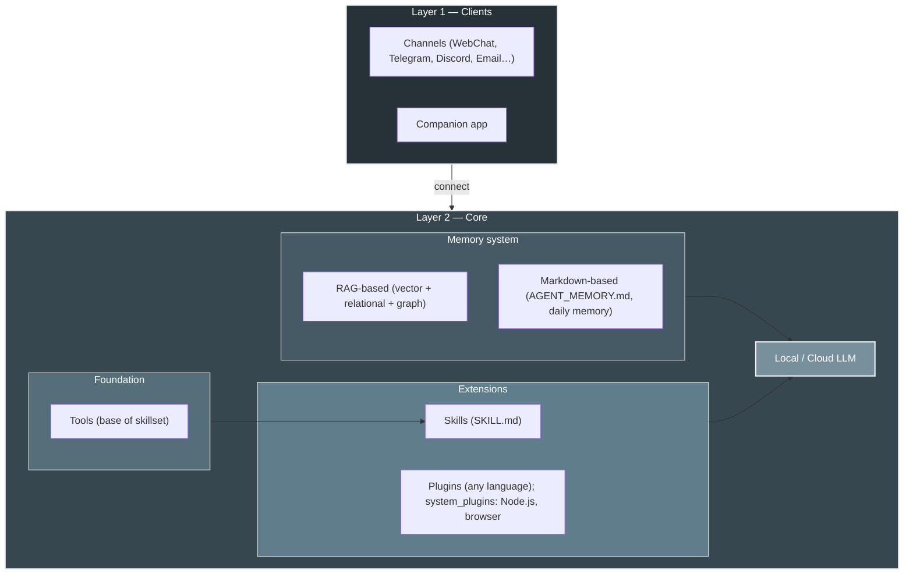
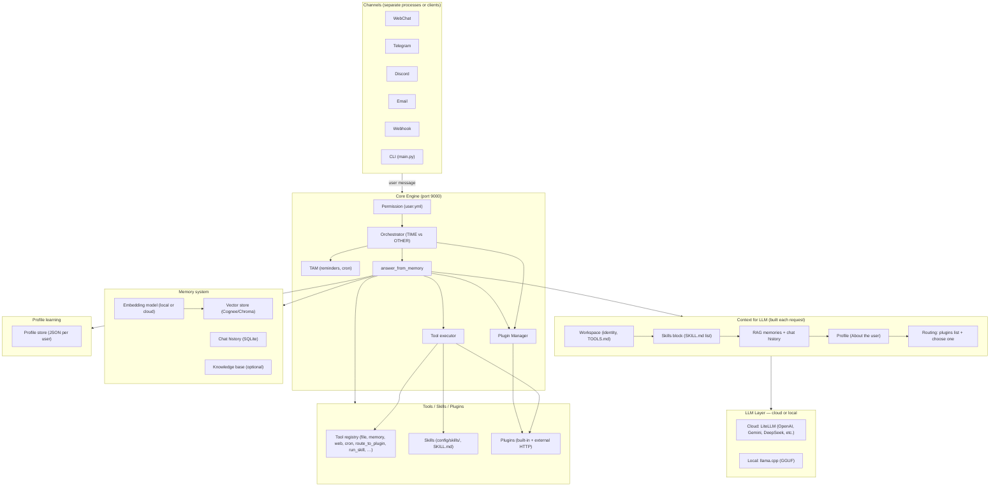
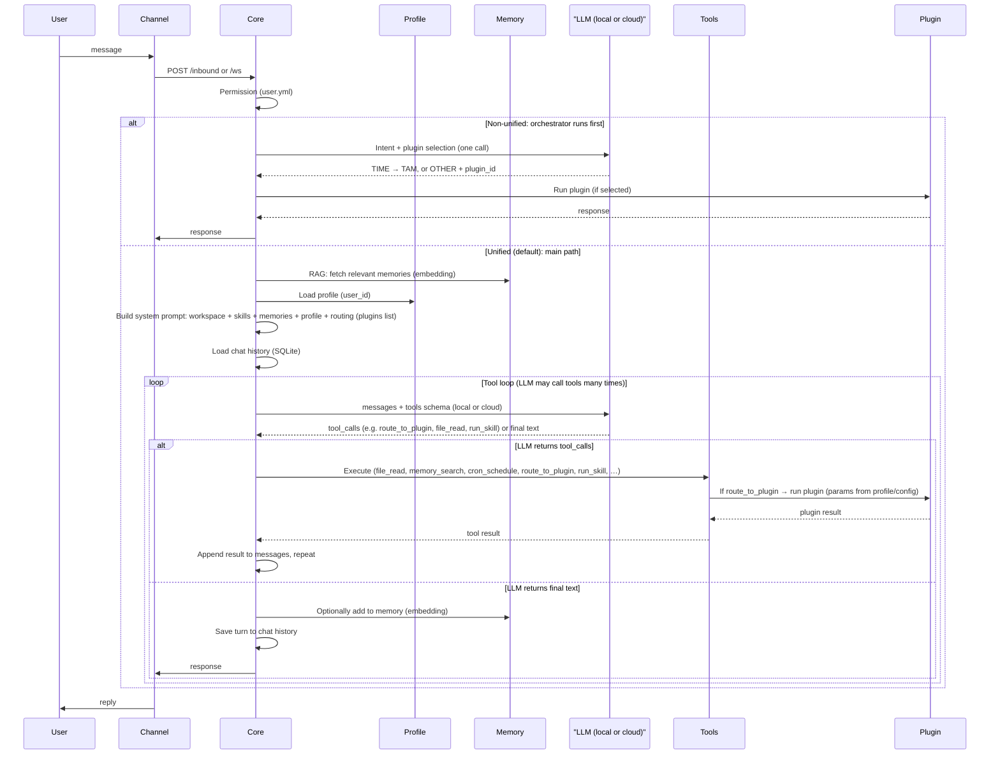

<p align="center">
  
</p>

# HomeClaw

**HomeClaw** is an **AI assistant** that runs on your own hardware. Each installation is an autonomous agent: it talks to you over the channels you already use (email, Telegram, Discord, WebChat, etc.), keeps **memory** (RAG + agent memory) and context, and extends its abilities through **built-in and external plugins** and **skills**. You can use **cloud models** (OpenAI, **Google Gemini**, DeepSeek, Anthropic, and more via LiteLLM) or **local models** (llama.cpp, GGUF), or **both together** for better capability and cost—**multimodal** (images, audio, video) works with both. A **Flutter companion app** (Mac, Windows, iPhone, Android) makes HomeClaw easy to use from any device. **Multi-agent** is simple: run multiple HomeClaw instances. HomeClaw is **for the people**—decentralized, private when you want it, and fully under your control.

**Highlights**

- **Companion app** — Flutter-based app for **Mac, Windows, iPhone, and Android**: chat, voice, attachments, and **Manage Core** (edit core.yml and user.yml) from your phone or desktop. One app, all platforms.
- **Memory** — **RAG** (vector + relational + optional graph) and **agent memory** (AGENT_MEMORY.md, daily memory). Cognee (default) or in-house Chroma backend.
- **Plugins** — **Built-in** (Python in `plugins/`) and **external** (any language: Node.js, Go, Java, Python, etc.). The **system plugin** (e.g. **homeclaw-browser**) is one external plugin written in **Node.js**; you can write plugins in any language and register them with Core.
- **Skills** — Full support for **OpenClaw-style skillset**: workflows in `config/skills/` (SKILL.md); LLM uses tools and optional `run_skill` to accomplish tasks.
- **Multi-agent** — Run **multiple HomeClaw instances** (e.g. one per user or use case); each instance is one agent with its own memory and config.
- **Cloud & multimodal** — **Gemini** and other cloud models work well. **Multimodal** (images, audio, video) is supported with both **local models** (e.g. Qwen2-VL with mmproj) and **cloud** (e.g. Gemini, GPT-4o).

**Other languages / 其他语言 / 他の言語 / 다른 언어:** [简体中文](README_zh.md) | [日本語](README_jp.md) | [한국어](README_kr.md)

**Documentation:** [https://allenpeng0705.github.io/HomeClaw/](https://allenpeng0705.github.io/HomeClaw/)

---

## Table of Contents

1. [What is HomeClaw?](#1-what-is-homeclaw)
2. [What Can HomeClaw Do?](#2-what-can-homeclaw-do)
3. [How to Use HomeClaw](#3-how-to-use-homeclaw) — includes [Remote access (Tailscale, Cloudflare Tunnel)](#remote-access-tailscale-cloudflare-tunnel)
4. [Companion app (Flutter)](#4-companion-app-flutter)
5. [System plugin: homeclaw-browser](#5-system-plugin-homeclaw-browser)
6. [Skills and Plugins: Make HomeClaw Work for You](#6-skills-and-plugins-make-homeclaw-work-for-you)
7. [Plugins: Extend HomeClaw](#7-plugins-extend-homeclaw)
8. [Skills: Extend HomeClaw with Workflows](#8-skills-extend-homeclaw-with-workflows)
9. [Acknowledgments](#9-acknowledgments)
10. [Contributing & License](#10-contributing--license)

---

## 1. What is HomeClaw?

### Design idea

HomeClaw is built around a few principles:

- **Cloud and local models** — The core runs on your machine. You can use **cloud models** (LiteLLM: OpenAI, Gemini, DeepSeek, etc.) or **local models** (llama.cpp, GGUF), or both; they can work together for better capability and cost. Use local-only to keep data at home, or cloud for scale and features.
- **Channel-agnostic** — The same Core serves all channels. Whether you talk via WebChat, Telegram, email, or Discord, the AI is one agent with one memory and one set of tools and plugins.
- **Modular** — The LLM layer, memory, channels, plugins, and tools are separate. You can choose cloud or local models (or both), enable or disable skills and plugins, and add new channels without changing the core logic.
- **Extensible** — **Plugins** add focused features (weather, news, email, custom APIs). **Skills** add application-style workflows (e.g. “social media agent”) that the LLM follows using tools. Both are designed so you can tailor HomeClaw to your needs.

### Architecture

**Channels** and the **Companion app** connect to **Core**. Inside Core: **memory** (RAG + Markdown files), **tools** (base for skills), **skills & plugins** (registered in RAG, filtered per request), and the **LLM** (cloud or local). [Full design →](docs_design/ToolsSkillsPlugins.md) · [Doc site →](https://allenpeng0705.github.io/HomeClaw/)

**Architecture (layer-based)**



- **Layer 1:** Channels + Companion app → Core. **Layer 2:** Memory (RAG + Markdown), Tools, Skills & Plugins (in RAG, filtered), Local/Cloud LLM. [Data flow & modules → Design.md](https://github.com/allenpeng0705/HomeClaw/blob/main/Design.md) · [Tools vs skills vs plugins →](docs_design/ToolsSkillsPlugins.md)

<details>
<summary>Detailed system overview (click to expand)</summary>

**System overview: all modules**



**Data flow: how a message is handled and where the LLM is used**



**Summary of what the diagram shows**

| Aspect | Where it appears |
|--------|-------------------|
| **LLM: local or cloud** | **LLM Layer** in the first diagram; **LLM (local or cloud)** in the sequence. Core calls one OpenAI-compatible API; that API is served by **local** (llama.cpp, GGUF) or **cloud** (LiteLLM → OpenAI, Gemini, DeepSeek, etc.). Main and embedding model can each be local or cloud. |
| **Memory system** | **Memory** subgraph: vector store (Cognee or Chroma), chat history (SQLite), optional knowledge base. **RAG**: embedding model vectorizes query and memories; relevant chunks are fetched and injected into the system prompt. |
| **Profile learning** | **Profile** subgraph: per-user JSON (e.g. `database/profiles/<user_id>.json`). Loaded each request and injected as **"About the user"** in the prompt. Used for personalization and for plugin parameter resolution (`profile_key`). |
| **Tools / skills / plugin selection** | **Context** includes: workspace (TOOLS.md), **skills block** (list of skills from SKILL.md), **routing block** (list of plugins + “choose one: time tools, route_to_tam, route_to_plugin, run_skill, or other tools”). **Tool registry** holds all tools (file_read, memory_search, route_to_plugin, run_skill, …). The **LLM** sees this context and chooses which tool to call (or to reply with text). So selection is done by the **LLM** given the prompt and tool schemas; no separate “selector” service. |

- **Channels** — Email, Matrix, Tinode, WeChat, WhatsApp, Telegram, Discord, Slack, WebChat, webhook, Google Chat, Signal, iMessage, Teams, Zalo, Feishu, DingTalk, BlueBubbles. Each channel connects to Core via HTTP (`/inbound`, `/process`) or WebSocket (`/ws`). See [Channels](#2-what-can-homeclaw-do) and `channels/README.md`.
- **Core** — Single FastAPI app: permission check (`config/user.yml`), orchestrator (intent TIME vs OTHER; plugin selection), TAM (reminders, cron), tool execution (file, memory, web search, browser, cron, `route_to_plugin`, `run_skill`), plugin invocation, and chat + RAG. Config: `config/core.yml`.
- **LLM layer** — One OpenAI-compatible API used by Core. Filled by **cloud models** (LiteLLM: OpenAI, Google Gemini, DeepSeek, Anthropic, Groq, Mistral, etc.) and/or **local models** (llama.cpp server, GGUF). Main and embedding model can be chosen independently; cloud and local can work together for better capability and cost. See `config/core.yml` (`cloud_models`, `local_models`, `main_llm`, `embedding_llm`).
- **Memory** — **Cognee** (default) or in-house **Chroma** backend: vector + relational + optional graph. Used for RAG and chat history. See `docs_design/MemoryAndDatabase.md`.
- **Profile** — Per-user JSON store (e.g. `database/profiles/`). Loaded each request and injected as “About the user” in the prompt; used for personalization and plugin parameter resolution. See `docs_design/UserProfileDesign.md`.
- **Plugins** — Built-in (Python in `plugins/`) and external (HTTP, any language). Core routes user intent to a plugin (e.g. Weather, News, Mail) when the request matches. See [§7 Plugins](#7-plugins-extend-homeclaw).
- **Skills** — Folders under `config/skills/` with `SKILL.md` (name, description, workflow). The LLM uses tools to accomplish skill workflows; optional `run_skill` runs scripts. See [§8 Skills](#8-skills-extend-homeclaw-with-workflows).

</details> More: [Design.md](https://github.com/allenpeng0705/HomeClaw/blob/main/Design.md) · [ToolsSkillsPlugins.md](docs_design/ToolsSkillsPlugins.md).

---

## 2. What Can HomeClaw Do?

### Channels and multi-user

Talk to HomeClaw via **WebChat**, **CLI**, **Telegram**, **Discord**, **Email**, and more—all use the same Core. Add users in `config/user.yml` (name, id, email, im, phone). [Channels →](https://allenpeng0705.github.io/HomeClaw/channels/) · [Multi-user →](docs_design/MultiUserSupport.md)

### Cloud and local models

Use **cloud** (LiteLLM: OpenAI, Gemini, DeepSeek, etc.) or **local** (llama.cpp, GGUF), or both. Set `main_llm` and `embedding_llm` in `config/core.yml`. [Models →](https://allenpeng0705.github.io/HomeClaw/models/) · [Remote access](#remote-access-tailscale-cloudflare-tunnel) (Tailscale, Cloudflare Tunnel) for the Companion app.

---

## 3. How to Use HomeClaw

For a **step-by-step guide** (install, config, local/cloud models, memory, tools, workspace, testing, plugins, skills), see **[HOW_TO_USE.md](HOW_TO_USE.md)** (also [中文](HOW_TO_USE_zh.md) | [日本語](HOW_TO_USE_jp.md) | [한국어](HOW_TO_USE_kr.md)).

### Supported platforms

HomeClaw runs on **macOS**, **Windows**, and **Linux**. You need:

- **Python** 3.10–3.12 (recommended).
- For **local GGUF models**: a **llama.cpp** server (or use the bundled `llama.cpp-master` and start servers per config).
- For **cloud models**: only network access and the right API keys in the environment.

### Quick start (run, config, test)

1. **Clone and install**

   ```bash
   git clone <repo_url>
   cd <your_clone_folder>   # e.g. HomeClaw or GPT4All
   pip install -r requirements.txt
   ```

2. **Config**

   - **Core**: `config/core.yml` — host, port (default 9000), `main_llm`, `embedding_llm`, `use_tools`, `use_skills`, `use_memory`, etc.
   - **Users**: `config/user.yml` — allowlist of users and their channel identities (email, im, phone).
   - **Channels**: Copy `channels/.env.example` to `channels/.env`; set `CORE_URL` (e.g. `http://127.0.0.1:9000`) and any bot tokens (e.g. `TELEGRAM_BOT_TOKEN`). See `channels/README.md` per channel.

3. **Models**

   - **Cloud**: Add entries to `cloud_models` in `config/core.yml` with `api_key_name`; set the env var (e.g. `OPENAI_API_KEY`, `GEMINI_API_KEY`, `DEEPSEEK_API_KEY`). Set `main_llm` to e.g. `cloud_models/OpenAI-GPT4o` or `cloud_models/Gemini-2.5-Flash`.
   - **Local**: Download GGUF models (e.g. from Hugging Face) into a `models/` folder; configure `local_models` in `config/core.yml` with path, host, port. Start the llama.cpp server(s) for each model you use. Or use **Ollama**: run Ollama, then use `llm download` and `llm set` in the CLI. Set `main_llm` to e.g. `local_models/main_vl_model_4B`.
   - **Both**: You can use cloud for one role and local for another (e.g. cloud chat + local embedding), or switch between them; they can work together for better capability and cost.

4. **Run Core**

   ```bash
   python -m core.core
   ```

   Or run the interactive CLI (Core + built-in channel):

   ```bash
   python -m main start
   ```

   **Run Core and all system plugins in one command:** Set `system_plugins_auto_start: true` in `config/core.yml`. Core will then start each plugin in `system_plugins/` (e.g. homeclaw-browser) and register them automatically. See [§5 System plugin: homeclaw-browser](#5-system-plugin-homeclaw-browser) and **system_plugins/README.md**.

5. **Run a channel** (in another terminal)

   ```bash
   python -m channels.run webchat
   ```

   Open http://localhost:8014 (or the port shown). Or run Telegram/Discord/Slack, etc., as needed.

6. **Test**

   - Send a message in WebChat or the CLI. For tools/skills/plugins, see **docs_design/ToolsAndSkillsTesting.md** and **docs_design/RunAndTestPlugins.md**.
   - Check config and LLM connectivity: `python -m main doctor`.

### Remote access (Tailscale, Cloudflare Tunnel)

To use the **Companion app** or WebChat from another network (e.g. phone on cellular, laptop away from home), expose Core so the client can reach it. Two common options:

**Tailscale (recommended for home + mobile)**

1. Install [Tailscale](https://tailscale.com/download) on the machine that runs Core and on your phone/laptop; log in with the same account.
2. On the Core host, get the Tailscale IP: `tailscale ip` (e.g. `100.x.x.x`).
3. In the Companion app **Settings**, set **Core URL** to `http://100.x.x.x:9000` (replace with your IP). Optional: use **Tailscale Serve** for HTTPS: `tailscale serve https / http://127.0.0.1:9000` and set Core URL to the URL Tailscale shows (e.g. `https://your-machine.your-tailnet.ts.net`).
4. If Core has `auth_enabled: true`, set the same **API key** in the app.

**Cloudflare Tunnel (public URL)**

1. Install [cloudflared](https://developers.cloudflare.com/cloudflare-one/connections/connect-apps/install-and-setup/tunnel-guide/local/) on the Core host.
2. Run: `cloudflared tunnel --url http://127.0.0.1:9000` and copy the URL (e.g. `https://xxx.trycloudflare.com`).
3. Enable Core auth: in `config/core.yml` set `auth_enabled: true` and `auth_api_key: "<long-random-key>"`.
4. In the Companion app **Settings**, set **Core URL** to the tunnel URL and the **API key** to match.

The app only needs **Core URL** and optional **API key**; no Tailscale or Cloudflare SDK in the app. For more (SSH tunnel, auth details), see the docs: **[Remote access](https://allenpeng0705.github.io/HomeClaw/remote-access/)** and **docs_design/RemoteAccess.md**.

### More: models, database, CLI, platforms

- **CLI** (`python -m main start`): `llm` / `llm set` / `llm cloud`, `channel list` / `channel run <name>`, `reset`. [HOW_TO_USE.md](HOW_TO_USE.md)
- **Local GGUF** and **cloud (OpenAI, Gemini, etc.)**: [Models doc](https://allenpeng0705.github.io/HomeClaw/models/) · config in `config/core.yml`.
- **Postgres, Neo4j, enterprise vector DB**: [MemoryAndDatabase.md](docs_design/MemoryAndDatabase.md)
- **Windows** (Visual C++ Build Tools, WeChat): [Install VSBuildTools](https://github.com/bycloudai/InstallVSBuildToolsWindows) · **China** (pip mirror): [getting-started](https://allenpeng0705.github.io/HomeClaw/getting-started/).

---

## 4. Companion app (Flutter)

**Companion** is a Flutter app for **Mac, Windows, iPhone, and Android**: chat, voice, attachments, and **Manage Core** (edit core.yml and user.yml from the app). [Companion app doc](https://allenpeng0705.github.io/HomeClaw/companion-app/) · [Build from source](clients/homeclaw_companion/README.md)

**Quick use:** (1) Get the app from `clients/homeclaw_companion/` or a build. (2) **Settings** → set **Core URL** (`http://127.0.0.1:9000` same machine, or [Tailscale](#remote-access-tailscale-cloudflare-tunnel) / [Cloudflare Tunnel](#remote-access-tailscale-cloudflare-tunnel) for remote). (3) Add your user in **config/user.yml** (or via **Manage Core** → Users). (4) Chat; use **Manage Core** to edit config. All channels and the app talk to the same Core and memory.

---

## 5. System plugin: homeclaw-browser

**homeclaw-browser** (Node.js) in `system_plugins/homeclaw-browser`: WebChat UI at http://127.0.0.1:3020/, browser automation (LLM can open URLs, click, type), Canvas, and Nodes. Set `system_plugins_auto_start: true` in `config/core.yml` to start with Core, or run `node server.js` and `node register.js` manually. [system_plugins/README.md](system_plugins/README.md) · [homeclaw-browser README](system_plugins/homeclaw-browser/README.md) · [§7 Plugins](#7-plugins-extend-homeclaw)

---

## 6. Skills and Plugins: Make HomeClaw Work for You

**Tools** (file, memory, web search, cron, browser), **plugins** (Weather, News, Mail, etc.), and **skills** (workflows in SKILL.md) let the agent answer, remember, route to plugins, and run workflows. Just ask naturally; the LLM chooses tools, skills, or plugins. [ToolsSkillsPlugins.md](docs_design/ToolsSkillsPlugins.md)

---


---

## 7. Plugins: Extend HomeClaw

**Built-in plugins** (Python): `plugins/<Name>/` with plugin.yaml, config.yml, plugin.py; Core discovers them at startup. **External plugins** (any language): run an HTTP server (`GET /health`, `POST /run`), register with `POST /api/plugins/register`; Core routes to it like built-in. [PluginStandard.md](docs_design/PluginStandard.md) · [PluginsGuide.md](docs_design/PluginsGuide.md) · [examples/external_plugins/](examples/external_plugins/README.md)

---

## 8. Skills: Extend HomeClaw with Workflows

**Skills** are folders under `config/skills/` with **SKILL.md** (name, description, workflow). The LLM sees "Available skills" and uses tools (or **run_skill** for scripts) to accomplish them. Set `use_skills: true` in `config/core.yml`. [SkillsGuide.md](docs_design/SkillsGuide.md) · [ToolsSkillsPlugins.md](docs_design/ToolsSkillsPlugins.md)

---


---

## 9. Acknowledgments

HomeClaw would not exist without two projects that inspired it:

- **GPT4People** — The author’s earlier project that explored decentralized, people-centric AI and channel-based interaction. Many of HomeClaw’s ideas—local-first agents, channels, memory, and the vision of AI “for the people“—grew from that work.
- **OpenClaw** — A sibling ecosystem (gateway, extensions, channels, providers). OpenClaw and HomeClaw share a similar spirit: extensible, channel-based AI that users can run and customize. The contrast between OpenClaw’s gateway/extensions model and HomeClaw’s core/plugins model helped clarify HomeClaw’s design (see **docs_design/ToolsSkillsPlugins.md** §2.8).

Thank you to everyone who contributed to GPT4People and OpenClaw, and to the open-source communities behind llama.cpp, LiteLLM, Cognee, and the many channels and tools we build on.

---

## 10. Contributing & License

- **Contributing** — We welcome issues, pull requests, and discussions. See **CONTRIBUTING.md** for guidelines.
- **License** — This project is licensed under the **Apache License 2.0**. See the **LICENSE** file.

### Roadmap (summary)

**Next**

- **Cloud and local model mix** — Design how to combine cloud and local models so that work is done efficiently and cost stays low (e.g. use local for simple or high-volume tasks, cloud for complex or low-latency needs; routing and fallback rules).

**Later**

- Simpler setup and onboarding (`python -m main onboard`, `python -m main doctor`).
- More channels and platform integrations.
- Stronger plugin/skill discovery and multi-agent options.
- Optional: directory, trust/reputation, and blockchain-based verification for agent-to-agent use cases.

We’re at the beginning of a long journey. Stay tuned and join us as we grow.
