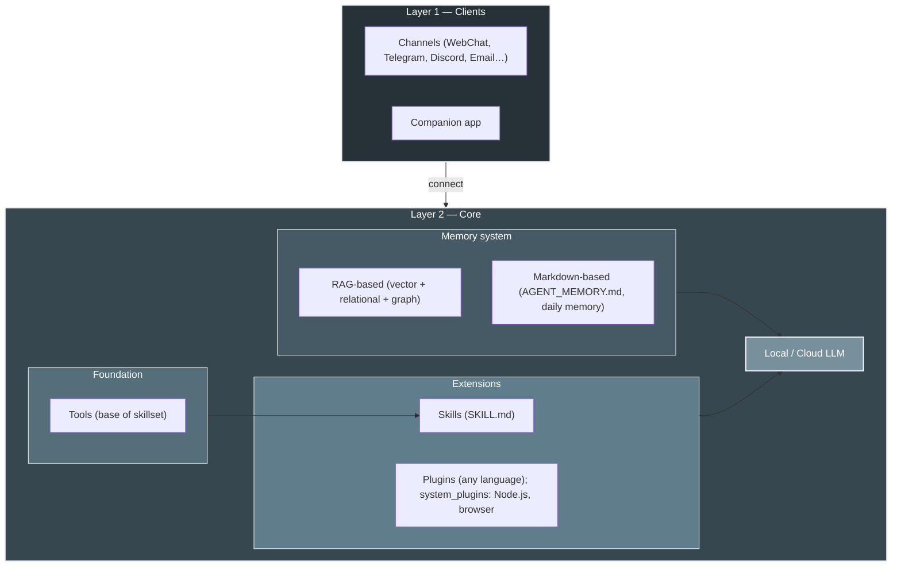

<p align="center">
  
</p>

# HomeClaw

**HomeClaw** は、ご自身のハードウェアで動作する **AI アシスタント**です。各インストールは自律エージェントとして、メール・Telegram・Discord・WebChat など既存の**チャネル**で会話し、**メモリ**（RAG + エージェントメモリ）とコンテキストを保持し、**組み込み・外部プラグイン**と**スキル**で機能を拡張します。**クラウドモデル**（OpenAI、**Google Gemini**、DeepSeek、Anthropic など LiteLLM 経由）または**ローカルモデル**（llama.cpp、GGUF）、または**両方**で能力とコストを最適化。**マルチモーダル**（画像・音声・動画）はローカル・クラウド両方で対応。**Flutter コンパニオンアプリ**（Mac、Windows、iPhone、Android）でどこからでも簡単に利用。**マルチエージェント**は複数 HomeClaw インスタンスの起動で実現。HomeClaw は**人々のため**に—分散型で、必要な時はプライベートに、完全にご自身の制御下で動作します。

**ハイライト**

- **コンパニオンアプリ** — Flutter ベースで **Mac、Windows、iPhone、Android** 対応：チャット、音声、添付、**Manage Core**（core.yml と user.yml をアプリから編集）。1 アプリで全プラットフォーム。
- **メモリ** — **RAG**（ベクトル + リレーショナル + オプションでグラフ）と**エージェントメモリ**（AGENT_MEMORY.md、日次メモリ）。デフォルトは Cognee または自前 Chroma バックエンド。
- **プラグイン** — **組み込み**（Python、`plugins/`）と**外部**（任意の言語：Node.js、Go、Java、Python など）。**システムプラグイン**（例：**homeclaw-browser**）は Node.js 製；任意の言語でプラグインを書いて Core に登録できます。
- **スキル** — **OpenClaw スタイルのスキルセット**を完全サポート：`config/skills/`（SKILL.md）のワークフロー；LLM がツールとオプションの `run_skill` でタスクを実行。
- **マルチエージェント** — **複数 HomeClaw インスタンス**を起動（ユーザーやユースケースごとなど）；各インスタンスは 1 エージェントで、独自のメモリと設定を持ちます。
- **クラウド・マルチモーダル** — **Gemini** などのクラウドモデルがよく動作。**マルチモーダル**（画像・音声・動画）は**ローカルモデル**（例：Qwen2-VL + mmproj）と**クラウド**（例：Gemini、GPT-4o）の両方でサポート。

**他の言語 / Other languages:** [English](README.md) | [简体中文](README_zh.md) | [한국어](README_kr.md)

**ドキュメント:** [https://allenpeng0705.github.io/HomeClaw/](https://allenpeng0705.github.io/HomeClaw/) — インストール・実行・Mix モード・レポート・ツール・プラグインなどのドキュメントは MkDocs でビルドされここで公開されています。GitHub の **`docs/`** フォルダでソースも閲覧できます。

---

## 目次

1. [HomeClaw とは？](#1-homeclaw-とは)
2. [HomeClaw でできること](#2-homeclaw-でできること)
3. [Mix モード：スマートなローカル/クラウドルーティング](#3-mix-モードスマートなローカルクラウドルーティング) — 3 層ルーターと強力な第 3 層
4. [HomeClaw の使い方](#4-homeclaw-の使い方) — [リモートアクセス（Tailscale、Cloudflare Tunnel）](#リモートアクセスtailscale-cloudflare-tunnel) を含む
5. [コンパニオンアプリ（Flutter）](#5-コンパニオンアプリflutter)
6. [システムプラグイン：homeclaw-browser](#6-システムプラグインhomeclaw-browser)
7. [スキルとプラグイン：HomeClaw を自分用に](#7-スキルとプラグインhomeclaw-を自分用に)
8. [プラグイン：HomeClaw の拡張](#8-プラグインhomeclaw-の拡張)
9. [スキル：ワークフローで HomeClaw を拡張](#9-スキルワークフローで-homeclaw-を拡張)
10. [謝辞](#10-謝辞)
11. [コントリビューションとライセンス](#11-コントリビューションとライセンス)

---

## 1. HomeClaw とは？

### 設計思想

HomeClaw は次の原則で構成されています。

- **クラウドとローカルモデル** — コアはご自身のマシンで動作します。**クラウドモデル**（LiteLLM：OpenAI、Gemini、DeepSeek など）または**ローカルモデル**（llama.cpp、GGUF）、または両方を使用可能；能力とコストのために一緒に動作できます。データを自宅に留めるならローカルのみ、スケールと機能ならクラウドを利用。
- **チャネル非依存** — 同じ Core がすべてのチャネルを提供します。WebChat、Telegram、メール、Discord のいずれで話しても、AI は一つのエージェント、一つのメモリ、一セットのツールとプラグインです。
- **モジュール化** — LLM 層、メモリ、チャネル、プラグイン、ツールは分離されています。クラウドとローカルのモデルを切り替え、スキルやプラグインの有効/無効を切り替え、コアロジックを変えずに新しいチャネルを追加できます。
- **拡張可能** — **プラグイン**は天気・ニュース・メール・カスタム API などの単一機能を追加します。**スキル**は「ソーシャルメディアエージェント」のようなアプリ型ワークフローを追加し、LLM がツールを使って実行します。どちらも HomeClaw をニーズに合わせて調整できます。

### アーキテクチャ

**チャネル**と**コンパニオンアプリ**が **Core** に接続します。Core 内：**メモリ**（RAG + Markdown ファイル）、**ツール**（スキルの基盤）、**スキルとプラグイン**（RAG に登録、リクエストごとにフィルタ）、**LLM**（クラウドまたはローカル）。[完全な設計 →](docs_design/ToolsSkillsPlugins.md) · [ドキュメントサイト →](https://allenpeng0705.github.io/HomeClaw/)

**アーキテクチャ（レイヤー）**



- **レイヤー 1：** チャネル + コンパニオンアプリ → Core。**レイヤー 2：** メモリ（RAG + Markdown）、ツール、スキルとプラグイン（RAG 内、フィルタ済み）、ローカル/クラウド LLM。[ツール vs スキル vs プラグイン →](docs_design/ToolsSkillsPlugins.md) · **システム概要とデータフロー**は[ドキュメント導入ページ](https://allenpeng0705.github.io/HomeClaw/)を参照。

---

## 2. HomeClaw でできること

### チャネルとマルチユーザー

**WebChat**、**CLI**、**Telegram**、**Discord**、**メール**などで HomeClaw と会話—すべて同じ Core を使用。`config/user.yml` でユーザーを追加（name、id、email、im、phone）。[チャネル →](https://allenpeng0705.github.io/HomeClaw/channels/) · [マルチユーザー →](docs_design/MultiUserSupport.md)

### クラウドとローカルモデル

**クラウド**（LiteLLM：OpenAI、Gemini、DeepSeek など）または**ローカル**（llama.cpp、GGUF）、または両方。`config/core.yml` で `main_llm` と `embedding_llm` を設定。[モデル →](https://allenpeng0705.github.io/HomeClaw/models/) · [リモートアクセス](#リモートアクセスtailscale-cloudflare-tunnel)（Tailscale、Cloudflare Tunnel）でコンパニオンアプリから利用。

---

## 3. Mix モード：スマートなローカル/クラウドルーティング

**Mix モード**では、HomeClaw が**リクエストごと**に**ローカル**か**クラウド**のメインモデルを使うか決めます。**3 層ルーター**がツール・プラグイン注入前に実行され、ユーザーメッセージだけを参照するため、1 ターン全体で同じモデルが使われます—シンプル・プライベートな処理はローカル、検索や重い推論はクラウド。**レポート**（ルート決定とクラウド利用量）は REST API または組み込み **usage_report** ツールで確認できます。

### 3 層の構成

| 層 | 名前 | 役割 |
|----|------|------|
| **1** | **ヒューリスティック** | キーワードと長文ルール（YAML）。例：「スクリーンショット」「ロック」→ ローカル；「ウェブ検索」「最新ニュース」→ クラウド。先にマッチした方が有効。 |
| **2** | **セマンティック** | 埋め込み類似度：ユーザーメッセージを**ローカル/クラウド**の例文と比較。言い換えや意図の把握に適する。 |
| **3** | **クラシファイアまたはパープレキシティ** | L1・L2 で決まらない場合：**小型ローカルモデル**が「Local か Cloud？」と答える（**classifier**）、または**メインローカルモデル**で数トークン＋**logprobs** を取得—自信が高ければ（平均 logprob が高い）ローカル、低ければクラウドへ（**perplexity**）。 |

**強力な第 3 層**：メインのローカルモデルが強い場合、第 3 層を **perplexity** モードにできます。同じメインモデルが「自信」で投票します。Core が llama.cpp サーバーへ短いプローブ（例：5 トークン、`logprobs=true`）を送り、平均 log 確率を計算。しきい値（例：-0.6）以上なら**ローカル**、未満なら**クラウド**。別のクラシファイアモデルは不要で、メインモデル自身の不確実性で判定します。ローカルが弱い場合は **classifier** モード（小型 0.5B 裁判モデル）を使用してください。

**有効化**：`config/core.yml` で `main_llm_mode: mix`、`main_llm_local`、`main_llm_cloud`、`hybrid_router` を設定。使い方・レポートの見方・全パラメータのチューニングは **[Mix mode and reports](https://allenpeng0705.github.io/HomeClaw/mix-mode-and-reports/)** を参照。

---

## 4. HomeClaw の使い方

**ステップバイステップガイド**（インストール、設定、ローカル/クラウドモデル、メモリ、ツール、ワークスペース、テスト、プラグイン、スキル）は **[HOW_TO_USE_jp.md](HOW_TO_USE_jp.md)**（[English](HOW_TO_USE.md) | [中文](HOW_TO_USE_zh.md) | [한국어](HOW_TO_USE_kr.md) もあり）。

### 対応プラットフォーム

HomeClaw は **macOS**、**Windows**、**Linux** で動作。必要環境：

- **Python** 3.10–3.12（推奨）。
- **ローカル GGUF モデル**：**llama.cpp のバイナリ配布**をデバイスに合わせて `llama.cpp-master/<platform>/`（mac/、win_cuda/、linux_cpu/ など）にコピー；メインと埋め込みの両方のローカルモデルに使用。`llama.cpp-master/README.md` 参照。その後、設定に従ってサーバーを起動。
- **クラウドモデル**：ネットワークと適切な API キー（環境変数）のみ。

### クイックスタート（実行、設定、テスト）

1. **クローンとインストール**

   ```bash
   git clone <repo_url>
   cd <your_clone_folder>   # 例：HomeClaw
   pip install -r requirements.txt
   ```

2. **設定**

   - **Core**：`config/core.yml` — host、port（デフォルト 9000）、`main_llm`、`embedding_llm`、`use_tools`、`use_skills`、`use_memory` など。
   - **ユーザー**：`config/user.yml` — ユーザー許可リストとチャネル識別子（email、im、phone）。
   - **チャネル**：`channels/.env.example` を `channels/.env` にコピー；`CORE_URL`（例：`http://127.0.0.1:9000`）とボットトークン（例：`TELEGRAM_BOT_TOKEN`）を設定。各チャネルは `channels/README.md` 参照。

3. **モデル**

   - **クラウド**：`config/core.yml` の `cloud_models` にエントリを追加し `api_key_name` を設定；環境変数を設定（例：`OPENAI_API_KEY`、`GEMINI_API_KEY`、`DEEPSEEK_API_KEY`）。`main_llm` を例：`cloud_models/OpenAI-GPT4o` または `cloud_models/Gemini-2.5-Flash` に。
   - **ローカル**：**llama.cpp のバイナリ配布**をデバイスに合わせて `llama.cpp-master/` にコピー（`llama.cpp-master/README.md` 参照）；メインと埋め込みの両方のローカルモデルに使用。GGUF モデル（例：Hugging Face から）を `models/` にダウンロード；`config/core.yml` の `local_models` で path、host、port を設定。使用するモデルごとに llama.cpp サーバーを起動。または **Ollama**：Ollama を起動し、CLI で `llm download` と `llm set` を使用。`main_llm` を例：`local_models/main_vl_model_4B` に。
   - **両方**：クラウドとローカルを役割で使い分け（例：クラウドチャット + ローカル埋め込み）、または切り替え；能力とコストのために一緒に使用可能。

4. **Core の起動**

   ```bash
   python -m core.core
   ```

   または対話型 CLI（Core + 組み込みチャネル）：

   ```bash
   python -m main start
   ```

   **Core と全システムプラグインを一括起動**：`config/core.yml` で `system_plugins_auto_start: true` を設定。Core が `system_plugins/`（例：homeclaw-browser）の各プラグインを起動し自動登録。 [§6 システムプラグイン：homeclaw-browser](#6-システムプラグインhomeclaw-browser) と **system_plugins/README.md** 参照。

5. **チャネルの起動**（別ターミナル）

   ```bash
   python -m channels.run webchat
   ```

   http://localhost:8014（または表示されるポート）を開く。必要に応じて Telegram、Discord、Slack などを起動。

6. **テスト**

   - WebChat または CLI でメッセージを送信。ツール/スキル/プラグインは **docs_design/ToolsAndSkillsTesting.md** と **docs_design/RunAndTestPlugins.md** 参照。
   - 設定と LLM 接続の確認：`python -m main doctor`。

### リモートアクセス（Tailscale、Cloudflare Tunnel）

**コンパニオンアプリ**や WebChat を別ネットワーク（例：スマホの cellular、外出先のノート PC）から使うには、Core にクライアントが到達できるようにします。主な 2 つの方法：

**Tailscale（自宅 + モバイル推奨）**

1. Core を動かすマシンとスマホ/ノート PC に [Tailscale](https://tailscale.com/download) をインストール；同じアカウントでログイン。
2. Core ホストで Tailscale IP を取得：`tailscale ip`（例：`100.x.x.x`）。
3. コンパニオンアプリ**設定**で **Core URL** を `http://100.x.x.x:9000`（IP を置き換え）に。オプション：**Tailscale Serve** で HTTPS：`tailscale serve https / http://127.0.0.1:9000` を実行し、Core URL を Tailscale が表示する URL（例：`https://your-machine.your-tailnet.ts.net`）に。
4. Core で `auth_enabled: true` の場合、アプリに同じ **API key** を設定。

**Cloudflare Tunnel（公開 URL）**

1. Core ホストに [cloudflared](https://developers.cloudflare.com/cloudflare-one/connections/connect-apps/install-and-setup/tunnel-guide/local/) をインストール。
2. 実行：`cloudflared tunnel --url http://127.0.0.1:9000` で URL（例：`https://xxx.trycloudflare.com`）をコピー。
3. Core 認証を有効化：`config/core.yml` で `auth_enabled: true` と `auth_api_key: "<長いランダムキー>"` を設定。
4. コンパニオンアプリ**設定**で **Core URL** を tunnel URL に、**API key** を一致させる。

アプリに必要なのは **Core URL** とオプションの **API key** のみ；Tailscale や Cloudflare の SDK はアプリに含みません。詳細（SSH トンネル、認証）はドキュメント **[リモートアクセス](https://allenpeng0705.github.io/HomeClaw/remote-access/)** と **docs_design/RemoteAccess.md** を参照。

### その他：モデル、DB、CLI、プラットフォーム

- **CLI**（`python -m main start`）：`llm` / `llm set` / `llm cloud`、`channel list` / `channel run <name>`、`reset`。[HOW_TO_USE_jp.md](HOW_TO_USE_jp.md)
- **ローカル GGUF** と**クラウド（OpenAI、Gemini など）**：[モデルドキュメント](https://allenpeng0705.github.io/HomeClaw/models/) · 設定は `config/core.yml`。
- **Postgres、Neo4j、エンタープライズベクトル DB**：[MemoryAndDatabase.md](docs_design/MemoryAndDatabase.md)
- **Windows**（Visual C++ Build Tools、WeChat）：[Install VSBuildTools](https://github.com/bycloudai/InstallVSBuildToolsWindows) · **中国**（pip ミラー）：[getting-started](https://allenpeng0705.github.io/HomeClaw/getting-started/)。

---

## 5. コンパニオンアプリ（Flutter）

**コンパニオン**は Flutter 製の **Mac、Windows、iPhone、Android** 用アプリ：チャット、音声、添付、**Manage Core**（アプリから core.yml と user.yml を編集）。[コンパニオンアプリドキュメント](https://allenpeng0705.github.io/HomeClaw/companion-app/) · [ソースからビルド](clients/homeclaw_companion/README.md)

**クイック利用**：（1）`clients/homeclaw_companion/` またはビルドからアプリを取得。（2）**設定** → **Core URL** を設定（同一マシンなら `http://127.0.0.1:9000`、リモートなら [Tailscale](#リモートアクセスtailscale-cloudflare-tunnel) / [Cloudflare Tunnel](#リモートアクセスtailscale-cloudflare-tunnel)）。（3）**config/user.yml** にユーザーを追加（または **Manage Core** → ユーザー）。（4）チャット；**Manage Core** で設定を編集。全チャネルとアプリが同じ Core とメモリを使用。

---

## 6. システムプラグイン：homeclaw-browser

**homeclaw-browser**（Node.js）は `system_plugins/homeclaw-browser` にあり：WebChat UI は http://127.0.0.1:3020/、ブラウザ自動化（LLM が URL を開く・クリック・入力）、Canvas、Nodes。`config/core.yml` で `system_plugins_auto_start: true` にすると Core と一緒に起動、または `node server.js` と `node register.js` を手動実行。[system_plugins/README.md](system_plugins/README.md) · [homeclaw-browser README](system_plugins/homeclaw-browser/README.md) · [§8 プラグイン](#8-プラグインhomeclaw-の拡張)

---

## 7. スキルとプラグイン：HomeClaw を自分用に

**ツール**（ファイル、メモリ、ウェブ検索、cron、ブラウザ）、**プラグイン**（Weather、News、Mail など）、**スキル**（SKILL.md のワークフロー）でエージェントが回答・記憶・プラグインへのルーティング・ワークフロー実行を行います。自然に質問するだけで、LLM がツール・スキル・プラグインを選択。[ToolsSkillsPlugins.md](docs_design/ToolsSkillsPlugins.md)

---

## 8. プラグイン：HomeClaw の拡張

**組み込みプラグイン**（Python）：`plugins/<Name>/` に plugin.yaml、config.yml、plugin.py；Core 起動時に自動検出。**外部プラグイン**（任意の言語）：HTTP サーバー（`GET /health`、`POST /run`）を動かし、`POST /api/plugins/register` で登録；Core は組み込みと同様にルーティング。[PluginStandard.md](docs_design/PluginStandard.md) · [PluginsGuide.md](docs_design/PluginsGuide.md) · [examples/external_plugins/](examples/external_plugins/README.md)

---

## 9. スキル：ワークフローで HomeClaw を拡張

**スキル**は `config/skills/` 下のフォルダで **SKILL.md**（名前、説明、ワークフロー）を含みます。LLM は「利用可能なスキル」を見て、ツール（または **run_skill** でスクリプト）で実行。`config/core.yml` で `use_skills: true` を設定。[SkillsGuide.md](docs_design/SkillsGuide.md) · [ToolsSkillsPlugins.md](docs_design/ToolsSkillsPlugins.md)

---

## 10. 謝辞

HomeClaw は次の 2 つのプロジェクトに触発されました。

- **GPT4People** — 作者の以前のプロジェクトで、分散型・人中心の AI とチャネルベースの対話を探求。HomeClaw の多くのアイデア—ローカルファーストエージェント、チャネル、メモリ、「人々のため」のビジョン—はここから育ちました。
- **OpenClaw** — 姉妹エコシステム（ゲートウェイ、拡張、チャネル、プロバイダ）。OpenClaw と HomeClaw は同じ精神を共有：拡張可能でチャネルベースの AI をユーザーが実行・カスタマイズ可能。OpenClaw のゲートウェイ/拡張モデルと HomeClaw の Core/プラグインモデルの対比が、HomeClaw の設計を明確にしました（**docs_design/ToolsSkillsPlugins.md** §2.8 参照）。

GPT4People と OpenClaw に貢献したすべての方、そして llama.cpp、LiteLLM、Cognee および多数のチャネルとツールを支えるオープンソースコミュニティに感謝します。

---

## 11. コントリビューションとライセンス

- **コントリビューション** — issue、プルリクエスト、議論を歓迎。**CONTRIBUTING.md** を参照。
- **ライセンス** — 本プロジェクトは **Apache License 2.0**。**LICENSE** ファイルを参照。

### ロードマップ（概要）

**完了**

- **Mix モード** — 3 層ルーター（ヒューリスティック → セマンティック → クラシファイアまたはパープレキシティ）でリクエストごとにローカル/クラウドを選択。レポート（API + **usage_report** ツール）でコストとチューニング。詳細は [Mix mode and reports](https://allenpeng0705.github.io/HomeClaw/mix-mode-and-reports/) を参照。

**今後**

- より簡単なセットアップとオンボーディング（`python -m main onboard`、`python -m main doctor`）。
- より多くのチャネルとプラットフォーム連携。
- プラグイン/スキル発見とマルチエージェントの強化。
- オプション：ディレクトリ、信頼/レピュテーション、エージェント間のブロックチェーン検証。

長い旅の始まりです。ぜひ参加してください。
