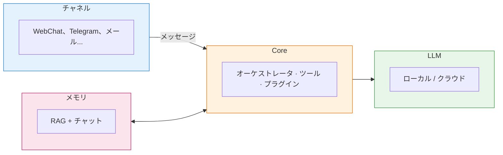
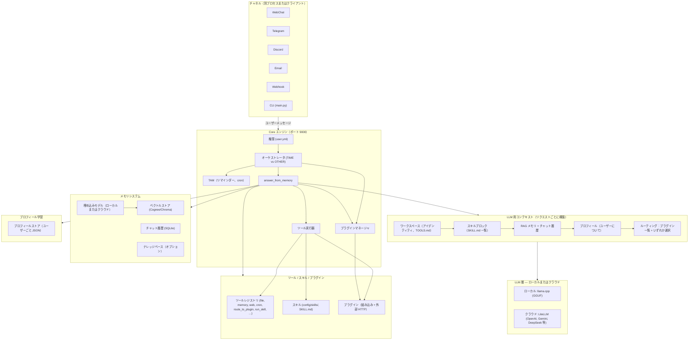
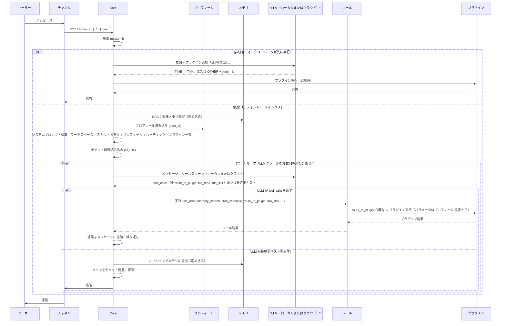

<p align="center">
  
</p>

# HomeClaw

**HomeClaw** は、ご自身のハードウェアで動作する**ローカルファーストの AI アシスタント**です。各インストールは自律エージェントとして、メール・Telegram・Discord・WebChat など既存の**チャネル**で会話し、**メモリ**（RAG + エージェントメモリ）とコンテキストを保持し、**組み込み・外部プラグイン**と**スキル**で機能を拡張します。**ローカルモデル**（llama.cpp、GGUF）のみでも、**クラウドモデル**（OpenAI、**Google Gemini**、DeepSeek、Anthropic など）と組み合わせても利用可能。**マルチモーダル**（画像・音声・動画）はローカル・クラウド両方で対応。**Flutter コンパニオンアプリ**（Mac、Windows、iPhone、Android）でどこからでも簡単に利用。**マルチエージェント**は複数 HomeClaw インスタンスの起動で実現。HomeClaw は**人々のため**に—分散型で、必要な時はプライベートに、完全にご自身の制御下で動作します。

**ハイライト：** **コンパニオンアプリ**（Flutter、全プラットフォーム）| **メモリ**（RAG + エージェントメモリ）| **プラグイン**（組み込み + 外部、**任意の言語**：Node.js、Go、Java、Python など）| **OpenClaw スキルセット** | **マルチエージェント**（複数インスタンス）| **クラウド・マルチモーダル**（Gemini など、ローカル・クラウド両方で動作確認済み）

**他の言語 / Other languages:** [English](README.md) | [简体中文](README_zh.md) | [한국어](README_kr.md)

**ドキュメント:** [https://allenpeng0705.github.io/HomeClaw/](https://allenpeng0705.github.io/HomeClaw/)

---

## 目次

1. [HomeClaw とは](#1-homeclaw-とは)
2. [HomeClaw でできること](#2-homeclaw-でできること)
3. [HomeClaw の使い方](#3-homeclaw-の使い方)
4. [スキルとプラグイン：HomeClaw を自分用に](#4-スキルとプラグインhomeclaw-を自分用に)
5. [プラグイン：HomeClaw の拡張](#5-プラグインhomeclaw-の拡張)
6. [スキル：ワークフローで HomeClaw を拡張](#6-スキルワークフローで-homeclaw-を拡張)
7. [謝辞](#7-謝辞)
8. [コントリビューションとライセンス](#8-コントリビューションとライセンス)

---

## 1. HomeClaw とは？

### 設計思想

HomeClaw は次の原則で構成されています。

- **ローカルファースト** — コアはご自身のマシンで動作します。会話とメモリを端末に留めるため、ローカル LLM（llama.cpp、GGUF）のみを使うことができます。
- **チャネル非依存** — 同じ Core がすべてのチャネルを提供します。WebChat、Telegram、メール、Discord のいずれで話しても、AI は一つのエージェント、一つのメモリ、一セットのツールとプラグインです。
- **モジュール化** — LLM 層、メモリ、チャネル、プラグイン、ツールは分離されています。ローカルとクラウドのモデルを切り替え、スキルやプラグインの有効/無効を切り替え、コアロジックを変えずに新しいチャネルを追加できます。
- **拡張可能** — **プラグイン**は天気・ニュース・メール・カスタム API などの単一機能を追加します。**スキル**は「ソーシャルメディアエージェント」のようなアプリ型ワークフローを追加し、LLM がツールを使って実行します。どちらも HomeClaw をニーズに合わせて調整できます。

### モジュールと構成

HomeClaw は **Core**（単一プロセス）、**チャネル**（別プロセスまたは HTTP クライアント）、**LLM 層**（ローカルおよび/またはクラウド）、**メモリ**（RAG + チャット履歴）、**プロフィール**（ユーザーごとの学習）、および **プラグイン** + **ツール** + **スキル**で構成されています。以下の図は全モジュールとデータの流れ、LLM（ローカルまたはクラウド）の利用方法、ツール・スキル・プラグインの選択方法を示します。

**簡単な概要**



**システム概要：全モジュール**



**データフロー：メッセージの処理と LLM の利用箇所**



**図の説明まとめ**

| 観点 | 図での位置 |
|--------|-------------------|
| **LLM：ローカルまたはクラウド** | 1つ目の図の **LLM 層**；シーケンス図の **LLM（ローカルまたはクラウド）**。Core は1つの OpenAI 互換 API を呼び出し、その API は**ローカル**（llama.cpp、GGUF）または**クラウド**（LiteLLM → OpenAI、Gemini、DeepSeek 等）が提供します。メインと埋め込みモデルはそれぞれローカル/クラウドを選択できます。 |
| **メモリシステム** | **メモリ**サブグラフ：ベクトルストア（Cognee または Chroma）、チャット履歴（SQLite）、オプションのナレッジベース。**RAG**：埋め込みモデルがクエリとメモリをベクトル化し、関連チャンクを取得してシステムプロンプトに注入します。 |
| **プロフィール学習** | **プロフィール**サブグラフ：ユーザーごとの JSON（例: `database/profiles/<user_id>.json`）。リクエストごとに読み込み、プロンプトに**「ユーザーについて」**として注入。パーソナライズとプラグインのパラメータ解決（`profile_key`）に使用。 |
| **ツール / スキル / プラグイン選択** | **コンテキスト**には：ワークスペース（TOOLS.md）、**スキルブロック**（SKILL.md のスキル一覧）、**ルーティングブロック**（プラグイン一覧 +「いずれか1つ：時間ツール、route_to_tam、route_to_plugin、run_skill、その他ツール」）。**ツールレジストリ**が全ツール（file_read、memory_search、route_to_plugin、run_skill 等）を保持。**LLM** がこのコンテキストを見て呼ぶツール（またはテキスト返信）を選択します。選択は**LLM**がプロンプトとツールスキーマに基づいて行い、別の「セレクタ」サービスはありません。 |

- **チャネル** — Email、Matrix、Tinode、WeChat、WhatsApp、Telegram、Discord、Slack、WebChat、webhook、Google Chat、Signal、iMessage、Teams、Zalo、Feishu、DingTalk、BlueBubbles。各チャネルは HTTP（`/inbound`、`/process`）または WebSocket（`/ws`）で Core に接続。 [チャネル](#2-homeclaw-でできること) と `channels/README.md` を参照。
- **Core** — 単一の FastAPI アプリ：権限チェック（`config/user.yml`）、オーケストレータ（意図 TIME vs OTHER；プラグイン選択）、TAM（リマインダー、cron）、ツール実行（ファイル、メモリ、ウェブ検索、ブラウザ、cron、`route_to_plugin`、`run_skill`）、プラグイン呼び出し、チャット + RAG。設定：`config/core.yml`。
- **LLM 層** — Core が利用する単一の OpenAI 互換 API。**ローカルモデル**（llama.cpp サーバ、GGUF）および/または**クラウドモデル**（LiteLLM：OpenAI、Google Gemini、DeepSeek、Anthropic、Groq、Mistral 等）で提供。メインと埋め込みモデルは独立に選択可能。`config/core.yml`（`local_models`、`cloud_models`、`main_llm`、`embedding_llm`）を参照。
- **メモリ** — **Cognee**（デフォルト）または自前 **Chroma** バックエンド：ベクトル + リレーショナル + オプションでグラフ。RAG とチャット履歴に使用。`docs_design/MemoryAndDatabase.md` を参照。
- **プロフィール** — ユーザーごとの JSON ストア（例: `database/profiles/`）。リクエストごとに読み込み、プロンプトに「ユーザーについて」として注入；パーソナライズとプラグインのパラメータ解決に使用。`docs_design/UserProfileDesign.md` を参照。
- **プラグイン** — 組み込み（Python、`plugins/`）と外部（HTTP、任意言語）。リクエストが一致したとき Core がユーザー意図をプラグイン（例: Weather、News、Mail）にルーティング。 [§5 プラグイン](#5-プラグインhomeclaw-の拡張) を参照。
- **スキル** — `config/skills/` 下のフォルダと `SKILL.md`（名前、説明、ワークフロー）。LLM がツールでスキルワークフローを実行；オプションで `run_skill` でスクリプト実行。 [§6 スキル](#6-スキルワークフローで-homeclaw-を拡張) を参照。

設計の詳細は **Design.md** を、ツール・スキル・プラグインの違いは **docs_design/ToolsSkillsPlugins.md** を参照してください。

---

## 2. HomeClaw でできること

### さまざまなチャネルで接続

次の方法で HomeClaw と会話できます。

- **WebChat** — WebSocket 上のブラウザ UI（`python -m channels.run webchat`、デフォルト http://localhost:8014）。
- **CLI** — ターミナルでの対話（`python -m main start`）。
- **Telegram、Discord、Slack** — インバウンドボット：`channels/<name>/.env` にボットトークンを設定、`config/user.yml` にユーザー ID を追加、`python -m channels.run telegram`（または `discord`、`slack`）を実行。
- **Email、Matrix、Tinode、WeChat、WhatsApp** — フルチャネル；設定は `channels/README.md` を参照。
- **Webhook** — 任意のクライアントが webhook の `/message` に POST して返信を取得（Core の `/inbound` に中継）。Core に直接届かない場合（NAT 内など）に便利。

すべてのチャネルが同じ Core を利用：1エージェント、1メモリ、1セットのプラグインとスキル。 **docs_design/RunAndTestPlugins.md** でクイック実行・テスト手順を参照。

### マルチユーザー対応

Core は `config/user.yml` の**許可リスト**を使用します。各ユーザーには以下があります。

- **name**、オプションの **id**（システムユーザー id；デフォルトは name）。
- **email** — メールアドレス一覧（メールチャネル用）。
- **im** — `"<channel>:<id>"` の一覧（例: `telegram_<chat_id>`、`discord_<user_id>`、`matrix:@user:domain`）。
- **phone** — SMS/電話チャネル用。
- **permissions** — オプション（例: IM、EMAIL）；空はすべて許可。

リストされたユーザーのみが Core にメッセージを送信できます。チャット、メモリ、ナレッジベース、プロフィールデータはこのシステムユーザー id でキー付けされます。**docs_design/MultiUserSupport.md** と **docs_design/UserProfileDesign.md** を参照。

### 安全：ローカル vs クラウドモデル

- **ローカルモデル** — ご自身のマシンで llama.cpp サーバ経由で GGUF モデルを実行。データは端末に残り、サードパーティ API は不要。`config/core.yml` の `local_models` で設定；`main_llm` と `embedding_llm` を例: `local_models/Qwen3-14B-Q5_K_M` に設定。
- **クラウドモデル** — `config/core.yml` の `cloud_models` で LiteLLM を使用。`api_key_name`（例: `OPENAI_API_KEY`、`GEMINI_API_KEY`、`DEEPSEEK_API_KEY`）と対応する環境変数を設定。HomeClaw は選択したプロバイダにプロンプトを送信；プライバシーと利用規約はそのプロバイダに従います。
- **併用** — チャットにローカル、埋め込みにクラウド（またはその逆）が可能。CLI の `llm set` / `llm cloud` または `config/core.yml` の `main_llm` / `embedding_llm` の編集で切り替え。
- **リモートアクセス** — Core をインターネットに公開する場合（WebChat やボット用）、`config/core.yml` で **auth** を有効に：`auth_enabled: true` と `auth_api_key: "<secret>"`。クライアントは `/inbound` と `/ws` で `X-API-Key` または `Authorization: Bearer <key>` を送信する必要があります。**docs_design/RemoteAccess.md** を参照。

対応クラウドプロバイダ（LiteLLM 経由）には **OpenAI**（GPT-4o 等）、**Google Gemini**、**DeepSeek**、**Anthropic**、**Groq**、**Mistral**、**xAI**、**Cohere**、**Together AI**、**OpenRouter**、**Perplexity** など。`config/core.yml` と [LiteLLM ドキュメント](https://docs.litellm.ai/docs_design/providers) を参照。

---

## 3. HomeClaw の使い方

**詳細な手順**（インストール、設定、ローカル／クラウドモデル、メモリ、ツール、ワークスペース、テスト、プラグイン、スキル）は **[HOW_TO_USE_jp.md](HOW_TO_USE_jp.md)** を参照（[English](HOW_TO_USE.md) | [简体中文](HOW_TO_USE_zh.md) | [한국어](HOW_TO_USE_kr.md) あり）。

### 対応プラットフォーム

HomeClaw は **macOS**、**Windows**、**Linux** で動作します。必要環境：

- **Python** 3.10–3.12（推奨）。
- **ローカル GGUF モデル**：**llama.cpp** サーバ（または同梱の `llama.cpp-master` を設定に従い起動）。
- **クラウドモデル**：ネットワークと適切な API キー環境変数のみ。

### クイックスタート（実行・設定・テスト）

1. **クローンとインストール**

   ```bash
   git clone <repo_url>
   cd <your_clone_folder>   # 例: HomeClaw または GPT4All
   pip install -r requirements.txt
   ```

2. **設定**

   - **Core**：`config/core.yml` — host、port（デフォルト 9000）、`main_llm`、`embedding_llm`、`use_tools`、`use_skills`、`use_memory` 等。
   - **ユーザー**：`config/user.yml` — ユーザー許可リストとチャネル識別子（email、im、phone）。
   - **チャネル**：`channels/.env.example` を `channels/.env` にコピー；`CORE_URL`（例: `http://127.0.0.1:9000`）と各ボットトークン（例: `TELEGRAM_BOT_TOKEN`）を設定。各チャネルは `channels/README.md` を参照。

3. **モデル**

   - **ローカル**：GGUF モデル（例: Hugging Face から）を `models/` に配置；`config/core.yml` の `local_models` で path、host、port を設定。使用するモデルごとに llama.cpp サーバを起動。または **Ollama**：Ollama を起動し、CLI で `llm download` と `llm set` を使用。
   - **クラウド**：`config/core.yml` の `cloud_models` にエントリを追加し `api_key_name` を設定；環境変数（例: `OPENAI_API_KEY`、`GEMINI_API_KEY`、`DEEPSEEK_API_KEY`）を設定。`main_llm` を例: `cloud_models/OpenAI-GPT4o` に設定。

4. **Core の起動**

   ```bash
   python -m core.core
   ```

   または対話 CLI（Core + 組み込みチャネル）を起動：

   ```bash
   python -m main start
   ```

5. **チャネルの起動**（別ターミナル）

   ```bash
   python -m channels.run webchat
   ```

   http://localhost:8014（または表示ポート）を開く。必要に応じて Telegram/Discord/Slack 等を起動。

6. **テスト**

   - WebChat または CLI でメッセージを送信。ツール/スキル/プラグインは **docs_design/ToolsAndSkillsTesting.md** と **docs_design/RunAndTestPlugins.md** を参照。
   - 設定と LLM 接続の確認：`python -m main doctor`。

### コマンド（対話 CLI、`python -m main start`）

- **llm** — モデル一覧；**llm set** — ローカルモデル切り替え；**llm cloud** — クラウド LLM 設定；**llm download** — Ollama でモデル取得。
- **channel** — ヘルプ；**channel list** — チャネル一覧；**channel run &lt;name&gt;** — バックグラウンドでチャネル起動。
- **wechat user / whatsapp user / matrix user / email user** — そのチャネルの許可ユーザー設定。
- **reset** — メモリと履歴のリセット（または Core API：`GET/POST http://127.0.0.1:9000/memory/reset`）。

### 例：ローカル GGUF モデル

GGUF ファイルを `models/` に配置。`config/core.yml` の `local_models` で各モデル（と埋め込み用1つ）に `id`、`path`、`host`、`port` を定義。`main_llm` と `embedding_llm` を例: `local_models/<id>` に設定。該当ポートで llama.cpp サーバを起動。モデルリンク例（Hugging Face の最新を参照）：

- **埋め込み**（例: BGE-M3）：[bge-m3-Q5_K_M.gguf](https://huggingface.co/gpustack/bge-m3-GGUF/blob/main/bge-m3-Q5_K_M.gguf)
- **チャット**：Qwen3-8B/14B/32B、Qwen2.5-7B/14B、Llama-3.2-3B/8B、GLM-4-9B/32B、Gemma-3-4B/12B/27B、DeepSeek-R1-Distill-Qwen-1.5B/7B/14B 等（Hugging Face で「GGUF」を検索し `local_models` に path を設定）。

**動作確認済み**：埋め込み **bge-m3-Q5_K_M.gguf**、チャット **Qwen3-14B-Q5_K_M.gguf**。ローカル RAG と会話に適しています。

### 開発者向け（Windows の注意）

- **Visual C++ Build Tools** が Windows で一部の依存関係に必要になる場合があります。[Install Visual Studio Build Tools](https://github.com/bycloudai/InstallVSBuildToolsWindows) を参照。
- **WeChat チャネル**：対応 WeChat バージョンと設定は CLI（`channel` コマンド）に記載。`python -m channels.run wechat` を実行し `wechat user` で許可ユーザーを設定。

---

## 4. スキルとプラグイン：HomeClaw を自分用に

HomeClaw には**ツール**（ファイル、メモリ、ウェブ検索、cron、ブラウザ等）、**プラグイン**（例: Weather、News、Mail）、**スキル**（SKILL.md で記述したワークフロー）が同梱されています。これらで次のことができます。

- **回答と記憶** — メイン LLM が RAG（メモリ）とチャット履歴で回答；ツールや自然言語で保存/想起可能。
- **一事に特化** — 天気・ニュース・メールを依頼すると、オーケストレータが適切な**プラグイン**にルーティングして結果を返します。
- **ワークフロー実行** — `config/core.yml` で**スキル**を有効に（`use_skills: true`）。LLM は「利用可能なスキル」を見て、スキルの指示に従いツールを使うか、**run_skill** でスクリプトを実行します。
- **スケジュールとリマインダー** — **TAM**（Time Awareness Module）を使用：「5分後にリマインド」「毎日9時」など；または `remind_me`、`record_date`、`cron_schedule` などのツール。

プラグインやスキルを名前で「呼ぶ」必要はありません。自然に依頼すれば、意図が一致したときにプラグインにルーティングされ、モデルが判断したときにツール/スキルが使われます。LLM がツール・スキル・プラグインをどう選ぶかは **docs_design/ToolsSkillsPlugins.md** を参照。

---

## 5. プラグイン：HomeClaw の拡張

**プラグイン**は単一機能モジュール：1プラグイン = 1つの能力（例: 天気、ニュース、メール、カスタム API）。

### 組み込みプラグイン（Python）

- `plugins/<Name>/` に **plugin.yaml**（id、説明、能力）、**config.yml**（API キー、デフォルト）、**plugin.py**（`BasePlugin` を継承したクラス）を配置。
- Core が起動時に自動検出；登録不要。例：**Weather**（`plugins/Weather/`）、**News**（`plugins/News/`）、**Mail**（`plugins/Mail/`）。
- LLM はルーティングブロックでプラグイン一覧を見て、ユーザー意図が一致したときに **route_to_plugin(plugin_id)** を呼びます。Core がプラグインを実行し、応答をチャネルに返します。

### 外部プラグイン（任意言語）

- 独立した **HTTP サーバ**（Node.js、Go、Java、Python 等）として動作し、次を実装：
  - `GET /health` → 2xx
  - `POST /run`（または任意パス）→ ボディ = PluginRequest JSON、応答 = PluginResult JSON。
- **Core に登録**：`POST http://<core>:9000/api/plugins/register` で plugin id、name、description、`health_check_url`、`type: "http"`、`config`（base_url、path、timeout_sec）、`capabilities` を送信。
- 登録後、Core は組み込みプラグインと同様にあなたのサーバにルーティングします。**docs_design/PluginStandard.md** と **docs_design/PluginsGuide.md** を参照。

### 例：多言語外部プラグイン

`examples/external_plugins/` に以下を用意しています。

- **Python** — Quote（ポート 3101）、Time（ポート 3102）。
- **Node.js** — Quote（ポート 3111）。
- **Go** — Time（ポート 3112）。
- **Java** — Quote（ポート 3113）。

各フォルダに README と登録スクリプトあり。**examples/external_plugins/README.md** と **docs_design/RunAndTestPlugins.md** を参照。

### パラメータ収集

プラグインはパラメータ（例: 都市、宛先）を宣言できます。Core は**ユーザープロフィール**、**設定**、**ユーザーメッセージ**から値を埋められます；オプションの **confirm_if_uncertain** と **use_default_directly_for** で確認を制御。**docs_design/PluginsGuide.md** と **docs_design/PluginParameterCollection.md** を参照。

---

## 6. スキル：ワークフローで HomeClaw を拡張

**スキル**はアプリ型の能力：各スキルは `config/skills/` 下の**フォルダ**と **SKILL.md**（名前、説明、ツールの使い方のオプション本文）で構成されます。

- **役割** — LLM はシステムプロンプトで「利用可能なスキル」を見ます。ユーザーリクエストがスキルの説明と一致すると、LLM は**ツール**（file_read、web_search、browser、cron 等）でワークフローを実行します。スキルに **scripts/** フォルダがある場合は、LLM が **run_skill(skill_name, script, ...)** でスクリプト（例: `run.sh`、`main.py`）を実行できます。
- **別プロセスなし** — スキルは別プロセスでは動きません；「ランタイム」はメイン LLM + ツールループです。スキルは**ツール駆動のワークフロー**です。
- **有効化** — `config/core.yml` で：`use_skills: true`、`skills_dir: config/skills`。オプションで **skills_use_vector_search** によりクエリに似たスキルのみが注入されます。**docs_design/SkillsGuide.md** と **docs_design/ToolsSkillsPlugins.md** を参照。

例：「ソーシャルメディアエージェント」スキルは、ブラウザと cron で X/Twitter に投稿する手順を記述；LLM がその指示に従い適切なツールを呼びます。

---

## 7. 謝辞

HomeClaw は次の二つのプロジェクトに触発されています。

- **GPT4People** — 作者の以前のプロジェクト。分散型・人中心の AI とチャネルベースの対話を探求。HomeClaw の多くのアイデア—ローカルファーストのエージェント、チャネル、メモリ、「人々のため」のビジョン—はここから育ちました。
- **OpenClaw** — 兄弟的なエコシステム（ゲートウェイ、拡張、チャネル、プロバイダ）。OpenClaw と HomeClaw は、拡張可能でチャネルベースの AI をユーザーが実行・カスタマイズするという同じ精神を共有しています。OpenClaw のゲートウェイ/拡張モデルと HomeClaw のコア/プラグインモデルの対比が、HomeClaw の設計を明確にする助けになりました（**docs_design/ToolsSkillsPlugins.md** §2.7 参照）。

GPT4People と OpenClaw に貢献したすべての方、そして llama.cpp、LiteLLM、Cognee および多数のチャネルとツールを支えるオープンソースコミュニティに感謝します。

---

## 8. コントリビューションとライセンス

- **コントリビューション** — Issue、Pull Request、ディスカッションを歓迎します。**CONTRIBUTING.md** を参照。
- **ライセンス** — 本プロジェクトは **Apache License 2.0** の下でライセンスされています。**LICENSE** ファイルを参照。

### ロードマップ（概要）

- より簡単なセットアップとオンボーディング（`python -m main onboard`、`python -m main doctor`）。
- より多くのチャネルとプラットフォーム連携。
- プラグイン/スキル発見とマルチエージェントの強化。
- オプション：ディレクトリ、信頼/レピュテーション、エージェント間のブロックチェーンベース検証。

長い旅の始まりです。これからもよろしくお願いします。
