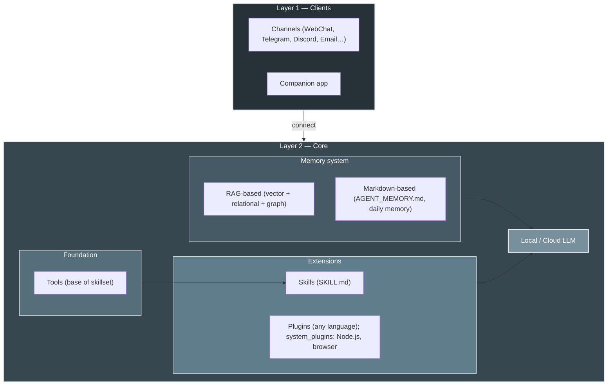

<p align="center">
  
</p>

# HomeClaw

**HomeClaw**는 사용자 자신의 하드웨어에서 동작하는 **AI 어시스턴트**입니다. 각 설치는 하나의 자율 에이전트로, 이메일·Telegram·Discord·WebChat 등 이미 사용 중인 **채널**로 대화하고, **메모리**(RAG + 에이전트 메모리)와 컨텍스트를 유지하며, **내장·외부 플러그인**과 **스킬**로 기능을 확장합니다. **클라우드 모델**(OpenAI, **Google Gemini**, DeepSeek, Anthropic 등 LiteLLM 경유) 또는 **로컬 모델**(llama.cpp, GGUF), 또는 **둘 다** 사용해 능력과 비용을 조절할 수 있습니다. **멀티모달**(이미지·오디오·비디오)은 로컬·클라우드 모두 지원합니다. **Flutter 동반 앱**(Mac, Windows, iPhone, Android)으로 어디서나 쉽게 사용할 수 있고, **멀티 에이전트**는 HomeClaw 인스턴스를 여러 개 실행하면 됩니다. HomeClaw는 **사람을 위한**—분산형이고, 원할 때는 비공개이며, 완전히 사용자 제어 하에 있습니다.

**하이라이트**

- **동반 앱** — Flutter 기반으로 **Mac, Windows, iPhone, Android** 지원: 채팅, 음성, 첨부, **Manage Core**(앱에서 core.yml, user.yml 편집). 한 앱으로 모든 플랫폼.
- **메모리** — **RAG**(벡터 + 관계형 + 선택적 그래프)와 **에이전트 메모리**(AGENT_MEMORY.md, 일일 메모리). 기본 Cognee 또는 자체 Chroma 백엔드.
- **플러그인** — **내장**(Python, `plugins/`)과 **외부**(어떤 언어든: Node.js, Go, Java, Python 등). **시스템 플러그인**(예: **homeclaw-browser**)은 Node.js로 작성; 어떤 언어로든 플러그인을 작성해 Core에 등록할 수 있습니다.
- **스킬** — **OpenClaw 스타일 스킬셋** 전체 지원: `config/skills/`(SKILL.md)의 워크플로; LLM이 도구와 선택적 `run_skill`로 작업 수행.
- **멀티 에이전트** — **여러 HomeClaw 인스턴스** 실행(사용자·용도별 등); 각 인스턴스는 하나의 에이전트로 자체 메모리와 설정을 가집니다.
- **클라우드·멀티모달** — **Gemini** 등 클라우드 모델이 잘 동작합니다. **멀티모달**(이미지·오디오·비디오)은 **로컬 모델**(예: Qwen2-VL + mmproj)과 **클라우드**(예: Gemini, GPT-4o) 모두 지원.

**다른 언어 / Other languages:** [English](README.md) | [简体中文](README_zh.md) | [日本語](README_jp.md)

**문서:** [https://allenpeng0705.github.io/HomeClaw/](https://allenpeng0705.github.io/HomeClaw/) — 설치·실행·Mix 모드·리포트·도구·플러그인 등 전체 문서는 MkDocs로 빌드되어 여기에서 제공됩니다. GitHub **`docs/`** 폴더에서 소스도 볼 수 있습니다.

---

## 목차

1. [HomeClaw란?](#1-homeclaw란)
2. [HomeClaw로 할 수 있는 것](#2-homeclaw로-할-수-있는-것)
3. [Mix 모드: 스마트 로컬/클라우드 라우팅](#3-mix-모드-스마트-로컬클라우드-라우팅) — 3계층 라우터와 강력한 제3계층
4. [HomeClaw 사용 방법](#4-homeclaw-사용-방법) — [원격 액세스(Tailscale, Cloudflare Tunnel)](#원격-액세스tailscale-cloudflare-tunnel) 포함
5. [동반 앱(Flutter)](#5-동반-앱flutter)
6. [시스템 플러그인: homeclaw-browser](#6-시스템-플러그인-homeclaw-browser)
7. [스킬과 플러그인: HomeClaw를 나에게 맞추기](#7-스킬과-플러그인-homeclaw를-나에게-맞추기)
8. [플러그인: HomeClaw 확장](#8-플러그인-homeclaw-확장)
9. [스킬: 워크플로로 HomeClaw 확장](#9-스킬-워크플로로-homeclaw-확장)
10. [감사의 말](#10-감사의-말)
11. [기여 및 라이선스](#11-기여-및-라이선스)
12. [연락처](#12-연락처)

---

## 1. HomeClaw란?

### 설계 철학

HomeClaw는 다음 원칙을 따릅니다.

- **클라우드와 로컬 모델** — 코어는 사용자 기기에서 실행됩니다. **클라우드 모델**(LiteLLM: OpenAI, Gemini, DeepSeek 등) 또는 **로컬 모델**(llama.cpp, GGUF), 또는 둘 다 사용할 수 있으며, 능력과 비용을 위해 함께 동작합니다. 데이터를 집에 두려면 로컬만, 규모와 기능을 원하면 클라우드를 사용하세요.
- **채널 무관** — 동일한 Core가 모든 채널을 제공합니다. WebChat, Telegram, 이메일, Discord 중 어떤 것으로 말하든 AI는 하나의 에이전트, 하나의 메모리, 하나의 도구·플러그인 세트입니다.
- **모듈화** — LLM 계층, 메모리, 채널, 플러그인, 도구는 분리되어 있습니다. 클라우드/로컬 모델을 바꾸고, 스킬·플러그인을 켜거나 끄고, 코어 로직을 바꾸지 않고 새 채널을 추가할 수 있습니다.
- **확장 가능** — **플러그인**은 날씨·뉴스·이메일·커스텀 API 같은 단일 기능을 추가합니다. **스킬**은 LLM이 도구를 사용해 실행하는 애플리케이션형 워크플로(예: “소셜 미디어 에이전트”)를 추가합니다. 둘 다 HomeClaw를 필요에 맞게 조정할 수 있게 합니다.

### 아키텍처

**채널**과 **동반 앱**이 **Core**에 연결됩니다. Core 내부: **메모리**(RAG + Markdown 파일), **도구**(스킬 기반), **스킬과 플러그인**(RAG에 등록, 요청별 필터), **LLM**(클라우드 또는 로컬). [전체 설계 →](docs_design/ToolsSkillsPlugins.md) · [문서 사이트 →](https://allenpeng0705.github.io/HomeClaw/)

**아키텍처(레이어)**



- **레이어 1:** 채널 + 동반 앱 → Core. **레이어 2:** 메모리(RAG + Markdown), 도구, 스킬과 플러그인(RAG 내, 필터됨), 로컬/클라우드 LLM. [도구 vs 스킬 vs 플러그인 →](docs_design/ToolsSkillsPlugins.md) · **시스템 개요 및 데이터 흐름**은 [문서 소개 페이지](https://allenpeng0705.github.io/HomeClaw/)를 참조하세요.

---

## 2. HomeClaw로 할 수 있는 것

### 채널과 다중 사용자

**WebChat**, **CLI**, **Telegram**, **Discord**, **이메일** 등으로 HomeClaw와 대화—모두 같은 Core를 사용합니다. `config/user.yml`에 사용자 추가(name, id, email, im, phone). [채널 →](https://allenpeng0705.github.io/HomeClaw/channels/) · [다중 사용자 →](docs_design/MultiUserSupport.md)

### 클라우드와 로컬 모델

**클라우드**(LiteLLM: OpenAI, Gemini, DeepSeek 등) 또는 **로컬**(llama.cpp, GGUF), 또는 둘 다. `config/core.yml`에서 `main_llm`과 `embedding_llm` 설정. [모델 →](https://allenpeng0705.github.io/HomeClaw/models/) · [원격 액세스](#원격-액세스tailscale-cloudflare-tunnel)(Tailscale, Cloudflare Tunnel)로 동반 앱에서 사용.

---

## 3. Mix 모드: 스마트 로컬/클라우드 라우팅

**Mix 모드**에서는 HomeClaw가 **요청마다** **로컬** 또는 **클라우드** 메인 모델을 선택합니다. **3계층 라우터**가 도구·플러그인 주입 전에 실행되며 사용자 메시지만 참조하므로, 한 턴 전체에서 동일한 모델이 사용됩니다—간단·비공개 작업은 로컬, 검색·무거운 추론은 클라우드. **리포트**(경로 결정 및 클라우드 사용량)는 REST API 또는 내장 **usage_report** 도구로 확인할 수 있습니다.

### 3계층 구성

| 계층 | 이름 | 역할 |
|------|------|------|
| **1** | **휴리스틱** | 키워드 및 긴 입력 규칙(YAML). 예: "스크린샷", "잠금" → 로컬; "웹 검색", "최신 뉴스" → 클라우드. 먼저 매칭된 쪽이 적용. |
| **2** | **시맨틱** | 임베딩 유사도: 사용자 메시지를 **로컬/클라우드** 예문과 비교. 말바꿈·의도 파악에 적합. |
| **3** | **분류기 또는 퍼플렉시티** | L1·L2에서 결정되지 않을 때: **소형 로컬 모델**이 "Local vs Cloud?"에 답하는(**classifier**), 또는 **메인 로컬 모델**로 몇 토큰 + **logprobs**를 얻어—신뢰도가 높으면(평균 logprob 높음) 로컬, 낮으면 클라우드(**perplexity**). |

**강력한 제3계층**: 메인 로컬 모델이 강할 때 제3계층을 **perplexity** 모드로 둘 수 있습니다. 같은 메인 모델이 "자신감"으로 투표합니다. Core가 llama.cpp 서버에 짧은 프로브(예: 5토큰, `logprobs=true`)를 보내 평균 로그 확률을 계산합니다. 임계값(예: -0.6) 이상이면 **로컬**, 미만이면 **클라우드**. 별도 분류기 모델 없이 메인 모델 자신의 불확실성으로 판단합니다. 로컬이 약하면 **classifier** 모드(소형 0.5B 판사 모델)를 사용하세요.

**활성화**: `config/core.yml`에서 `main_llm_mode: mix`, `main_llm_local`, `main_llm_cloud`, `hybrid_router` 설정. 사용법·리포트 보기·전체 파라미터 튜닝은 **[Mix mode and reports](https://allenpeng0705.github.io/HomeClaw/mix-mode-and-reports/)** 참조.

---

## 4. HomeClaw 사용 방법

**단계별 가이드**(설치, 설정, 로컬/클라우드 모델, 메모리, 도구, 워크스페이스, 테스트, 플러그인, 스킬)는 **[HOW_TO_USE_kr.md](HOW_TO_USE_kr.md)**([English](HOW_TO_USE.md) | [中文](HOW_TO_USE_zh.md) | [日本語](HOW_TO_USE_jp.md) 참조).

### 지원 플랫폼

HomeClaw는 **macOS**, **Windows**, **Linux**에서 동작합니다. 필요 사항:

- **Python** 3.10–3.12(권장).
- **로컬 GGUF 모델**: 기기 유형에 맞게 **llama.cpp 바이너리 배포**를 `llama.cpp-master/<platform>/`(mac/, win_cuda/, linux_cpu/ 등)에 복사; 메인 및 임베딩 로컬 모델 모두에 사용. `llama.cpp-master/README.md` 참조. 그 다음 설정에 따라 서버를 시작합니다.
- **클라우드 모델**: 네트워크와 올바른 API 키(환경 변수)만 있으면 됩니다.

### 빠른 시작(실행, 설정, 테스트)

1. **클론 및 설치**

   ```bash
   git clone <repo_url>
   cd <your_clone_folder>   # 예: HomeClaw
   pip install -r requirements.txt
   ```

2. **설정**

   - **Core**: `config/core.yml` — host, port(기본 9000), `main_llm`, `embedding_llm`, `use_tools`, `use_skills`, `use_memory` 등.
   - **사용자**: `config/user.yml` — 사용자 허용 목록 및 채널 식별자(email, im, phone).
   - **채널**: `channels/.env.example`을 `channels/.env`로 복사; `CORE_URL`(예: `http://127.0.0.1:9000`) 및 봇 토큰(예: `TELEGRAM_BOT_TOKEN`) 설정. 채널별로 `channels/README.md` 참조.

3. **모델**

   - **클라우드**: `config/core.yml`의 `cloud_models`에 항목 추가 및 `api_key_name` 설정; 환경 변수 설정(예: `OPENAI_API_KEY`, `GEMINI_API_KEY`, `DEEPSEEK_API_KEY`). `main_llm`을 예: `cloud_models/OpenAI-GPT4o` 또는 `cloud_models/Gemini-2.5-Flash`로.
   - **로컬**: 기기 유형에 맞게 **llama.cpp 바이너리 배포**를 `llama.cpp-master/`에 복사(`llama.cpp-master/README.md` 참조); 메인 및 임베딩 로컬 모델 모두에 사용. GGUF 모델(예: Hugging Face)을 `models/`에 다운로드; `config/core.yml`의 `local_models`에서 path, host, port 설정. 사용하는 모델마다 llama.cpp 서버 시작. 또는 **Ollama**: Ollama 실행 후 CLI에서 `llm download`와 `llm set` 사용. `main_llm`을 예: `local_models/main_vl_model_4B`로.
   - **둘 다**: 클라우드와 로컬을 역할별로 사용(예: 클라우드 채팅 + 로컬 임베딩)하거나 전환; 능력과 비용을 위해 함께 사용할 수 있습니다.

4. **Core 실행**

   ```bash
   python -m core.core
   ```

   또는 대화형 CLI(Core + 내장 채널):

   ```bash
   python -m main start
   ```

   **Core와 모든 시스템 플러그인 한 번에 실행**: `config/core.yml`에서 `system_plugins_auto_start: true` 설정. Core가 `system_plugins/`(예: homeclaw-browser)의 각 플러그인을 시작하고 자동 등록. [§6 시스템 플러그인: homeclaw-browser](#6-시스템-플러그인-homeclaw-browser) 및 **system_plugins/README.md** 참조.

5. **채널 실행**(다른 터미널)

   ```bash
   python -m channels.run webchat
   ```

   http://localhost:8014(또는 표시된 포트) 열기. 필요 시 Telegram, Discord, Slack 등 실행.

6. **테스트**

   - WebChat 또는 CLI에서 메시지 전송. 도구/스킬/플러그인은 **docs_design/ToolsAndSkillsTesting.md** 및 **docs_design/RunAndTestPlugins.md** 참조.
   - 설정 및 LLM 연결 확인: `python -m main doctor`.

### 원격 액세스(Tailscale, Cloudflare Tunnel)

**동반 앱** 또는 WebChat을 다른 네트워크(예: 휴대폰 셀룰러, 외부 노트북)에서 사용하려면 클라이언트가 Core에 도달할 수 있도록 합니다. 일반적인 두 가지 방법:

**Tailscale(홈 + 모바일 권장)**

1. Core를 실행하는 머신과 휴대폰/노트북에 [Tailscale](https://tailscale.com/download) 설치; 같은 계정으로 로그인.
2. Core 호스트에서 Tailscale IP 확인: `tailscale ip`(예: `100.x.x.x`).
3. 동반 앱 **설정**에서 **Core URL**을 `http://100.x.x.x:9000`(본인 IP로 교체)로 설정. 선택: **Tailscale Serve**로 HTTPS: `tailscale serve https / http://127.0.0.1:9000` 실행 후 Core URL을 Tailscale이 보여 주는 URL(예: `https://your-machine.your-tailnet.ts.net`)로 설정.
4. Core에 `auth_enabled: true`인 경우 앱에 같은 **API key** 설정.

**Cloudflare Tunnel(공개 URL)**

1. Core 호스트에 [cloudflared](https://developers.cloudflare.com/cloudflare-one/connections/connect-apps/install-and-setup/tunnel-guide/local/) 설치.
2. 실행: `cloudflared tunnel --url http://127.0.0.1:9000` 후 URL(예: `https://xxx.trycloudflare.com`) 복사.
3. Core 인증 활성화: `config/core.yml`에서 `auth_enabled: true`와 `auth_api_key: "<긴-랜덤-키>"` 설정.
4. 동반 앱 **설정**에서 **Core URL**을 tunnel URL로, **API key**를 일치시킵니다.

앱에는 **Core URL**과 선택적 **API key**만 필요합니다; Tailscale이나 Cloudflare SDK는 앱에 포함되지 않습니다. 자세한 내용(SSH 터널, 인증)은 문서 **[원격 액세스](https://allenpeng0705.github.io/HomeClaw/remote-access/)** 및 **docs_design/RemoteAccess.md**를 참조하세요.

### 더 보기: 모델, DB, CLI, 플랫폼

- **CLI**(`python -m main start`): `llm` / `llm set` / `llm cloud`, `channel list` / `channel run <name>`, `reset`. [HOW_TO_USE_kr.md](HOW_TO_USE_kr.md)
- **로컬 GGUF** 및 **클라우드(OpenAI, Gemini 등)**: [모델 문서](https://allenpeng0705.github.io/HomeClaw/models/) · 설정은 `config/core.yml`.
- **Postgres, Neo4j, 엔터프라이즈 벡터 DB**: [MemoryAndDatabase.md](docs_design/MemoryAndDatabase.md)
- **Windows**(Visual C++ Build Tools, WeChat): [Install VSBuildTools](https://github.com/bycloudai/InstallVSBuildToolsWindows) · **중국**(pip 미러): [getting-started](https://allenpeng0705.github.io/HomeClaw/getting-started/).

---

## 5. 동반 앱(Flutter)

**동반 앱**은 Flutter 기반 **Mac, Windows, iPhone, Android** 클라이언트: 채팅, 음성, 첨부, **Manage Core**(앱에서 core.yml, user.yml 편집). [동반 앱 문서](https://allenpeng0705.github.io/HomeClaw/companion-app/) · [소스에서 빌드](clients/homeclaw_companion/README.md)

**빠른 사용**: (1) `clients/homeclaw_companion/` 또는 빌드에서 앱 가져오기. (2) **설정** → **Core URL** 설정(같은 기기면 `http://127.0.0.1:9000`, 원격이면 [Tailscale](#원격-액세스tailscale-cloudflare-tunnel) / [Cloudflare Tunnel](#원격-액세스tailscale-cloudflare-tunnel)). (3) **config/user.yml**에 사용자 추가(또는 **Manage Core** → 사용자). (4) 채팅; **Manage Core**로 설정 편집. 모든 채널과 앱이 같은 Core와 메모리를 사용합니다.

---

## 6. 시스템 플러그인: homeclaw-browser

**homeclaw-browser**(Node.js)는 `system_plugins/homeclaw-browser`에 있음: WebChat UI는 http://127.0.0.1:3020/, 브라우저 자동화(LLM이 URL 열기·클릭·입력), Canvas, Nodes. `config/core.yml`에서 `system_plugins_auto_start: true`로 설정하면 Core와 함께 시작하거나, `node server.js`와 `node register.js`를 수동 실행. [system_plugins/README.md](system_plugins/README.md) · [homeclaw-browser README](system_plugins/homeclaw-browser/README.md) · [§8 플러그인](#8-플러그인-homeclaw-확장)

---

## 7. 스킬과 플러그인: HomeClaw를 나에게 맞추기

**도구**(파일, 메모리, 웹 검색, cron, 브라우저), **플러그인**(Weather, News, Mail 등), **스킬**(SKILL.md의 워크플로)로 에이전트가 답변·기억·플러그인 라우팅·워크플로 실행을 합니다. 자연스럽게 질문하면 LLM이 도구·스킬·플러그인을 선택합니다. [ToolsSkillsPlugins.md](docs_design/ToolsSkillsPlugins.md)

---

## 8. 플러그인: HomeClaw 확장

**내장 플러그인**(Python): `plugins/<Name>/`에 plugin.yaml, config.yml, plugin.py; Core 시작 시 자동 발견. **외부 플러그인**(어떤 언어든): HTTP 서버(`GET /health`, `POST /run`) 실행, `POST /api/plugins/register`로 등록; Core가 내장과 동일하게 라우팅. [PluginStandard.md](docs_design/PluginStandard.md) · [PluginsGuide.md](docs_design/PluginsGuide.md) · [examples/external_plugins/](examples/external_plugins/README.md)

---

## 9. 스킬: 워크플로로 HomeClaw 확장

**스킬**은 `config/skills/` 아래 폴더로 **SKILL.md**(이름, 설명, 워크플로)를 포함합니다. LLM은 "사용 가능한 스킬"을 보고 도구(또는 **run_skill**로 스크립트)로 실행합니다. `config/core.yml`에서 `use_skills: true` 설정. [SkillsGuide.md](docs_design/SkillsGuide.md) · [ToolsSkillsPlugins.md](docs_design/ToolsSkillsPlugins.md)

---

## 10. 감사의 말

HomeClaw는 다음 두 프로젝트에 영감을 받았습니다.

- **GPT4People** — 작성자의 이전 프로젝트로, 분산·사람 중심 AI와 채널 기반 상호작용을 탐구했습니다. HomeClaw의 많은 아이디어—로컬 우선 에이전트, 채널, 메모리, "사람을 위한" AI 비전—는 여기서 나왔습니다.
- **OpenClaw** — 자매 생태계(게이트웨이, 확장, 채널, 프로바이더). OpenClaw와 HomeClaw는 비슷한 정신을 공유합니다: 사용자가 실행·커스터마이즈할 수 있는 확장 가능한 채널 기반 AI. OpenClaw의 게이트웨이/확장 모델과 HomeClaw의 Core/플러그인 모델의 대비가 HomeClaw 설계를 명확히 했습니다(**docs_design/ToolsSkillsPlugins.md** §2.8 참조).

GPT4People과 OpenClaw에 기여한 모든 분, 그리고 llama.cpp, LiteLLM, Cognee 및 수많은 채널과 도구를 지탱하는 오픈소스 커뮤니티에 감사드립니다.

---

## 11. 기여 및 라이선스

- **기여** — 이슈, 풀 리퀘스트, 논의를 환영합니다. **CONTRIBUTING.md**를 참조하세요.
- **라이선스** — 이 프로젝트는 **Apache License 2.0**입니다. **LICENSE** 파일을 참조하세요.

### 로드맵(요약)

**완료**

- **Mix 모드** — 3계층 라우터(휴리스틱 → 시맨틱 → 분류기 또는 퍼플렉시티)로 요청마다 로컬/클라우드 선택. 리포트(API + **usage_report** 도구)로 비용·튜닝. 자세한 내용은 [Mix mode and reports](https://allenpeng0705.github.io/HomeClaw/mix-mode-and-reports/) 참조.

**이후**

- 더 간단한 설정 및 온보딩(`python -m main onboard`, `python -m main doctor`).
- 더 많은 채널 및 플랫폼 통합.
- 플러그인/스킬 발견 및 멀티 에이전트 강화.
- 선택: 디렉토리, 신뢰/평판, 에이전트 간 블록체인 검증.

긴 여정의 시작입니다. 관심 가져 주시고 함께해 주세요.

---

## 12. 연락처

질문이나 피드백이 있으시면 연락 주세요.

- **이메일:** [shilei.peng@qq.com](mailto:shilei.peng@qq.com)
- **WeChat:** shileipeng
