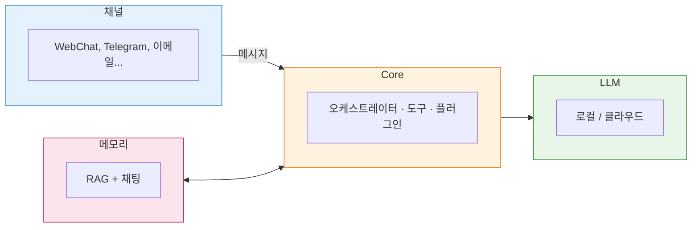
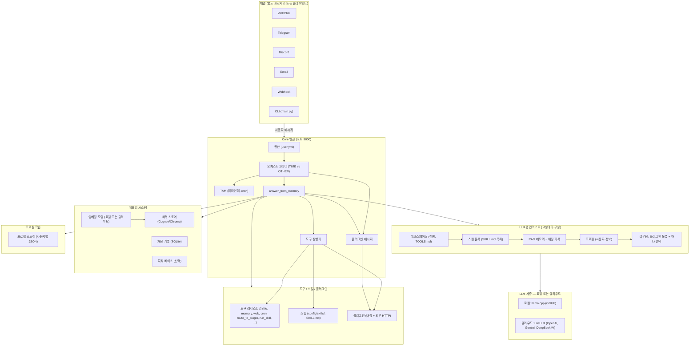
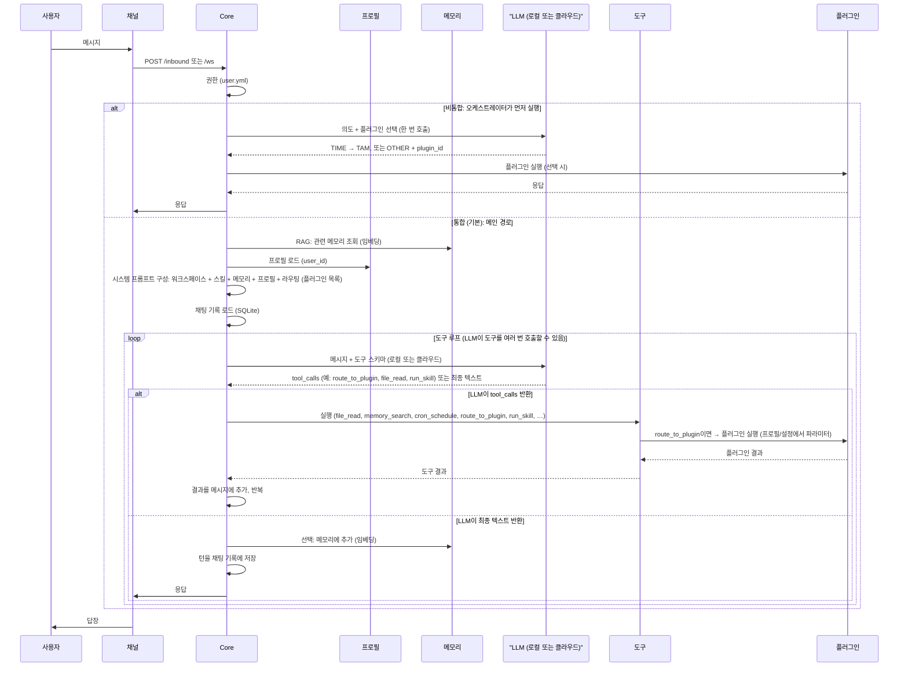

<p align="center">
  
</p>

# HomeClaw

**HomeClaw**는 사용자 자신의 하드웨어에서 동작하는 **로컬 우선 AI 어시스턴트**입니다. 각 설치는 하나의 자율 에이전트로, 이메일·Telegram·Discord·WebChat 등 이미 사용 중인 **채널**로 대화하고, **메모리**(RAG + 에이전트 메모리)와 컨텍스트를 유지하며, **내장·외부 플러그인**과 **스킬**로 기능을 확장합니다. **로컬 모델**(llama.cpp, GGUF)만 사용하거나 **클라우드 모델**(OpenAI, **Google Gemini**, DeepSeek, Anthropic 등)을 섞어 쓸 수 있으며, **멀티모달**(이미지·오디오·비디오)은 로컬·클라우드 모두 지원합니다. **Flutter 동반 앱**(Mac, Windows, iPhone, Android)으로 어디서나 쉽게 사용할 수 있고, **멀티 에이전트**는 HomeClaw 인스턴스를 여러 개 실행하면 됩니다. HomeClaw는 **사람을 위한**—분산형이고, 원할 때는 비공개이며, 완전히 사용자 제어 하에 있습니다.

**하이라이트:** **동반 앱**(Flutter, 전 플랫폼) | **메모리**(RAG + 에이전트 메모리) | **플러그인**(내장 + 외부, **어떤 언어든** Node.js, Go, Java, Python 등) | **OpenClaw 스킬셋** | **멀티 에이전트**(다중 인스턴스) | **클라우드·멀티모달**(Gemini 등, 로컬·클라우드 모두 동작 확인)

**다른 언어 / Other languages:** [English](README.md) | [简体中文](README_zh.md) | [日本語](README_jp.md)

**문서:** [https://allenpeng0705.github.io/HomeClaw/](https://allenpeng0705.github.io/HomeClaw/)

---

## 목차

1. [HomeClaw란?](#1-homeclaw란)
2. [HomeClaw로 할 수 있는 것](#2-homeclaw로-할-수-있는-것)
3. [HomeClaw 사용 방법](#3-homeclaw-사용-방법)
4. [스킬과 플러그인: HomeClaw를 나에게 맞추기](#4-스킬과-플러그인-homeclaw를-나에게-맞추기)
5. [플러그인: HomeClaw 확장](#5-플러그인-homeclaw-확장)
6. [스킬: 워크플로로 HomeClaw 확장](#6-스킬-워크플로로-homeclaw-확장)
7. [감사의 말](#7-감사의-말)
8. [기여 및 라이선스](#8-기여-및-라이선스)

---

## 1. HomeClaw란?

### 설계 철학

HomeClaw는 다음 원칙을 따릅니다.

- **로컬 우선** — 코어는 사용자 기기에서 실행됩니다. 대화와 메모리를 기기에 두려면 로컬 LLM(llama.cpp, GGUF)만 사용할 수 있습니다.
- **채널 무관** — 동일한 Core가 모든 채널을 제공합니다. WebChat, Telegram, 이메일, Discord 중 어떤 것으로 말하든 AI는 하나의 에이전트, 하나의 메모리, 하나의 도구·플러그인 세트입니다.
- **모듈화** — LLM 계층, 메모리, 채널, 플러그인, 도구는 분리되어 있습니다. 로컬/클라우드 모델을 바꾸고, 스킬·플러그인을 켜거나 끄고, 코어 로직을 바꾸지 않고 새 채널을 추가할 수 있습니다.
- **확장 가능** — **플러그인**은 날씨·뉴스·이메일·커스텀 API 같은 단일 기능을 추가합니다. **스킬**은 LLM이 도구를 사용해 실행하는 애플리케이션형 워크플로(예: “소셜 미디어 에이전트”)를 추가합니다. 둘 다 HomeClaw를 필요에 맞게 조정할 수 있게 합니다.

### 모듈과 구조

HomeClaw는 **Core**(단일 프로세스), **채널**(별도 프로세스 또는 HTTP 클라이언트), **LLM 계층**(로컬 및/또는 클라우드), **메모리**(RAG + 채팅 기록), **프로필**(사용자별 학습), **플러그인** + **도구** + **스킬**로 구성됩니다. 아래 다이어그램은 모든 모듈과 데이터 흐름, LLM(로컬 또는 클라우드) 사용 방식, 도구·스킬·플러그인 선택 방식을 보여 줍니다.

**간단 개요**



**시스템 개요: 모든 모듈**



**데이터 흐름: 메시지 처리 및 LLM 사용 위치**



**다이어그램 요약**

| 항목 | 다이어그램에서의 위치 |
|--------|-------------------|
| **LLM: 로컬 또는 클라우드** | 첫 번째 다이어그램의 **LLM 계층**; 시퀀스 다이어그램의 **LLM (로컬 또는 클라우드)**. Core는 하나의 OpenAI 호환 API를 호출하며, 그 API는 **로컬**(llama.cpp, GGUF) 또는 **클라우드**(LiteLLM → OpenAI, Gemini, DeepSeek 등)가 제공합니다. 메인과 임베딩 모델은 각각 로컬/클라우드를 선택할 수 있습니다. |
| **메모리 시스템** | **메모리** 서브그래프: 벡터 스토어(Cognee 또는 Chroma), 채팅 기록(SQLite), 선택적 지식 베이스. **RAG**: 임베딩 모델이 쿼리와 메모리를 벡터화하고, 관련 청크를 가져와 시스템 프롬프트에 주입합니다. |
| **프로필 학습** | **프로필** 서브그래프: 사용자별 JSON(예: `database/profiles/<user_id>.json`). 요청마다 로드되어 **"사용자 정보"**로 프롬프트에 주입됩니다. 개인화와 플러그인 파라미터 해석(`profile_key`)에 사용됩니다. |
| **도구 / 스킬 / 플러그인 선택** | **컨텍스트**에는 워크스페이스(TOOLS.md), **스킬 블록**(SKILL.md 스킬 목록), **라우팅 블록**(플러그인 목록 + "하나 선택: 시간 도구, route_to_tam, route_to_plugin, run_skill, 기타 도구")이 포함됩니다. **도구 레지스트리**가 모든 도구(file_read, memory_search, route_to_plugin, run_skill 등)를 보관합니다. **LLM**이 이 컨텍스트를 보고 호출할 도구(또는 텍스트로 답할지)를 선택합니다. 선택은 **LLM**이 프롬프트와 도구 스키마에 따라 수행하며, 별도 "선택기" 서비스는 없습니다. |

- **채널** — Email, Matrix, Tinode, WeChat, WhatsApp, Telegram, Discord, Slack, WebChat, webhook, Google Chat, Signal, iMessage, Teams, Zalo, Feishu, DingTalk, BlueBubbles. 각 채널은 HTTP(`/inbound`, `/process`) 또는 WebSocket(`/ws`)로 Core에 연결합니다. [채널](#2-homeclaw로-할-수-있는-것) 및 `channels/README.md` 참조.
- **Core** — 단일 FastAPI 앱: 권한 검사(`config/user.yml`), 오케스트레이터(의도 TIME vs OTHER; 플러그인 선택), TAM(리마인더, cron), 도구 실행(파일, 메모리, 웹 검색, 브라우저, cron, `route_to_plugin`, `run_skill`), 플러그인 호출, 채팅 + RAG. 설정: `config/core.yml`.
- **LLM 계층** — Core가 사용하는 단일 OpenAI 호환 API. **로컬 모델**(llama.cpp 서버, GGUF) 및/또는 **클라우드 모델**(LiteLLM: OpenAI, Google Gemini, DeepSeek, Anthropic, Groq, Mistral 등)로 제공됩니다. 메인과 임베딩 모델은 독립적으로 선택할 수 있습니다. `config/core.yml`(`local_models`, `cloud_models`, `main_llm`, `embedding_llm`) 참조.
- **메모리** — **Cognee**(기본) 또는 자체 **Chroma** 백엔드: 벡터 + 관계형 + 선택적 그래프. RAG와 채팅 기록에 사용됩니다. `docs_design/MemoryAndDatabase.md` 참조.
- **프로필** — 사용자별 JSON 스토어(예: `database/profiles/`). 요청마다 로드되어 "사용자 정보"로 프롬프트에 주입됩니다. 개인화와 플러그인 파라미터 해석에 사용됩니다. `docs_design/UserProfileDesign.md` 참조.
- **플러그인** — 내장(Python, `plugins/`) 및 외부(HTTP, 모든 언어). 요청이 일치하면 Core가 사용자 의도를 플러그인(예: Weather, News, Mail)으로 라우팅합니다. [§5 플러그인](#5-플러그인-homeclaw-확장) 참조.
- **스킬** — `config/skills/` 아래 폴더와 `SKILL.md`(이름, 설명, 워크플로). LLM이 도구로 스킬 워크플로를 수행하며, 선택적으로 `run_skill`로 스크립트를 실행합니다. [§6 스킬](#6-스킬-워크플로로-homeclaw-확장) 참조.

전체 설계는 **Design.md**를, 도구·스킬·플러그인 차이는 **docs_design/ToolsSkillsPlugins.md**를 참조하세요.

---

## 2. HomeClaw로 할 수 있는 것

### 다양한 채널로 연결

다음 방식으로 HomeClaw와 대화할 수 있습니다.

- **WebChat** — WebSocket 기반 브라우저 UI(`python -m channels.run webchat`, 기본 http://localhost:8014).
- **CLI** — 터미널 대화형 채팅(`python -m main start`).
- **Telegram, Discord, Slack** — 인바운드 봇: `channels/<name>/.env`에 봇 토큰 설정, `config/user.yml`에 사용자 ID 추가, `python -m channels.run telegram`(또는 `discord`, `slack`) 실행.
- **Email, Matrix, Tinode, WeChat, WhatsApp** — 전체 채널; 설정은 `channels/README.md` 참조.
- **Webhook** — 어떤 클라이언트든 webhook의 `/message`로 POST하여 응답을 받을 수 있습니다(Core `/inbound`로 중계). Core에 직접 접근할 수 없을 때(예: NAT 뒤) 유용합니다.

모든 채널이 같은 Core를 사용합니다: 하나의 에이전트, 하나의 메모리, 하나의 플러그인·스킬 세트. **docs_design/RunAndTestPlugins.md**에서 빠른 실행·테스트 흐름을 참조하세요.

### 다중 사용자 지원

Core는 `config/user.yml`의 **허용 목록**을 사용합니다. 각 사용자에는 다음이 있습니다.

- **name**, 선택 **id**(시스템 사용자 id; 기본값은 name).
- **email** — 이메일 주소 목록(이메일 채널용).
- **im** — `"<channel>:<id>"` 목록(예: `telegram_<chat_id>`, `discord_<user_id>`, `matrix:@user:domain`).
- **phone** — SMS/전화 채널용.
- **permissions** — 선택(예: IM, EMAIL); 비어 있으면 모두 허용.

목록에 있는 사용자만 Core에 메시지를 보낼 수 있습니다. 채팅, 메모리, 지식 베이스, 프로필 데이터는 이 시스템 사용자 id로 구분됩니다. **docs_design/MultiUserSupport.md**와 **docs_design/UserProfileDesign.md**를 참조하세요.

### 보안: 로컬 vs 클라우드 모델

- **로컬 모델** — 사용자 기기에서 llama.cpp 서버로 GGUF 모델을 실행합니다. 데이터는 기기에 남고, 제3자 API는 사용하지 않습니다. `config/core.yml`의 `local_models`에서 설정하고, `main_llm`과 `embedding_llm`을 예: `local_models/Qwen3-14B-Q5_K_M`으로 설정합니다.
- **클라우드 모델** — `config/core.yml`의 `cloud_models`에서 LiteLLM을 사용합니다. `api_key_name`(예: `OPENAI_API_KEY`, `GEMINI_API_KEY`, `DEEPSEEK_API_KEY`)과 해당 환경 변수를 설정합니다. HomeClaw는 선택한 제공자에게 프롬프트를 보내며, 개인정보와 약관은 해당 제공자에 따릅니다.
- **혼합** — 채팅에 로컬, 임베딩에 클라우드(또는 그 반대)를 쓸 수 있습니다. CLI의 `llm set` / `llm cloud` 또는 `config/core.yml`의 `main_llm` / `embedding_llm` 편집으로 전환합니다.
- **원격 접근** — Core를 인터넷에 노출할 때(예: WebChat 또는 봇용) `config/core.yml`에서 **auth**를 켭니다: `auth_enabled: true`와 `auth_api_key: "<secret>"`. 클라이언트는 `/inbound`와 `/ws`에서 `X-API-Key` 또는 `Authorization: Bearer <key>`를 보내야 합니다. **docs_design/RemoteAccess.md** 참조.

지원 클라우드 제공자(LiteLLM 경유)에는 **OpenAI**(GPT-4o 등), **Google Gemini**, **DeepSeek**, **Anthropic**, **Groq**, **Mistral**, **xAI**, **Cohere**, **Together AI**, **OpenRouter**, **Perplexity** 등이 있습니다. `config/core.yml`과 [LiteLLM 문서](https://docs.litellm.ai/docs_design/providers)를 참조하세요.

---

## 3. HomeClaw 사용 방법

**단계별 가이드**（설치, 설정, 로컬/클라우드 모델, 메모리, 도구, 워크스페이스, 테스트, 플러그인, 스킬)는 **[HOW_TO_USE_kr.md](HOW_TO_USE_kr.md)** 참조 ([English](HOW_TO_USE.md) | [简体中文](HOW_TO_USE_zh.md) | [日本語](HOW_TO_USE_jp.md) 있음).

### 지원 플랫폼

HomeClaw는 **macOS**, **Windows**, **Linux**에서 실행됩니다. 필요 사항:

- **Python** 3.10–3.12(권장).
- **로컬 GGUF 모델**: **llama.cpp** 서버(또는 번들된 `llama.cpp-master`를 설정에 따라 시작).
- **클라우드 모델**: 네트워크와 올바른 API 키 환경 변수만 있으면 됩니다.

### 빠른 시작 (실행, 설정, 테스트)

1. **클론 및 설치**

   ```bash
   git clone <repo_url>
   cd <your_clone_folder>   # 예: HomeClaw 또는 GPT4All
   pip install -r requirements.txt
   ```

2. **설정**

   - **Core**: `config/core.yml` — host, port(기본 9000), `main_llm`, `embedding_llm`, `use_tools`, `use_skills`, `use_memory` 등.
   - **사용자**: `config/user.yml` — 사용자 허용 목록과 채널 식별자(email, im, phone).
   - **채널**: `channels/.env.example`을 `channels/.env`로 복사; `CORE_URL`(예: `http://127.0.0.1:9000`)과 각 봇 토큰(예: `TELEGRAM_BOT_TOKEN`) 설정. 채널별로 `channels/README.md` 참조.

3. **모델**

   - **로컬**: GGUF 모델(예: Hugging Face)을 `models/`에 넣고, `config/core.yml`의 `local_models`에서 path, host, port 설정. 사용하는 모델마다 llama.cpp 서버를 시작합니다. 또는 **Ollama**: Ollama를 실행한 뒤 CLI에서 `llm download`와 `llm set` 사용.
   - **클라우드**: `config/core.yml`의 `cloud_models`에 항목을 추가하고 `api_key_name` 설정; 환경 변수(예: `OPENAI_API_KEY`, `GEMINI_API_KEY`, `DEEPSEEK_API_KEY`) 설정. `main_llm`을 예: `cloud_models/OpenAI-GPT4o`로 설정.

4. **Core 실행**

   ```bash
   python -m core.core
   ```

   또는 대화형 CLI(Core + 내장 채널) 실행:

   ```bash
   python -m main start
   ```

5. **채널 실행**(다른 터미널에서)

   ```bash
   python -m channels.run webchat
   ```

   http://localhost:8014(또는 표시된 포트)를 엽니다. 필요하면 Telegram/Discord/Slack 등을 실행합니다.

6. **테스트**

   - WebChat 또는 CLI에서 메시지를 보냅니다. 도구/스킬/플러그인은 **docs_design/ToolsAndSkillsTesting.md**와 **docs_design/RunAndTestPlugins.md**를 참조하세요.
   - 설정과 LLM 연결 확인: `python -m main doctor`.

### 명령 (대화형 CLI, `python -m main start`)

- **llm** — 모델 목록; **llm set** — 로컬 모델 전환; **llm cloud** — 클라우드 LLM 설정; **llm download** — Ollama로 모델 가져오기.
- **channel** — 도움말; **channel list** — 채널 목록; **channel run &lt;name&gt;** — 백그라운드에서 채널 시작.
- **wechat user / whatsapp user / matrix user / email user** — 해당 채널 허용 사용자 설정.
- **reset** — 메모리와 기록 초기화(또는 Core API: `GET/POST http://127.0.0.1:9000/memory/reset`).

### 예: 로컬 GGUF 모델

GGUF 파일을 `models/`에 넣습니다. `config/core.yml`의 `local_models`에서 각 모델(및 임베딩용 하나)에 `id`, `path`, `host`, `port`를 정의합니다. `main_llm`과 `embedding_llm`을 예: `local_models/<id>`로 설정합니다. 해당 포트에서 llama.cpp 서버를 시작합니다. 모델 링크 예(최신은 Hugging Face 참조):

- **임베딩**(예: BGE-M3): [bge-m3-Q5_K_M.gguf](https://huggingface.co/gpustack/bge-m3-GGUF/blob/main/bge-m3-Q5_K_M.gguf)
- **채팅**: Qwen3-8B/14B/32B, Qwen2.5-7B/14B, Llama-3.2-3B/8B, GLM-4-9B/32B, Gemma-3-4B/12B/27B, DeepSeek-R1-Distill-Qwen-1.5B/7B/14B 등(Hugging Face에서 "GGUF" 검색 후 `local_models`에 path 설정).

**테스트 완료 조합**: 임베딩 **bge-m3-Q5_K_M.gguf**, 채팅 **Qwen3-14B-Q5_K_M.gguf**. 로컬 RAG 및 대화에 적합합니다.

### 개발자용 (Windows 참고)

- **Visual C++ Build Tools**가 Windows에서 일부 의존성에 필요할 수 있습니다. [Install Visual Studio Build Tools](https://github.com/bycloudai/InstallVSBuildToolsWindows) 참조.
- **WeChat 채널**: 지원 WeChat 버전과 설정은 CLI(`channel` 명령)에 나와 있습니다. `python -m channels.run wechat` 실행 후 `wechat user`로 허용 사용자를 설정합니다.

---

## 4. 스킬과 플러그인: HomeClaw를 나에게 맞추기

HomeClaw에는 **도구**(파일, 메모리, 웹 검색, cron, 브라우저 등), **플러그인**(예: Weather, News, Mail), **스킬**(SKILL.md에 설명된 워크플로)이 포함되어 있습니다. 이를 통해 다음을 할 수 있습니다.

- **답변과 기억** — 메인 LLM이 RAG(메모리)와 채팅 기록으로 답합니다. 도구나 자연어로 저장/상기할 수 있습니다.
- **한 가지에 집중** — 날씨, 뉴스, 이메일을 요청하면 오케스트레이터가 해당 **플러그인**으로 라우팅해 결과를 반환합니다.
- **워크플로 실행** — `config/core.yml`에서 **스킬**을 켭니다(`use_skills: true`). LLM은 "사용 가능한 스킬"을 보고, 스킬 지시에 따라 도구를 사용하거나 **run_skill**로 스크립트를 실행할 수 있습니다.
- **일정과 리마인더** — **TAM**(Time Awareness Module) 사용: "5분 후에 알려줘" 또는 "매일 9시"; 또는 `remind_me`, `record_date`, `cron_schedule` 같은 도구 사용.

플러그인이나 스킬을 이름으로 "호출"할 필요는 없습니다. 자연스럽게 요청하면, 의도가 맞을 때 플러그인으로 라우팅되고, 모델이 결정할 때 도구/스킬이 사용됩니다. LLM이 도구·스킬·플러그인을 어떻게 선택하는지는 **docs_design/ToolsSkillsPlugins.md**를 참조하세요.

---

## 5. 플러그인: HomeClaw 확장

**플러그인**은 단일 기능 모듈입니다: 하나의 플러그인 = 하나의 기능(예: 날씨, 뉴스, 메일, 커스텀 API).

### 내장 플러그인 (Python)

- `plugins/<Name>/`에 **plugin.yaml**(id, 설명, 능력), **config.yml**(API 키, 기본값), **plugin.py**(`BasePlugin` 상속 클래스)를 둡니다.
- Core가 시작 시 자동으로 발견합니다. 등록 단계 없음. 예: **Weather**(`plugins/Weather/`), **News**(`plugins/News/`), **Mail**(`plugins/Mail/`).
- LLM은 라우팅 블록에서 플러그인 목록을 보고, 사용자 의도가 맞을 때 **route_to_plugin(plugin_id)**를 호출합니다. Core가 플러그인을 실행하고 채널로 응답을 보냅니다.

### 외부 플러그인 (모든 언어)

- 별도 **HTTP 서버**(Node.js, Go, Java, Python 등)로 실행하며 다음을 구현합니다.
  - `GET /health` → 2xx
  - `POST /run`(또는 사용자 경로) → 본문 = PluginRequest JSON, 응답 = PluginResult JSON.
- **Core에 등록**: `POST http://<core>:9000/api/plugins/register`로 plugin id, name, description, `health_check_url`, `type: "http"`, `config`(base_url, path, timeout_sec), `capabilities` 전송.
- 등록 후 Core는 내장 플러그인처럼 사용자 서버로 라우팅합니다. **docs_design/PluginStandard.md**와 **docs_design/PluginsGuide.md** 참조.

### 예: 다국어 외부 플러그인

`examples/external_plugins/`에 다음을 제공합니다.

- **Python** — Quote(포트 3101), Time(포트 3102).
- **Node.js** — Quote(포트 3111).
- **Go** — Time(포트 3112).
- **Java** — Quote(포트 3113).

각 폴더에 README와 등록 스크립트가 있습니다. **examples/external_plugins/README.md**와 **docs_design/RunAndTestPlugins.md** 참조.

### 파라미터 수집

플러그인은 파라미터(예: 도시, 수신자)를 선언할 수 있습니다. Core는 **사용자 프로필**, **설정**, **사용자 메시지**에서 채울 수 있으며, 선택적 **confirm_if_uncertain**과 **use_default_directly_for**로 확인을 제어합니다. **docs_design/PluginsGuide.md**와 **docs_design/PluginParameterCollection.md** 참조.

---

## 6. 스킬: 워크플로로 HomeClaw 확장

**스킬**은 애플리케이션형 능력입니다: 각 스킬은 `config/skills/` 아래 **폴더**와 **SKILL.md**(이름, 설명, 도구 사용 방법에 대한 선택적 본문)로 구성됩니다.

- **역할** — LLM은 시스템 프롬프트에서 "사용 가능한 스킬"을 봅니다. 사용자 요청이 스킬 설명과 맞으면 LLM은 **도구**(file_read, web_search, browser, cron 등)로 워크플로를 수행합니다. 스킬에 **scripts/** 폴더가 있으면 LLM이 **run_skill(skill_name, script, ...)**로 스크립트(예: `run.sh`, `main.py`)를 실행할 수 있습니다.
- **별도 런타임 없음** — 스킬은 별도 프로세스에서 실행되지 않습니다. "런타임"은 메인 LLM + 도구 루프입니다. 스킬은 **도구 기반 워크플로**입니다.
- **활성화** — `config/core.yml`에서: `use_skills: true`, `skills_dir: config/skills`. 선택적으로 **skills_use_vector_search**로 쿼리와 유사한 스킬만 주입할 수 있습니다. **docs_design/SkillsGuide.md**와 **docs_design/ToolsSkillsPlugins.md** 참조.

예: "소셜 미디어 에이전트" 스킬은 브라우저와 cron으로 X/Twitter에 게시하는 방법을 설명할 수 있고, LLM이 그 지시에 따라 적절한 도구를 호출합니다.

---

## 7. 감사의 말

HomeClaw는 다음 두 프로젝트 없이는 존재할 수 없었습니다.

- **GPT4People** — 작성자의 이전 프로젝트로, 분산형·사람 중심 AI와 채널 기반 상호작용을 탐구했습니다. HomeClaw의 많은 아이디어—로컬 우선 에이전트, 채널, 메모리, "사람을 위한" AI 비전—는 여기서 나왔습니다.
- **OpenClaw** — 형제 격 에코시스템(게이트웨이, 확장, 채널, 제공자). OpenClaw와 HomeClaw는 확장 가능하고 채널 기반인, 사용자가 실행·맞춤 설정할 수 있는 AI라는 같은 정신을 공유합니다. OpenClaw의 게이트웨이/확장 모델과 HomeClaw의 코어/플러그인 모델의 대비가 HomeClaw 설계를 명확히 하는 데 도움이 되었습니다(**docs_design/ToolsSkillsPlugins.md** §2.7 참조).

GPT4People과 OpenClaw에 기여한 모든 분, 그리고 llama.cpp, LiteLLM, Cognee 및 수많은 채널과 도구를 지탱하는 오픈소스 커뮤니티에 감사드립니다.

---

## 8. 기여 및 라이선스

- **기여** — 이슈, 풀 리퀘스트, 논의를 환영합니다. **CONTRIBUTING.md**를 참조하세요.
- **라이선스** — 이 프로젝트는 **Apache License 2.0** 하에 라이선스됩니다. **LICENSE** 파일을 참조하세요.

### 로드맵 (요약)

- 더 쉬운 설정과 온보딩(`python -m main onboard`, `python -m main doctor`).
- 더 많은 채널과 플랫폼 연동.
- 플러그인/스킬 발견과 다중 에이전트 옵션 강화.
- 선택: 디렉터리, 신뢰/평판, 에이전트 간 블록체인 기반 검증.

긴 여정의 시작입니다. 계속 지켜봐 주시고 함께해 주세요.
