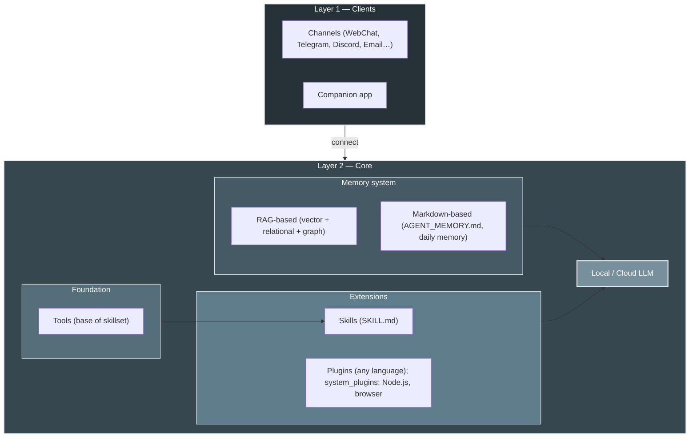

<p align="center">
  
</p>

# HomeClaw

**HomeClaw** 是一款运行在您自己硬件上的 **AI 助手**。每次安装都是一个自主智能体：通过您已有的渠道（邮件、Telegram、Discord、WebChat 等）与您对话，保持**记忆**（RAG + 智能体记忆）与上下文，并通过**内置与外部插件**和**技能**扩展能力。您可以使用**云端模型**（OpenAI、**Google Gemini**、DeepSeek、Anthropic 等，通过 LiteLLM）或**本地模型**（llama.cpp、GGUF），或**两者结合**以获得更好能力与成本——**多模态**（图像、音频、视频）在本地与云端均支持。**Flutter 伴侣应用**（Mac、Windows、iPhone、Android）让 HomeClaw 更易用。**多智能体**即运行多个 HomeClaw 实例。HomeClaw **为人们服务**——去中心化、按需隐私、完全由您掌控。

**亮点**

- **伴侣应用** — 基于 Flutter，支持 **Mac、Windows、iPhone、Android**：聊天、语音、附件，以及**管理 Core**（在应用中编辑 core.yml 和 user.yml）。一个应用，全平台。
- **记忆** — **RAG**（向量 + 关系 + 可选图）与**智能体记忆**（AGENT_MEMORY.md、每日记忆）。默认 Cognee 或自研 Chroma 后端。
- **插件** — **内置**（Python，位于 `plugins/`）与**外部**（任意语言：Node.js、Go、Java、Python 等）。**系统插件**（如 **homeclaw-browser**）为 Node.js 编写；您可用任意语言编写插件并向 Core 注册。
- **技能** — 完整支持 **OpenClaw 风格技能集**：工作流位于 `skills/`（SKILL.md）；LLM 使用工具与可选 `run_skill` 完成任务。
- **多智能体** — 运行**多个 HomeClaw 实例**（如按用户或场景）；每个实例为一个智能体，拥有自己的记忆与配置。
- **云端与多模态** — **Gemini** 等云端模型表现良好。**多模态**（图像、音频、视频）在**本地模型**（如 Qwen2-VL + mmproj）与**云端**（如 Gemini、GPT-4o）均支持。

**其他语言 / Other languages:** [English](README.md) | [日本語](README_jp.md) | [한국어](README_kr.md)

**文档:** [https://allenpeng0705.github.io/HomeClaw/](https://allenpeng0705.github.io/HomeClaw/) — 完整文档（安装、运行、Mix 模式、报告、工具、插件）由 MkDocs 构建并发布于此。您也可以在 GitHub 的 **`docs/`** 目录中浏览源码。

---

## 目录

1. [HomeClaw 是什么？](#1-homeclaw-是什么)
2. [HomeClaw 能做什么？](#2-homeclaw-能做什么)
3. [Mix 模式：智能本地/云端路由](#3-mix-模式智能本地云端路由) — 三层路由与强大的第三层
4. [如何使用 HomeClaw](#4-如何使用-homeclaw) — 含 [远程访问（Tailscale、Cloudflare Tunnel）](#远程访问tailscale-cloudflare-tunnel)
5. [伴侣应用（Flutter）](#5-伴侣应用flutter)
6. [系统插件：homeclaw-browser](#6-系统插件homeclaw-browser)
7. [技能与插件：让 HomeClaw 为您服务](#7-技能与插件让-homeclaw-为您服务)
8. [插件：扩展 HomeClaw](#8-插件扩展-homeclaw)
9. [技能：用工作流扩展 HomeClaw](#9-技能用工作流扩展-homeclaw)
10. [致谢](#10-致谢)
11. [贡献与许可](#11-贡献与许可)
12. [联系方式](#12-联系方式)

---

## 1. HomeClaw 是什么？

### 设计理念

HomeClaw 围绕以下原则构建：

- **云端与本地模型** — 核心在您的机器上运行。可使用**云端模型**（LiteLLM：OpenAI、Gemini、DeepSeek 等）或**本地模型**（llama.cpp、GGUF），或两者；它们可共同工作以提升能力与成本。仅用本地可让数据留在本机，用云端可获得规模与功能。
- **渠道无关** — 同一 Core 服务所有渠道。无论通过 WebChat、Telegram、邮件还是 Discord，AI 都是同一智能体、同一记忆、同一套工具与插件。
- **模块化** — LLM 层、记忆、渠道、插件与工具彼此独立。可切换云端或本地模型（或两者），启用或禁用技能与插件，新增渠道而无需改动核心逻辑。
- **可扩展** — **插件**提供单一功能（天气、新闻、邮件、自定义 API）。**技能**提供应用式工作流（如「社交媒体代理」），由 LLM 通过工具执行。两者都便于您按需定制 HomeClaw。

### 架构

**渠道**与**伴侣应用**连接到 **Core**。Core 内包含：**记忆**（RAG + Markdown 文件）、**工具**（技能基础）、**技能与插件**（在 RAG 中注册，按请求过滤）以及 **LLM**（云端或本地）。[完整设计 →](docs_design/ToolsSkillsPlugins.md) · [文档站 →](https://allenpeng0705.github.io/HomeClaw/)

**架构（分层）**



- **第一层：** 渠道 + 伴侣应用 → Core。**第二层：** 记忆（RAG + Markdown）、工具、技能与插件（在 RAG 中、按请求过滤）、本地/云端 LLM。[工具 vs 技能 vs 插件 →](docs_design/ToolsSkillsPlugins.md) · **系统概览与数据流**见[文档首页](https://allenpeng0705.github.io/HomeClaw/)。

---

## 2. HomeClaw 能做什么？

### 渠道与多用户

通过 **WebChat**、**CLI**、**Telegram**、**Discord**、**邮件**等与 HomeClaw 对话——均使用同一 Core。在 `config/user.yml` 中添加用户（name、id、email、im、phone）。[渠道 →](https://allenpeng0705.github.io/HomeClaw/channels/) · [多用户 →](docs_design/MultiUserSupport.md)

### 云端与本地模型

使用**云端**（LiteLLM：OpenAI、Gemini、DeepSeek 等）或**本地**（llama.cpp、GGUF），或两者。在 `config/core.yml` 中设置 `main_llm` 与 `embedding_llm`。[模型 →](https://allenpeng0705.github.io/HomeClaw/models/) · [远程访问](#远程访问tailscale-cloudflare-tunnel)（Tailscale、Cloudflare Tunnel）供伴侣应用使用。

---

## 3. Mix 模式：智能本地/云端路由

**Mix 模式**让 HomeClaw 按**每条请求**选择使用**本地**或**云端**主模型。**三层路由器**在注入工具与插件之前运行，仅根据用户消息决策，因此整轮对话由同一模型完成——简单或私密任务走本地，需要搜索或复杂推理时走云端。可通过 REST API 或内置 **usage_report** 工具查看**报告**（路由决策与云端用量）。

### 三层结构

| 层 | 名称 | 作用 |
|----|------|------|
| **1** | **启发式** | 基于关键词与长文本的 YAML 规则。例如：“截图”“锁屏”→ 本地；“搜索网页”“最新新闻”→ 云端。先匹配先生效。 |
| **2** | **语义** | 嵌入相似度：将用户消息与**本地/云端**示例语句比较。适合同义表达与意图识别，无需列举所有说法。 |
| **3** | **分类器或困惑度** | 当 L1、L2 未决时：可用**小本地模型**回答“Local 或 Cloud？”（**classifier**），或用**主本地模型**生成少量 token 并取 **logprobs**——置信高（平均 logprob 高）则留本地，否则上云（**perplexity**）。 |

**强大的第三层设计：** 当本地主模型较强时，可将第三层设为 **perplexity** 模式：由同一主模型通过“置信度”参与决策。Core 向您的 llama.cpp 服务发送一次短探测（如 5 个 token 且 `logprobs=true`），计算平均 log 概率；高于阈值（如 -0.6）则走**本地**，否则走**云端**。无需额外分类器模型，主模型自身的不确定性驱动决策。若本地模型较弱，可改用 **classifier** 模式（小型 0.5B 裁判模型）。

**启用方式：** 在 `config/core.yml` 中设置 `main_llm_mode: mix`、`main_llm_local`、`main_llm_cloud` 与 `hybrid_router`。完整说明（如何使用、如何查看报告、如何调节参数）见 **[Mix mode and reports](https://allenpeng0705.github.io/HomeClaw/mix-mode-and-reports/)**。

---

## 4. 如何使用 HomeClaw

**分步指南**（安装、配置、本地/云端模型、记忆、工具、工作区、测试、插件、技能）见 **[HOW_TO_USE_zh.md](HOW_TO_USE_zh.md)**（另有 [English](HOW_TO_USE.md) | [日本語](HOW_TO_USE_jp.md) | [한국어](HOW_TO_USE_kr.md)）。

### 支持平台

HomeClaw 支持 **macOS**、**Windows** 与 **Linux**。需要：

- **Python** 3.10–3.12（推荐）。
- **本地 GGUF 模型**：将 **llama.cpp 的二进制发行版**复制到 `llama.cpp-master/<平台>/`（如 mac/、win_cuda/、linux_cpu/ 等），用于主模型与嵌入模型。见 `llama.cpp-master/README.md`。再按配置启动服务。
- **云端模型**：仅需网络与正确的 API 密钥环境变量。

### 快速开始（运行、配置、测试）

1. **克隆与安装**

   ```bash
   git clone <repo_url>
   cd <your_clone_folder>   # 如 HomeClaw
   pip install -r requirements.txt
   ```

2. **配置**

   - **Core**：`config/core.yml` — host、port（默认 9000）、`main_llm`、`embedding_llm`、`use_tools`、`use_skills`、`use_memory` 等。
   - **用户**：`config/user.yml` — 用户允许列表及渠道身份（email、im、phone）。
   - **渠道**：将 `channels/.env.example` 复制为 `channels/.env`；设置 `CORE_URL`（如 `http://127.0.0.1:9000`）及机器人令牌（如 `TELEGRAM_BOT_TOKEN`）。见 `channels/README.md`。

3. **模型**

   - **云端**：在 `config/core.yml` 的 `cloud_models` 中添加条目并设置 `api_key_name`；设置对应环境变量（如 `OPENAI_API_KEY`、`GEMINI_API_KEY`、`DEEPSEEK_API_KEY`）。将 `main_llm` 设为如 `cloud_models/OpenAI-GPT4o` 或 `cloud_models/Gemini-2.5-Flash`。
   - **本地**：将 **llama.cpp 的二进制发行版**复制到 `llama.cpp-master/`（见 `llama.cpp-master/README.md`）；用于主模型与嵌入模型。将 GGUF 模型（如从 Hugging Face）下载到 `models/`；在 `config/core.yml` 的 `local_models` 中配置 path、host、port。为每个使用的模型启动 llama.cpp 服务。或使用 **Ollama**：运行 Ollama 后，在 CLI 中使用 `llm download` 与 `llm set`。将 `main_llm` 设为如 `local_models/main_vl_model_4B`。
   - **两者**：可一端用云端、一端用本地（如云端对话 + 本地嵌入），或随时切换；两者可共同工作以提升能力与成本。

4. **运行 Core**

   ```bash
   python -m core.core
   ```

   或运行交互式 CLI（Core + 内置渠道）：

   ```bash
   python -m main start
   ```

   **一键运行 Core 与所有系统插件**：在 `config/core.yml` 中设置 `system_plugins_auto_start: true`。Core 将自动启动 `system_plugins/`（如 homeclaw-browser）并注册。见 [§6 系统插件：homeclaw-browser](#6-系统插件homeclaw-browser) 与 **system_plugins/README.md**。

5. **运行渠道**（另开终端）

   ```bash
   python -m channels.run webchat
   ```

   打开 http://localhost:8014（或显示的端口）。或按需运行 Telegram、Discord、Slack 等。

6. **测试**

   - 在 WebChat 或 CLI 中发送消息。工具/技能/插件测试见 **docs_design/ToolsAndSkillsTesting.md** 与 **docs_design/RunAndTestPlugins.md**。
   - 检查配置与 LLM 连通性：`python -m main doctor`。

### 远程访问（Tailscale、Cloudflare Tunnel）

若要从其他网络（如手机蜂窝、外出笔记本）使用**伴侣应用**或 WebChat，需让客户端能访问 Core。两种常见方式：

**Tailscale（家庭 + 移动推荐）**

1. 在运行 Core 的机器及手机/笔记本上安装 [Tailscale](https://tailscale.com/download)；使用同一账号登录。
2. 在 Core 主机上获取 Tailscale IP：`tailscale ip`（如 `100.x.x.x`）。
3. 在伴侣应用**设置**中，将 **Core URL** 设为 `http://100.x.x.x:9000`（替换为您的 IP）。可选：用 **Tailscale Serve** 提供 HTTPS：`tailscale serve https / http://127.0.0.1:9000`，并将 Core URL 设为 Tailscale 显示的 URL（如 `https://your-machine.your-tailnet.ts.net`）。
4. 若 Core 启用了 `auth_enabled: true`，在应用中设置相同的 **API key**。

**Cloudflare Tunnel（公网 URL）**

1. 在 Core 主机上安装 [cloudflared](https://developers.cloudflare.com/cloudflare-one/connections/connect-apps/install-and-setup/tunnel-guide/local/)。
2. 运行：`cloudflared tunnel --url http://127.0.0.1:9000`，复制输出的 URL（如 `https://xxx.trycloudflare.com`）。
3. 启用 Core 认证：在 `config/core.yml` 中设置 `auth_enabled: true` 与 `auth_api_key: "<长随机密钥>"`。
4. 在伴侣应用**设置**中，将 **Core URL** 设为该 tunnel URL，**API key** 与之一致。

应用仅需 **Core URL** 与可选的 **API key**；无需在应用内集成 Tailscale 或 Cloudflare SDK。更多（SSH 隧道、认证细节）见文档 **[远程访问](https://allenpeng0705.github.io/HomeClaw/remote-access/)** 与 **docs_design/RemoteAccess.md**。

### 更多：模型、数据库、CLI、平台

- **CLI**（`python -m main start`）：`llm` / `llm set` / `llm cloud`，`channel list` / `channel run <name>`，`reset`。[HOW_TO_USE_zh.md](HOW_TO_USE_zh.md)
- **本地 GGUF** 与**云端（OpenAI、Gemini 等）**：[模型文档](https://allenpeng0705.github.io/HomeClaw/models/) · 配置在 `config/core.yml`。
- **Postgres、Neo4j、企业向量库**：[MemoryAndDatabase.md](docs_design/MemoryAndDatabase.md)
- **Windows**（Visual C++ Build Tools、微信）：[Install VSBuildTools](https://github.com/bycloudai/InstallVSBuildToolsWindows) · **中国**（pip 镜像）：[getting-started](https://allenpeng0705.github.io/HomeClaw/getting-started/)。

---

## 5. 伴侣应用（Flutter）

**伴侣应用**是基于 Flutter 的 **Mac、Windows、iPhone、Android** 客户端：聊天、语音、附件，以及**管理 Core**（在应用中编辑 core.yml 和 user.yml）。[伴侣应用文档](https://allenpeng0705.github.io/HomeClaw/companion-app/) · [从源码构建](clients/HomeClawApp/README.md)

**快速使用**：（1）从 `clients/HomeClawApp/` 或构建包获取应用。（2）**设置** → 设置 **Core URL**（本机 `http://127.0.0.1:9000`，远程用 [Tailscale](#远程访问tailscale-cloudflare-tunnel) / [Cloudflare Tunnel](#远程访问tailscale-cloudflare-tunnel)）。（3）在 **config/user.yml** 中添加您的用户（或通过 **管理 Core** → 用户）。（4）聊天；用 **管理 Core** 编辑配置。所有渠道与应用共用同一 Core 与记忆。

---

## 6. 系统插件：homeclaw-browser

**homeclaw-browser**（Node.js）位于 `system_plugins/homeclaw-browser`：WebChat UI 在 http://127.0.0.1:3020/，浏览器自动化（LLM 可打开 URL、点击、输入），Canvas 与 Nodes。在 `config/core.yml` 中设置 `system_plugins_auto_start: true` 可与 Core 一起启动，或手动运行 `node server.js` 与 `node register.js`。[system_plugins/README.md](system_plugins/README.md) · [homeclaw-browser README](system_plugins/homeclaw-browser/README.md) · [§8 插件](#8-插件扩展-homeclaw)

---

## 7. 技能与插件：让 HomeClaw 为您服务

**工具**（文件、记忆、网页搜索、cron、浏览器）、**插件**（Weather、News、Mail 等）与**技能**（SKILL.md 中的工作流）让智能体回答、记忆、路由到插件并运行工作流。自然提问即可；LLM 会选择工具、技能或插件。[ToolsSkillsPlugins.md](docs_design/ToolsSkillsPlugins.md)

---

## 8. 插件：扩展 HomeClaw

**内置插件**（Python）：`plugins/<Name>/`，含 plugin.yaml、config.yml、plugin.py；Core 启动时自动发现。**外部插件**（任意语言）：运行 HTTP 服务（`GET /health`、`POST /run`），通过 `POST /api/plugins/register` 注册；Core 会像内置插件一样路由到该服务。[PluginStandard.md](docs_design/PluginStandard.md) · [PluginsGuide.md](docs_design/PluginsGuide.md) · [external_plugins/](external_plugins/README.md)

---

## 9. 技能：用工作流扩展 HomeClaw

**技能**是 `skills/` 下的文件夹，内含 **SKILL.md**（名称、描述、工作流）。LLM 会看到「可用技能」并使用工具（或 **run_skill** 运行脚本）完成任务。在 `config/core.yml` 中设置 `use_skills: true`。[SkillsGuide.md](docs_design/SkillsGuide.md) · [ToolsSkillsPlugins.md](docs_design/ToolsSkillsPlugins.md)

---

## 10. 致谢

HomeClaw 的诞生离不开两个项目的启发：

- **GPT4People** — 作者早先的项目，探索去中心化、以人为中心的 AI 与基于渠道的交互。HomeClaw 的许多想法——本地优先智能体、渠道、记忆以及「为人们服务」的愿景——都源于此。
- **OpenClaw** — 姊妹生态（网关、扩展、渠道、提供商）。OpenClaw 与 HomeClaw 理念相近：可扩展、基于渠道的 AI，用户可自运行与定制。OpenClaw 的网关/扩展模式与 HomeClaw 的 Core/插件模式的对比，帮助厘清了 HomeClaw 的设计（参见 **docs_design/ToolsSkillsPlugins.md** §2.8）。

感谢所有为 GPT4People 与 OpenClaw 做出贡献的人，以及 llama.cpp、LiteLLM、Cognee 与众多渠道与工具背后的开源社区。

---

## 11. 贡献与许可

- **贡献** — 欢迎提交 issue、Pull Request 与讨论。参见 **CONTRIBUTING.md**。
- **许可** — 本项目采用 **Apache License 2.0**。见 **LICENSE** 文件。

### 路线图（摘要）

**已完成**

- **Mix 模式** — 三层路由（启发式 → 语义 → 分类器或困惑度）按请求选择本地或云端。报告（API + `usage_report` 工具）用于成本与调参。见 [Mix mode and reports](https://allenpeng0705.github.io/HomeClaw/mix-mode-and-reports/)。

**下一步**

**后续**

- 更简单的安装与入门（`python -m main onboard`、`python -m main doctor`）。
- 更多渠道与平台集成。
- 更强的插件/技能发现与多智能体选项。
- 可选：目录、信任/声誉与基于区块链的智能体间验证。

我们刚刚启程。欢迎关注并一起成长。

---

## 12. 联系方式

有问题或反馈？欢迎联系：

- **邮箱：** [shilei.peng@qq.com](mailto:shilei.peng@qq.com)
- **微信：** shileipeng
