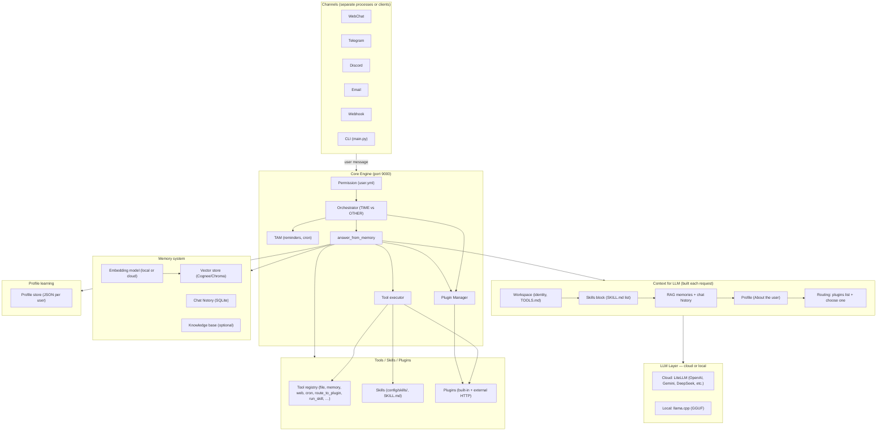
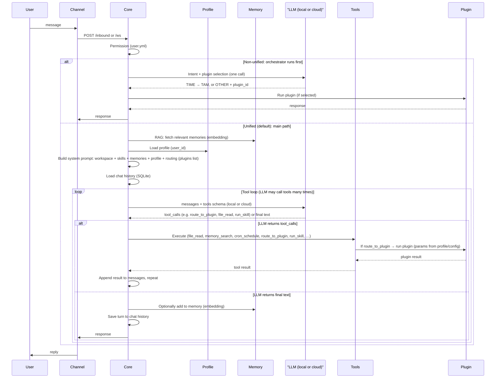

# Welcome to HomeClaw

**HomeClaw** is an **AI assistant** that runs on your own hardware. Talk to it over the channels you already use—Telegram, Discord, WebChat, email, and more—or use the **Flutter companion app** (Mac, Windows, iPhone, Android) for chat, voice, and **Manage Core** (edit config from the app). Extend it with **built-in and external plugins** (any language: Node.js, Go, Java, Python, etc.) and **OpenClaw-style skills**. **Memory** is RAG + agent memory (AGENT_MEMORY.md, daily memory). Use **cloud models** (OpenAI, **Gemini**, DeepSeek, etc.) or **local models** (llama.cpp, GGUF), or **both together** for better capability and cost. **Multimodal** (images, audio, video) works with both. **Multi-agent** = run multiple HomeClaw instances. Your data stays yours.

## System overview and data flow

**System overview: all modules**

**Data flow: how a message is handled and where the LLM is used**

**Summary of what the diagram shows**

| Aspect | Where it appears |
|--------|-------------------|
| **LLM: local or cloud** | **LLM Layer** in the first diagram; **LLM (local or cloud)** in the sequence. Core calls one OpenAI-compatible API; that API is served by **local** (llama.cpp, GGUF) or **cloud** (LiteLLM → OpenAI, Gemini, DeepSeek, etc.). Main and embedding model can each be local or cloud. |
| **Memory system** | **Memory** subgraph: vector store (Cognee or Chroma), chat history (SQLite), optional knowledge base. **RAG**: embedding model vectorizes query and memories; relevant chunks are fetched and injected into the system prompt. |
| **Profile learning** | **Profile** subgraph: per-user JSON (e.g. `database/profiles/<user_id>.json`). Loaded each request and injected as **"About the user"** in the prompt. Used for personalization and for plugin parameter resolution (`profile_key`). |
| **Tools / skills / plugin selection** | **Context** includes: workspace (TOOLS.md), **skills block** (list of skills from SKILL.md), **routing block** (list of plugins + “choose one: time tools, route_to_tam, route_to_plugin, run_skill, or other tools”). **Tool registry** holds all tools (file_read, memory_search, route_to_plugin, run_skill, …). The **LLM** sees this context and chooses which tool to call (or to reply with text). So selection is done by the **LLM** given the prompt and tool schemas; no separate “selector” service. |

- **Channels** — Email, Matrix, Tinode, WeChat, WhatsApp, Telegram, Discord, Slack, WebChat, webhook, Google Chat, Signal, iMessage, Teams, Zalo, Feishu, DingTalk, BlueBubbles. Each channel connects to Core via HTTP (`/inbound`, `/process`) or WebSocket (`/ws`). See [Channels](channels.md).
- **Core** — Single FastAPI app: permission check (`config/user.yml`), orchestrator (intent TIME vs OTHER; plugin selection), TAM (reminders, cron), tool execution (file, memory, web search, browser, cron, `route_to_plugin`, `run_skill`), plugin invocation, and chat + RAG. Config: `config/core.yml`.
- **LLM layer** — One OpenAI-compatible API used by Core. Filled by **cloud models** (LiteLLM: OpenAI, Google Gemini, DeepSeek, Anthropic, Groq, Mistral, etc.) and/or **local models** (llama.cpp server, GGUF). Main and embedding model can be chosen independently; cloud and local can work together for better capability and cost. See `config/core.yml` (`cloud_models`, `local_models`, `main_llm`, `embedding_llm`).
- **Memory** — **Cognee** (default) or in-house **Chroma** backend: vector + relational + optional graph. Used for RAG and chat history. See `docs_design/MemoryAndDatabase.md`.
- **Profile** — Per-user JSON store (e.g. `database/profiles/`). Loaded each request and injected as “About the user” in the prompt; used for personalization and plugin parameter resolution. See `docs_design/UserProfileDesign.md`.
- **Plugins** — Built-in (Python in `plugins/`) and external (HTTP, any language). Core routes user intent to a plugin (e.g. Weather, News, Mail) when the request matches. See [Tools](tools.md).
- **Skills** — Folders under `config/skills/` with `SKILL.md` (name, description, workflow). The LLM uses tools to accomplish skill workflows; optional `run_skill` runs scripts. See [Tools](tools.md).

---

## Get started

| | |
|---|---|
| [**Install**](install.md) | Clone, pip install, optional local/cloud LLM setup |
| [**Run**](run.md) | Start Core and a channel (WebChat, Telegram, CLI, Companion app, …) |
| [**Channels**](channels.md) | WhatsApp, Telegram, email, WebHook, and how to allow users |
| [**Tools**](tools.md) | Built-in tools, plugins, and skills |
| [**Models**](models.md) | Cloud (LiteLLM) and local (llama.cpp); multimodal (Gemini, etc.); both can work together |
| [**Platform**](platform.md) | Config files, multi-user, memory backend |
| [**Remote access**](remote-access.md) | Tailscale and Cloudflare Tunnel to reach Core from anywhere |
| [**Companion vs Channels**](companion-vs-channels.md) | How the Companion app and channels differ; how Core handles them |
| [**Help**](help.md) | Doctor, troubleshooting, and repo docs |

---

## More

- [Introducing HomeClaw](introducing-homeclaw.md) — What it is: companion app, memory, plugins (any language), OpenClaw skillset, multi-agent, cloud & multimodal  
- [Story](story.md) — Why and how HomeClaw was built  

---

## One sentence

HomeClaw supports **cloud and local LLMs** (or both together for better capability and cost), **multi-user**, **memory-based** (RAG + agent memory), and **self-hosted**. A **Flutter companion app** (Mac, Win, iPhone, Android) and **external plugins** (any language) make it **extensible and easy to use**. **Multimodal** (local + Gemini) and **multi-agent** (multi-instance) supported. One agent, one memory, many channels—your home, your AI, your control.
