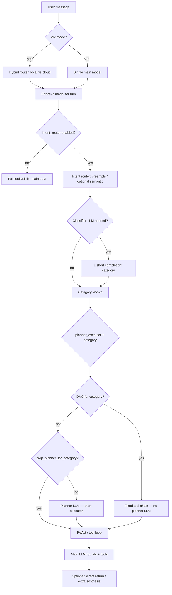

# Intent router flow (end-to-end) and latency

This document describes how a user message moves through **intent routing**, **planner / DAG**, and the **main LLM + tools** path, with **concrete examples** and notes on **what makes responses fast or slow**.

---

## 1. High-level pipeline (one user turn)

Rough order inside the main chat path (`answer_from_memory` / `llm_loop`):

**Categories can be comma-separated** (`cat1,cat2`): tools/skills are a **union**; the **first** category often drives which **DAG** applies—keep intents clean when you care about predictability.

---

## 2. Step-by-step with examples

### Step A — Hybrid router (mix mode only)

**Not** the intent router: this picks **local vs cloud** for the main stack (`hybrid_router` in `llm.yml`). Skipped when `main_llm_mode` is `local` or `cloud`.

| Example | Typical outcome |
|--------|------------------|
| User sends a **screenshot**; local model has no vision, cloud does | **Cloud** (`vision_fallback`) |
| “Remind me **tomorrow 9am** every week” | **Cloud** if `main_llm_cloud` set (`scheduling_prefer_cloud`) |
| Short chit-chat, `default_route: local` | **Local** after optional heuristic / semantic / SLM layers |

---

### Step B — Intent router entry (`intent_router` in `config/skills_and_plugins.yml`)

When `intent_router.enabled` is true, routing runs **early** so **tools and skills** can be filtered by category before the heavy main turn.

**2a. Preempts (no classifier LLM)** — fast path.

Code applies **keyword / regex heuristics** before any completion. Optional **`match_patterns`** in each `config/intent_category/<id>.md` frontmatter adds **`re.search`** rules when using the default intent category doc path (or set **`intent_router.intent_category_docs_dir`** / `""` to disable). Examples (see `base/intent_router.py`):

| User message (illustrative) | Preempt category (if in `categories`) |
|----------------------------|----------------------------------------|
| “What’s in my **watchlist**?” / “**自选股**行情” | `stock_monitor` |
| “Generate **HTML slides** from this doc” | `create_html_slides` |
| “**images**里有什么图片” | `list_files` |
| “**Send me** img1.png / **发给我**那个文件” | `get_file_link` |

**2b. Classifier completion** — **one** short LLM call.

Runs only if earlier steps (preempts, and semantic when enabled) did not return a category.

- **`router_llm`** (optional): if set to a model ref string, that ref is passed as `llm_name` to the completion helper for **this call only**. If omitted/null, the router uses the **same default completion path** as the main model (not a separate tiny model unless you configure one).
- **`timeout_seconds`**: caps wait; on timeout → **`general_chat`** (safe default).

Example:

| User message | No preempt match → classifier may output |
|--------------|----------------------------------------|
| “Search the web for Python 3.13 release notes” | `search_web` |
| “What’s the weather in Seattle?” | `weather` |
| “Hi, how are you?” | `general_chat` |

---

### Step C — Identity / capabilities

“Who are you?”, “what can you do?”, etc. map to category **`identity_capabilities`** (`config/intent_category/identity_capabilities.md`). The **main LLM** responds; **IDENTITY.md** and **TOOLS.md** are in the workspace system prefix as usual.

---

### Step D — Planner vs DAG vs straight ReAct

Configured under **`planner_executor`** (same YAML file).

| Situation | What happens |
|-----------|----------------|
| **DAG** `flows.<category>` exists for the first category | **No planner LLM**: executor runs the fixed steps (e.g. `run_skill` only). |
| Category in **`skip_planner_for_categories`** | **No planner LLM**: normal **tool loop** / ReAct with narrowed tools. |
| Planner enabled, no DAG, not skipped | **One planner completion** to produce steps, then execution. |
| Special cases in code | e.g. some news+magazine combos **force** normal tool loop (see `llm_loop` comments). |

Example:

| Category | Typical fast path |
|----------|-------------------|
| `weather` | DAG or skip planner + narrow `category_tools` → fewer wrong tools |
| `stock_monitor` | DAG `run_skill(stock-monitor, portfolio)` when configured |

---

### Step E — Main loop: ReAct, tools, synthesis

- Each **tool round** is roughly **one main LLM call** (plus tool execution time).
- **`category_tools`**: smaller tool set → fewer mistaken tool picks → fewer retries.
- **`run_skill_direct_return_skills_in_mix_cloud`** (and related rules): when the skill output is already user-ready, **skip** an extra LLM “polish” round in mix/cloud paths.

---

## 3. What reduces response time? (practical map)

Goal: **as few blocking steps as possible** per message, and **fail fast** instead of hanging.

### Biggest wins (usually)

**1. Fewer LLM calls per user message**

| Step | Cost | Mitigations |
|------|------|-------------|
| Intent router classifier | **1 completion** when preempts (and semantic, if enabled) miss | Add code preempts or use **`intent_router.mode: semantic`** for category docs; tune **`timeout_seconds`** (e.g. 8–15s) so a stuck router falls back to `general_chat` quickly (**trade-off**: routing quality vs speed). |
| Planner | **1 completion** when planner is on and **no DAG** applies | Use **`skip_planner_for_categories`** for chit-chat and stable intents; define **DAGs** for fixed chains. |
| ReAct loop | **1 main LLM call per round** + tool time | **Narrow `category_tools`**; prefer **DAG** over “model figures out the chain”; keep **`max_tool_rounds`** reasonable (safety vs stall). |

**2. Faster / more reliable model on the main path**

Slow **local** + **retries** + **mix fallback** often dominates wall time. For perceived speed, **cloud-only** or a **fast cloud** main model often beats YAML-only tuning.

Optional: set **`intent_router.router_llm`** to a **small, fast** local/cloud ref so the **router** completion is cheaper than the main model (when supported by your deployment).

**3. Skip work entirely when possible**

- **DAG success**: **no** planner and often **minimal** reasoning before tools.
- **`run_skill_direct_return_*`**: avoid an extra synthesis pass when output is already display-ready.

---

### Medium wins

**4. Tool execution time**

- Lower **`run_skill_timeout`**, **`tool_timeout_seconds`**, **`exec_timeout`** where safe → fail fast; pair with **fallbacks** (e.g. weather DAG fails → `web_search`).
- External HTTP: keep **timeouts** tight and **retries** low.

**5. Less context to process**

- **`tools.description_max_chars`**: shorter tool blurbs → faster tool choice on weak models.
- **`skills_include_body_max_chars`** / location-only modes: fewer skill tokens → faster main calls (**trade-off**: model may need `file_read` for skill docs).

**6. Optional RAG**

- **`skills_use_vector_search`** / **`tools_use_vector_search`**: adds embedding + retrieval per turn — leave **off** unless you measure a net win.

**7. After-tool synthesis**

- **`run_skill_direct_return_skills_in_mix_cloud`** (and related rules): skip an extra LLM round when the tool output is already user-ready.

---

### Smaller / situational

**8. Multi-category routing**

First category wins for **which DAG** runs; tools/skills are a **union** — can confuse the model. Prefer **one clear category** when possible.

**9. `strict_fallback: true`**

Safer, but may block **auto_invoke** when the model omits tools → can feel like “slow thinking then wrong.” For known patterns, prefer **DAG/preempt**; relaxing strict fallback is a **security/behavior** trade-off.

**10. Startup (first reply after Core start)**

Embedding / model **health waits** affect **first** interaction more than steady-state message latency.

---

## 4. Example timelines (conceptual)

### Fastest: preempt + DAG + direct return

1. User: “自选股今天怎么样” → **stock_monitor** via preempt (**0** router LLM calls).
2. DAG runs **`run_skill`** only (**0** planner calls).
3. Skill output returned directly (**0** extra synthesis LLM calls).

### Slower: full router + planner + multi-round ReAct

1. **1×** router classifier (no preempt).
2. **1×** planner (no DAG, not in skip list).
3. **N×** main LLM rounds with tools until done or `max_tool_rounds`.

---

## 5. Related config keys (quick reference)

| Area | Keys / files |
|------|----------------|
| Intent router | `config/skills_and_plugins.yml` → `intent_router` (`enabled`, `intent_category_docs_dir`, `timeout_seconds`, `router_llm`, `mode`, `semantic`, optional YAML overrides, …) |
| Planner / DAG | `planner_executor` (`enabled`, `skip_planner_for_categories`, `flows`) |
| Mix routing | `config/llm.yml` → `main_llm_mode`, `hybrid_router`, `main_llm_local`, `main_llm_cloud` |

For mix-mode **local vs cloud** selection details, see the hybrid router section in `core/llm_loop.py` and `docs_design/LlmConfigCloudAndMixModeReview.md`.

---

## 6. Taxonomy maintenance notes

- Prefer **high-precision** preempt/pattern cues for delivery verbs such as `发给我` only when combined with **file-like evidence** (path/filename/extension). This avoids misrouting news/web asks into `get_file_link`.
- Keep **mutual boundaries** between confusing pairs (both sides): `get_file_link` vs `search_web/news_digest`, `list_files` vs `coding`, `read_document` vs `summarize_to_page/generate_pdf`.
- For multilingual traffic, include **Chinese + English + mixed** examples in each category doc; short Chinese requests are otherwise easy to collapse into broad categories in semantic mode.
- Use `match_patterns` sparingly: add only patterns with strong intent precision. Broad regex on common verbs can create deterministic false positives that override semantic/classifier logic.
- After category-doc updates, refresh intent category vectors (`/api/intent-category/sync-vector-store` or startup refresh) before evaluating semantic routing quality.
