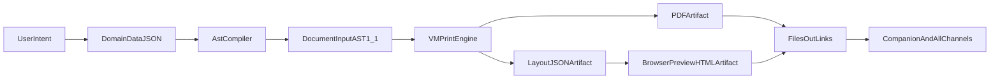

# VMPrint As HomeClaw UI Runtime

HomeClaw currently uses VMPrint mostly as a Markdown-to-PDF converter. This document defines the runtime model to use VMPrint as a **document UI system**:

- **AST as UI DSL**
- **flat box output as scene graph**
- **PDF as one renderer target**

## Why this model

VMPrint docs describe a deterministic simulation engine with flat `Page[] -> Box[]` output and source traceability, not a one-shot formatter:

- `tools/vmprint/documents/ARCHITECTURE.md`
- `tools/vmprint/documents/ENGINE-INTERNALS.md`
- `tools/vmprint/docs/reference/ast.md`

This allows one authored AST to drive both printable PDF and browser preview artifacts.

## Channel-first output strategy

Do not bind preview to Portal internals. Generate artifacts in `output/` and share via existing `/files/out` links.

- Companion: opens same browser-preview link
- Channels (WebChat/Telegram/Discord/etc.): receive and open the same link
- PDF remains the download/print target

## Runtime flow

## Output formats in HomeClaw

Tool `vmprint_render` supports:

- `pdf`
- `ast_json`
- `layout_json`
- `browser_preview_html`

For channels/Companion, prefer:

1. `browser_preview_html` link for quick read
2. `pdf` link for download/print

## AST constraints (must enforce)

- `documentVersion` must be `1.1`
- AST 1.1 top-level keys used correctly (`image`, `table`, `dropCap`, `columnSpan`, `placement`, `stripLayout`, `zoneLayout`)
- table repeat header requires `semanticRole: "header"` on header row
- non-image float blocks require explicit width/height

Fail fast with clear validation errors before rendering.

## Daily-brief pilot template

First pilot should be template-driven:

- input: normalized daily-brief JSON
- compiler: stable AST template (`story`/`zone-map`/`strip`)
- outputs: `browser_preview_html` + `pdf`

This keeps geometry deterministic and avoids free-form LLM layout drift.

## `vmprint-contexts` summary

`vmprint-contexts` is a separate repository for official VMPrint output contexts (PDF and Canvas targets). A context maps VMPrint flat pages/boxes to a concrete rendering target. This is how the browser examples can render VMPrint documents onto canvas.

Reference:

- [vmprint-contexts repository](https://github.com/cosmiciron/vmprint-contexts)
- [AST-to-canvas browser example](https://cosmiciron.github.io/vmprint/examples/ast-to-canvas-webfonts/index.html)

## Should HomeClaw build its own context?

Yes, but not immediately.

### Phase 1 (recommended now)

- Use existing VMPrint CLI + generated browser preview artifact
- Ship channel/Companion links
- Validate real user workflows and performance

### Phase 2 (only if needed)

Build a HomeClaw-specific context if Phase 1 reveals hard limits.

### Go / no-go criteria for custom context

Build custom context when at least two are true:

- Need lower-latency interactive preview than artifact-based HTML
- Need progressive rendering/streamed page updates
- Need channel-specific compact payload protocol not served by current artifacts
- Need richer telemetry hooks (boot/layout/render) coupled to HomeClaw observability

Do not build yet if:

- link-based preview + PDF already satisfies channel UX
- performance is acceptable for typical brief/report sizes
- maintenance cost of another renderer package outweighs benefit
