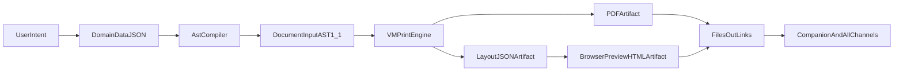

# VMPrint As HomeClaw UI Runtime

HomeClaw uses VMPrint as a **document UI runtime**: AST in, **canvas or PDF** out, with chat surfacing **preview links** instead of pasting huge bodies. The upstream project positions VMPrint as a **deterministic spatial simulation engine** for multi-page documents — preview and export share the same layout session ([README](https://github.com/cosmiciron/vmprint)).

- **AST as UI DSL**
- **flat box output as scene graph**
- **PDF / SVG / canvas as renderer targets** (not “HTML print CSS + hope”)

## Why this model

VMPrint describes a deterministic simulation engine with flat `Page[] -> Box[]` output, source traceability, and optional **post-settlement scripting** (e.g. real page counts in footers), not a one-shot formatter:

- Public overview: [github.com/cosmiciron/vmprint](https://github.com/cosmiciron/vmprint)
- Vendored deep dives (when `tools/vmprint` is installed): `tools/vmprint/documents/ARCHITECTURE.md`, `ENGINE-INTERNALS.md`, `docs/reference/ast.md`

One authored AST can drive **browser preview** (`@vmprint/preview` + canvas context) and **printable PDF** from the same settlement — matching HomeClaw’s goal of VMPrint as the primary long-response UI.

## “Gaming technology,” AI integration, and how far “UI / OS” goes

The author’s framing matches what upstream documents **literally** specify: VMPrint is not “Markdown → boxes in one pass.” It is a **deterministic spatial simulation** where layout elements are **actors** (implemented as **packagers**) that measure, negotiate space, **split** across page/column boundaries, and rejoin while preserving identity and signals. The engine describes a **world** with an exploration **frontier** (they use **fog-of-war** vocabulary) and treats **pages as viewports** over that world—not as the primary containers content is poured into. That is the same *class* of machinery game engines use (simulation loop, entities with lifecycle, spatial constraints, deterministic state), applied to typography instead of sprites. See [ENGINE-INTERNALS.md](https://github.com/cosmiciron/vmprint/blob/main/documents/ENGINE-INTERNALS.md) and [ARCHITECTURE.md](https://github.com/cosmiciron/vmprint/blob/main/documents/ARCHITECTURE.md).

### Why that helps AI and agents

- **Structured boundary** — Models can target **JSON `DocumentInput`** (AST 1.1) or **Markdown** that a **transmuter** turns into AST; the heavy geometry lives in a **typed, testable** engine, not in free-form HTML/CSS.
- **Determinism and audit** — Same inputs → same layout; output is **flat `Page[]` / `Box[]`**, easy to snapshot, diff, and gate in CI—useful when prompts or compilers change.
- **Provenance** — Boxes carry metadata (`sourceId`, `fragmentIndex`, continuation flags, etc.), so you can relate rendered regions back to authored or model-generated nodes (debugging, accessibility, future “click this paragraph” UX).
- **Post-settlement scripting** — After the world **settles**, scripts can read **real** facts (e.g. page count) and mutate structure via messages—a natural hook for **human + LLM** collaborative documents without a second layout pass. See the **Scripting** section in the [vmprint README](https://github.com/cosmiciron/vmprint) and repo `documents/` for API details.
- **Portable runtime** — Same core runs in **browser, Node, serverless, edge**; an agent stack can render server-side and hand channels a **preview link** or file artifact (HomeClaw’s current pattern).

### “UI system” vs “an OS”

- **As a UI system** — VMPrint is already a credible **document UI substrate**: one layout settlement drives **canvas** (interactive preview, thumbnails) and **PDF/SVG** (artifacts users keep). That is “UI” in the sense of **a renderer + scene graph** (flat boxes + draw calls), not a general widget toolkit like Qt—for **reading and print-grade layout**, it is the right shape.
- **“Document OS” (metaphor vs reality)** — The strong reading is: a **sovereign document runtime** with its own **physics** (settlement, messaging, rollback/speculative paths in the engine), **not** a dependency on browser layout or a second-pass PDF hack. It is **not** a replacement for macOS/Linux/iOS; the ceiling is **rich, multi-page, programmable documents** that behave like a **small world** the engine runs to equilibrium. Product-wise, that is still a big surface: reports, magazines, manuscripts, and any agent output that should look like a **finished publication** rather than a chat transcript.

### What HomeClaw should do next (investigation → action)

1. **Keep `tools/vmprint` on a recent upstream** so packager, scripting, and context packages stay aligned with the public modular repos (`vmprint-contexts`, `vmprint-transmuters`, etc.).
2. **Treat AST + templates as the agent contract** for long outputs (daily brief, web search digests)—minimize raw Markdown in chat when “magazine” intent applies; compile JSON → AST → `vmprint_render` / `magazine-render` (aligned with `response-output-policy.md`).
3. **Embedded reading UX** — Hybrid preview pages now ship **server SVG** plus **embedded `layout_json`** (when under a size cap) and a **SVG / Boxes** toggle for the flat scene graph. Full in-browser **live** `LayoutEngine` wiring (no server SVG) is still optional if you want zero Node pre-render.

## layout_json in practice (sidecar + preview embed)

- **`vmprint_render`** with `output_format=browser_preview_html` runs VMPrint CLI **`--emit-layout`** in addition to server-side canvas/SVG. The HTML includes `<script id="layout-data">` when under **`tools.vmprint_preview_inline.max_embed_layout_json_chars`** (default 600000), and writes **`output/<stem>.layout.json`** next to `*.preview.html` when **`write_layout_json_sidecar`** is true (default on). JSON metadata includes **`layout_json_path`** when a sidecar is produced.
- **`magazine-render`** `render-template-ast` / `render-daily-brief-ast` / `render-ast`: **`--also-layout-json` / `--no-also-layout-json`** (default on for browser preview) writes the same sibling **`.layout.json`**. New JSON→AST template **`web_search`** accepts Tavily-shaped `results[]` (`title`, `url`, `content`/`snippet`).
- **Scripted AST** (upstream `onReady`, TOC, real page counts) is not generated by HomeClaw templates yet; start from [vmprint README — Built-In Scripting](https://github.com/cosmiciron/vmprint?tab=readme-ov-file#built-in-scripting-not-bolted-on-templating) and merge YAML/`methods` blocks into hand-authored AST when you need footers that depend on settled layout.

## Channel-first output strategy

Do not bind preview to Portal internals. Generate artifacts in `output/` and share via existing `/files/out` links.

- Companion: opens same browser-preview link
- Channels (WebChat/Telegram/Discord/etc.): receive and open the same link
- PDF remains the download/print target

## Runtime flow



## Output formats in HomeClaw

Tool `vmprint_render` supports:

- `pdf`
- `ast_json`
- `layout_json`
- `browser_preview_html`

For channels/Companion, prefer:

1. `browser_preview_html` link for quick read
2. `pdf` link for download/print

## AST constraints (must enforce)

- `documentVersion` must be `1.1`
- AST 1.1 top-level keys used correctly (`image`, `table`, `dropCap`, `columnSpan`, `placement`, `stripLayout`, `zoneLayout`)
- table repeat header requires `semanticRole: "header"` on header row
- non-image float blocks require explicit width/height

Fail fast with clear validation errors before rendering.

## Daily-brief pilot template

First pilot should be template-driven:

- input: normalized daily-brief JSON
- compiler: stable AST template (`story`/`zone-map`/`strip`)
- outputs: `browser_preview_html` + `pdf`

This keeps geometry deterministic and avoids free-form LLM layout drift.

## Python templates now → AI-generated AST later (product direction)

**Current (keep and extend):** Domain JSON → **Python compilers** in `skills/magazine-render-1.0.0/scripts/render_magazine.py` (`render-template-ast`, `render-daily-brief-ast`). New product surfaces add **new templates** or **`--document-layout`** variants; outputs stay testable and deterministic.

**Target (move toward):** The model (or a tool-calling step) produces **AST 1.1 JSON** directly; HomeClaw runs **`magazine-render render-ast`** (or `vmprint_render` with `ast_json` / preview) after the **same validation** as today (`_validate_ast_1_1` and the rules in this doc). The compiler’s job shrinks for one-off / novel layouts; **templates remain** for high-traffic, strict contracts (briefs, digests, finance shells).

**Bridge steps when you implement AI-AST:**

1. **Single ingress** — Treat “AST in” as one path: validate → render; log validation errors for prompt/tool tuning.
2. **Constrain generation** — Prefer JSON Schema / strict tool output or a **small intermediate schema** → optional repair pass → AST, rather than unbounded prose.
3. **Retry or repair** — On validation failure, one automatic repair turn (model or rule-based) before falling back to Markdown or a safe template.
4. **Keep tests** — Golden AST snippets or “valid minimal document” fixtures so CI catches schema drift.

Until then, adding **Python templates** is the correct default; they define the **ground truth** for what valid, good-looking AST looks like for each use case.

## `vmprint-contexts` summary

`vmprint-contexts` is a separate repository for official VMPrint output contexts (PDF and Canvas targets). A context maps VMPrint flat pages/boxes to a concrete rendering target. This is how the browser examples can render VMPrint documents onto canvas.

Reference:

- [vmprint-contexts repository](https://github.com/cosmiciron/vmprint-contexts)
- [AST-to-canvas browser example](https://cosmiciron.github.io/vmprint/examples/ast-to-canvas-webfonts/index.html)

## Should HomeClaw build its own context?

Yes, but not immediately.

### Phase 1 (recommended now)

- Use existing VMPrint CLI + generated browser preview artifact
- Ship channel/Companion links
- Validate real user workflows and performance

### Phase 2 (only if needed)

Build a HomeClaw-specific context if Phase 1 reveals hard limits.

### VMPrint `cli/dist/index.js` and `ERR_INVALID_ARG_TYPE` / `fileURLToPath`

**Not a HomeClaw-only issue.** Quick check from the repo root:

```bash
cd tools/vmprint && node cli/dist/index.js --help
```

If that throws `The "path" argument ... Received undefined` at `cli/dist/index.js` (often a huge line number), the **bundled** `@vmprint/cli` build is bad: **tsup** inlined `@vmprint/local-fonts` as `var import_meta = {}` and then called `fileURLToPath(import_meta.url)`, so `url` is **undefined** at load time.

- **Markdown → PDF via `draft2final`** can still work; that path does not load this broken chunk the same way.
- **HomeClaw preview / `--emit-layout`** runs `node cli/dist/index.js`, so it hits this bug until the CLI bundle is fixed.

**HomeClaw** may ship a small patch in `tools/vmprint/cli/dist/index.js` (derive `__dirname2` from `require.main.filename` instead of `import_meta.url`). Re-running `npm run build` inside `tools/vmprint/cli` **overwrites** `dist/`; after an upstream rebuild, re-check `node cli/dist/index.js --help` and re-apply or wait for an upstream **tsup / local-fonts** fix ([cosmiciron/vmprint](https://github.com/cosmiciron/vmprint)).

### Go / no-go criteria for custom context

Build custom context when at least two are true:

- Need lower-latency interactive preview than artifact-based HTML
- Need progressive rendering/streamed page updates
- Need channel-specific compact payload protocol not served by current artifacts
- Need richer telemetry hooks (boot/layout/render) coupled to HomeClaw observability

Do not build yet if:

- link-based preview + PDF already satisfies channel UX
- performance is acceptable for typical brief/report sizes
- maintenance cost of another renderer package outweighs benefit
