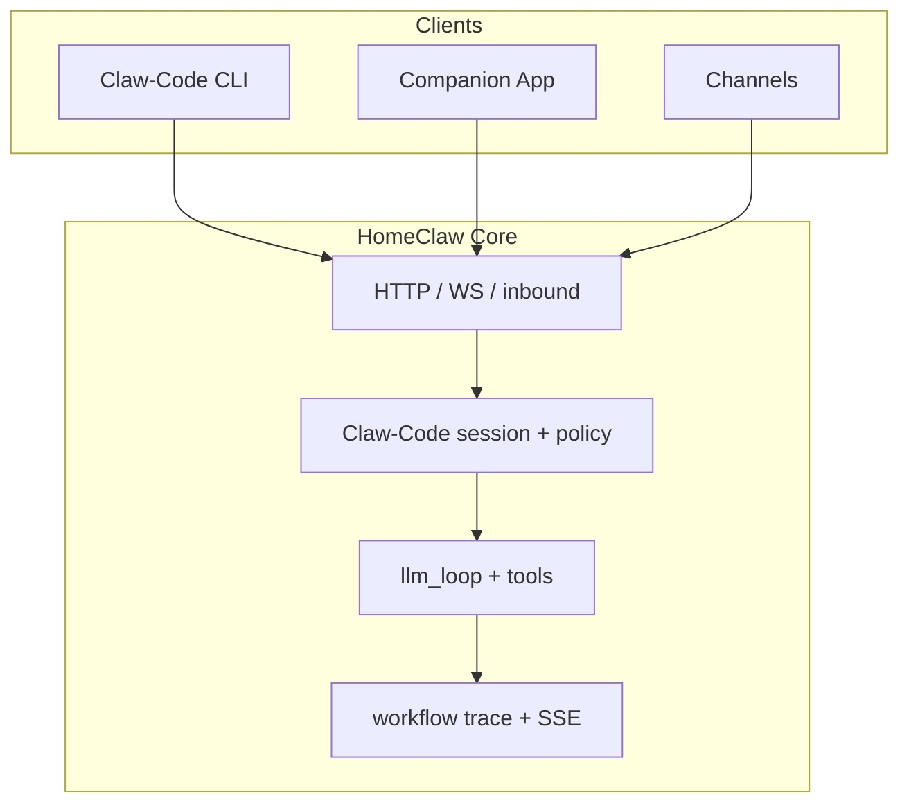
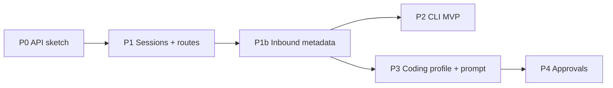

# Claw-Code — design (clean-room)

**Status:** **P0–P5 baseline implemented** in Core (JSON sessions, inbound binding, CLI, approvals, channel-bindings API, plan/agent mode, rebind cwd, LLM refs, git/exec gate, path preflight). Keep **§14.7** non-regression rules when extending. Sketch: `docs_design/ClawCode_API_Sketch.md`.

**Principle:** Claw-Code is a **HomeClaw-native** coding-agent experience. It does **not** copy third-party **source trees** wholesale. It may **match capabilities** described in public product docs and common CLI patterns, implemented in **Python** (CLI + Core) inside this repo. **System prompts:** follow §3.2 — **use reference material, reorganize, and HomeClaw-ify** (not unchecked paste of whole external files).

**Goals:**

- **CLI-first** coding workflow (local terminal), comparable in *scope* to “agentic IDE assistants.”
- **Model choice:** user-configured providers — Minimax, DeepSeek, Anthropic, OpenAI, Ollama/local, etc. — via existing HomeClaw LLM plumbing (`config/llm.yml`, LiteLLM, local llama.cpp) plus explicit **Claw-Code profiles**.
- **Native Companion + channels:** same Core instance; coding sessions controllable and observable from mobile (Companion) and IM channels (Telegram, Discord, WebChat, …).
- **Safety:** tool policy, risk tiers, optional approvals, audit/trace.

---

## 1. Scope and non-goals

### 1.1 In scope (phased)

| Area | Claw-Code intent |
|------|------------------|
| CLI | Thin client: auth to Core, pick session/repo, stream logs, send commands, attach to trace SSE. |
| Core | “Coding mode” or dedicated **Claw-Code** tool profile + optional **coding session** state machine. |
| Models | Reuse `llm.yml` / `cloud_models` / `main_llm_*`; add **named profiles** (e.g. `clawcode_main`, `clawcode_fast`) without forking the whole stack. |
| Companion | Screens or deep links: session list, approve/deny, view diff summary, stop run. |
| Channels | Structured messages: `/clawcode status`, approve buttons (where channel supports), file links for patches/logs. |
| Observability | Workflow trace + SSE; coding-specific event types (see §7). |

### 1.2 Out of scope (initially)

- Shipping a proprietary IDE extension as **the** primary UI (optional later: LSP bridge or reuse existing Cursor/Claude **bridge** presets).
- Replacing Portal for all config (Portal remains; Claw-Code may add a minimal “coding” section later).
- Multi-tenant SaaS operation (HomeClaw stays self-hosted per operator).

---

## 2. Language: Python CLI (decision)

You can **study `../claude-code` heavily** for flows, tool boundaries, permission patterns, and UX — that is **reference**, not a requirement to implement in TypeScript. The reference codebase is TS/Bun; HomeClaw’s brain stays **Python (Core)**.

### 2.1 What “refer a lot” means in practice

| Activity | Language |
|----------|----------|
| Read Claude Code for **ideas** (tool loop, Skill tool pattern, deferred tools, plan mode) | Any — docs + reading TS |
| **Claw-Code CLI** (HTTP/SSE to Core, session commands) | **Python** (decision; see §2.4) |
| **Core** (sessions, approvals, `llm_loop` hooks) | **Python** (existing stack) |
| **Companion / channels** | Whatever those apps already use (often TS/JS for mobile/web); they only call Core APIs |

### 2.2 Why Python for the CLI

- One **install surface** with Core: `python3 -m main …` or a small package beside `main`, same `requirements.txt`, **pytest** for CLI tests.
- **No second runtime** on the operator’s machine (no Node required for the coding CLI).
- Trivial reuse of **config paths**, env conventions, and internal helpers if you later share code with Core (still keep CLI thin).

### 2.3 TypeScript (deferred)

A separate **Node/npm** CLI is **not** in scope for v1. If it is ever added, it would be an **alternate client** only, same REST contract as the Python CLI — not a replacement for Core (which stays Python).

### 2.4 Decision (locked)

| Component | Language |
|-----------|----------|
| **Claw-Code CLI v1** | **Python** (Typer/Click + `httpx`). |
| **Core** | **Python** only. |

**Summary:** Refer to Claude Code–class products for *behavior* and prompt *structure*; **prompt workflow** is §3.2 (reorganize for HomeClaw). The **official** Claw-Code CLI is **Python**.

---

## 3. Feature parity matrix (conceptual)

“Claude Code–class” products typically combine: terminal UX, file/shell tools, plan/review flows, MCP, permissions, session resume, cost/context hints. Below maps **intent → HomeClaw lever** (not line-by-line parity).

| Capability (conceptual) | Claw-Code approach (HomeClaw) |
|-------------------------|--------------------------------|
| Terminal CLI | New package e.g. `clients/clawcode/` or `python -m main clawcode` — HTTP/WebSocket to Core, not a second brain. |
| Read / write / edit files | Existing tools: `file_read`, `file_write`, `file_edit`, `apply_patch`, `document_read`, sandbox rules. |
| Shell / process | `exec`, `process_*`; stricter **risk_tier** + Claw-Code allowlists. |
| Search repo | `file_find`, `folder_list`, optional **grep** tool or skill (if not already exposed). |
| Web fetch / search | `web_search`, `fetch_url`, etc. |
| Sub-agent / delegation | Existing **skill subagent** + **Agent** patterns; Claw-Code defines **one** default “coding subagent” policy. |
| Skills | `run_skill` + folder skills; Claw-Code **recommended skill set** in docs + optional preset. |
| MCP | `mcp_list_tools` / `mcp_call` where enabled. |
| Plan / review / compact | **Phased:** prompt blocks + tools; later dedicated **plan** artifact in session store; compaction already in Core. |
| Permissions | `tool_policy`, `risk_tier`, future **pending approval** queue for Companion (extend pending-user-actions pattern). |
| Session resume | **Coding session** record: `session_id`, `cwd`, `git_head`, `last_run_id`, link to trace file. |
| Model pick | `llm.yml` refs + **Claw-Code override** in session or CLI flag (`--model cloud_models/...`). |
| Cost / tokens | Optional: surface `usage_report` / LiteLLM logs in CLI; not blocking MVP. |

Gaps to close explicitly in later phases: **LSP**, **native worktree UI**, **deep IDE bridge** — tracked as optional milestones.

### 3.1 Reference dimensions (prompt, roles, verification, orchestration, lifecycle)

It is **explicitly in scope** to study how products like Claude Code (or the Python **`../claw-code`** port) handle **system prompt shape**, **role separation**, **response verification**, **tool orchestration**, and **session lifecycle**. **Prompt text** for HomeClaw Claw-Code is built with the **reorganize-and-HomeClaw-ify** workflow in §3.2.

| Reference idea | HomeClaw mapping (conceptual) |
|----------------|------------------------------|
| **Layered system prompt** (product rules, tools, env, repo context) | Merge today’s **skill/plugin** injections, **`tool_profile`**, optional **`clawcode`** preset in config, and a **per-coding-session** appendix (cwd, git hint, allowed tools) assembled in Core — not a second prompt engine in the CLI. |
| **Role separation** (e.g. planner vs implementer, reviewer, “developer” instructions) | Today: **system + user** turns in `llm_loop`. **Phased:** optional **verifier pass** (second call or small model), explicit **developer** message class if the API stack supports it, or **skill subagent** as a delegated role with a tight tool allowlist. |
| **Verification of responses** (self-check, structured output, tests) | **Trace + contracts** (`workflow_trace`, scenario YAML), optional **structured tool** outputs validated in code, **Companion/channel approval** for high-risk tools, optional **follow-up turn** (“confirm plan before edit”) driven by policy. |
| **Tool orchestrator** (ordering, defer, batch, MCP) | **Core-only:** `llm_loop`, tool registry, **`tool_policy`**, defer/discovery patterns, MCP tools — CLI and Companion **observe** (SSE/trace) and **approve**, they do not re-orchestrate tools. |
| **Lifecycle** (bootstrap, turns, compaction, resume) | **Coding session** record + inbound attach; **turn loop** in Core; existing **compaction**; CLI **`session new` / `attach` / `run`**; trace file + `last_run_id` for resume narrative. |

### 3.2 System prompt: use → reorganize → HomeClaw Claw-Code

**Decision:** We **use** reference prompt material as raw input, then **reorganize** it (section order, grouping, layers) and **edit** it so the result is clearly **our** Claw-Code prompt — wired to HomeClaw tools, policy, and session context. The shipped artifact is a **restructured, HomeClaw-specific** document, not an unmodified copy of someone else’s file.

**Workflow**

1. **Ingest** — Pull prompt blocks from **`../claw-code`** as the preferred draft source (same vocabulary as our Python direction). Other references (e.g. studying `../claude-code` or public docs) inform **missing sections** or **ordering**, not necessarily verbatim paragraphs.
2. **Reorganize** — Define our own outline: e.g. identity & scope → tools & calling conventions → filesystem/sandbox → approvals & risk → output style (see `docs/response-output-policy.md`) → Claw-Code session appendix (cwd, git, channel). Merge/split/move chunks to match that outline.
3. **HomeClaw-ify** — Replace tool names and examples with **actual** HomeClaw tools/schemas; align with `tool_profile`, `tool_policy`, skills/plugins merge rules; remove other-product branding; add HomeClaw-only rules where needed.
4. **Land** — Store in versioned config (e.g. `clawcode` preset YAML, or a dedicated prompt include merged in Core) so diffs are reviewable.

**Guardrails**

- Do **not** commit a **single unmodified** external prompt file as the default; always apply steps 2–3.
- **Attribution / NOTICE:** honor whatever license terms apply to prose you started from (e.g. `../claw-code`).
- If a source’s terms are **restrictive or unclear**, lean on **stronger reorganization and fresher phrasing** so the default prompt is **structurally and vocally** HomeClaw’s.

**Checklist before merge:** Tool catalog & JSON shapes match reality; risk tiers and approvals; memory/skill paths; channel-safe output; no false affiliation with another vendor; session appendix present for coding mode.

---

## 4. Architecture (logical)



- **Single source of truth:** Core runs the LLM loop and tools. CLI/Companion/channels are **control planes**.
- **No duplicate agent runtime** in the CLI (avoids drift and double billing).

### 4.1 How we use Claw-Code with HomeClaw (CLI, Companion, channels)

**Shared idea:** One **HomeClaw Core** (self-hosted). One **`clawcode_session_id`** per coding thread. Every surface sends **user turns** and metadata to Core the same way (inbound HTTP / channel adapter → Core); only the **UX** differs.

| Surface | Who / where | Typical use | What you do there |
|---------|-------------|-------------|-------------------|
| **CLI** | Developer at a laptop, same LAN or VPN to Core | Start a run from the repo, stream logs, script automation | `python3 -m main clawcode login` → `session new --cwd …` → `run "…"` → optional `attach` for trace SSE; best for **dense output**, **copy-paste**, **CI hooks** later. |
| **Companion app** | Phone / tablet; push-friendly | Approve risky tools, glance status, nudge the agent while away from keyboard | List **my sessions**; open session → last summary + link to trace; **Approve / Deny** on `exec` / `apply_patch` (when policy requires); optional short message as **inbound** with same `session_id`. |
| **Channels** (Telegram, Discord, WebChat, …) | Same household / team chat as everyday HomeClaw | “Ask the coding agent from chat” without opening a terminal | Message or slash command **bound to a session** (e.g. `/clawcode <short_id> …` or default session per channel); Core receives inbound with **channel identity** + **`clawcode_session_id`**; **rate limits** and **message size** matter more than on CLI. |

**Remote picture:** Core stays at home (or a VPS). You **do not** run the LLM on the phone. The Companion app and channel bots are **thin clients**: they call your Core URL with the same API key / app auth you already use for HomeClaw. A run started from the **CLI** can **pause for approval**; you **approve on the Companion**; the session **resumes** on Core with no second agent. Similarly, a **channel** message can append a user turn to that same session so desktop and chat stay **one conversation**.

**What is identical across surfaces**

- **Session binding:** payload includes `clawcode_session_id` (and `tool_profile` appropriate for coding, e.g. `coding`).
- **Policy:** `clawcode.allowed_roots`, approval lists, and tool policy apply **in Core** regardless of client.
- **Observability:** workflow trace + SSE; CLI tails raw events; Companion may show **summaries** + deep link; channels may post **short status** lines or links (operator-configured).

**What differs on purpose**

- **CLI:** full trace stream, local `cwd` at session creation, best ergonomics for long prompts and file paths.
- **Companion:** optimized for **interrupts** (stop, approve) and **glanceable** state, not full log dumps.
- **Channels:** conversational, possibly multi-user; need clear rules for **who may bind** or **create** sessions (friend / channel ACLs already in HomeClaw).

**Minimal v1 story (imagined)**

1. You **`clawcode session new`** in a git repo on your machine; Core returns `session_id`.
2. You **`clawcode run`** a task; the model proposes **`exec`**; Core marks **approval required** and emits trace + push.
3. You **open Companion**, tap **Approve**; Core continues the tool loop.
4. From **Telegram**, you send a follow-up on the same session: “also add tests” — same `session_id` in metadata — Core appends the user turn.

Later phases add **channel-specific** polish (buttons, thread pinning); the **contract** stays: **one session, many clients**.

### 4.2 Streaming, session ↔ project, modes (Plan / Agent), MCP exposure

#### Streaming (how to implement)

HomeClaw already has **several channels**; Claw-Code should **compose** them instead of inventing a parallel pipe:

| Layer | What exists / planned | Claw-Code use |
|-------|------------------------|---------------|
| **Inbound SSE** | `POST /inbound` with **`stream: true`**: progress events while work runs, then a final **`done`** payload (`core/inbound_handlers.py`, `core/route_registration.py`). | CLI and WebChat-style clients: one HTTP connection for “something is happening” + final assistant text. |
| **Workflow trace SSE** | `GET /dev/workflow-trace/stream` when enabled (`core/routes/workflow_trace_stream.py`). | CLI **`attach`**, dev tails, Companion “technical” view — **tool loop** and trace events, not necessarily every token. |
| **Token-level LLM streaming** | Not assumed universal in Core today; some bridge paths may stream previews. | **Phased:** plumb provider streaming through `llm_loop` and forward chunks on the same SSE or a dedicated event type; Claw-Code CLI can then **multiplex** progress + trace + (optional) tokens. |

**Practical v1:** rely on **inbound `stream`** + **workflow-trace SSE**; add **token streaming** when Core exposes a stable hook.

#### Session bound to one “project”

Treat **project** as **one primary working context** the session owns:

- **Required:** `cwd` (absolute path) validated against `clawcode.allowed_roots`.
- **Recommended fields on session record:** `git_root` or `repo_key` (e.g. normalized path or remote URL hint), optional **`project_label`** (human name), optional **`default_branch`** for display.
- **Rule:** one **`clawcode_session_id`** ↔ **one anchored `cwd`** for v1; switching repo = **new session** (simplest). Later: explicit **`POST …/sessions/{id}/rebind`** if product needs it (dangerous; policy-heavy).

Inbound always sends **`clawcode_session_id`**; Core loads session and injects **cwd + project appendix** into the system context so every client agrees on “which tree we’re editing.”

#### Modes: Agent vs Plan (Cursor-like)

Products in this space (including Claude Code in various releases) often distinguish **planning / read-only** vs **full agent** (mutating tools). HomeClaw does not need to match Cursor’s names — only the **behavior**:

| Mode (conceptual) | Tool / policy idea | Prompt idea |
|-------------------|-------------------|-------------|
| **Plan** (or “ask”) | Tighter allowlist: **no** `apply_patch` / `file_write` / `exec` (or dry-run only); **read** + search + summarize. | System block: “Propose steps; do not modify files until user confirms.” |
| **Agent** | Normal **coding** `tool_profile`: edits and shell subject to policy and approvals. | Default Claw-Code coding prompt. |

**How to switch:** (pick one or combine)

1. **Session field:** `mode: plan | agent` stored on the coding session; Core maps to **tool allowlist** + **prompt suffix** on each turn.
2. **Per-message override:** inbound metadata `clawcode_mode` for a single turn.
3. **CLI flags:** `clawcode run --mode plan` … forwards to Core.

**Verification:** optional **Plan → Agent** handoff tool (e.g. user message “execute the plan” or structured confirmation) so the model does not silently escalate.

*Whether Anthropic’s Claude Code names the same split is product-specific; we only borrow the **pattern**.*

#### Exposing HomeClaw / Claw-Code as an MCP **server** for others

Today HomeClaw is primarily an MCP **client** (`mcp_list_tools` / `mcp_call` in `tools/builtin.py` — connects **out** to configured servers).

**Yes, you can add an MCP server** that lets **other apps** (Cursor, Claude Desktop, another agent) call into HomeClaw:

- **Shape:** a small **stdio or SSE MCP server** process (Python or Node) that implements MCP `tools/list` and `tools/call`.
- **Each tool** maps to **HTTP** against Core: e.g. `clawcode_send_turn(session_id, text)`, `clawcode_session_create`, `clawcode_stream_subscribe` (or poll trace).
- **Auth:** API key or token in server env; **never** embed secrets in MCP configs committed to repos.
- **Scope:** start with **narrow** tools (one session, one turn, get last reply); expand after P2.

This is a **separate deliverable** from the Claw-Code CLI (P2): e.g. **P6 or “integrations”** milestone, so Core APIs stabilize first.

---

## 5. Model configuration (step-by-step)

### Step 5.1 — Reuse existing layers

1. **Local:** `local_models/*` in `llm.yml` + `main_llm_mode: local` or `mix`.
2. **Cloud:** `cloud_models/*` via LiteLLM (already supports many providers; add Minimax/OpenAI/Anthropic/DeepSeek as documented in LiteLLM).
3. **Per-request override (existing patterns):** `tool_profile`, friend preset, `tool_selection_llm`.

### Step 5.2 — Add Claw-Code-specific config (design)

New optional block in `config/core.yml` or `config/clawcode.yml` (merged like other includes):

```yaml
# Illustrative only — subject to review
clawcode:
  enabled: true
  # References into llm.yml (cloud_models/<id> or local_models/<id>)
  default_main_llm: cloud_models/DeepSeek-Chat
  default_tool_llm: null          # null = same as main
  # Session defaults
  default_sandbox: coding         # logical name → maps to homeclaw_root subdir or allowed cwd list
  require_git_repo: false         # if true, CLI refuses outside a git work tree
  approval_tools: [exec, apply_patch]  # must get Companion/channel approval when set
```

### Step 5.3 — Provider matrix (documentation task)

Maintain a **supported providers** table in docs: provider → LiteLLM model string → env vars → known limits (context, tools). No code change required per provider if LiteLLM already supports it.

### Step 5.4 — CLI flags

- `--model <ref>` → overrides `default_main_llm` for this CLI session only (passed to Core on each turn).
- `--profile minimal|messaging|coding` → maps to existing `tool_profile` + Claw-Code additions.

### Step 5.5 — Separate model for Claw-Code (cloud vs local)

Claw-Code **does not have to share** the same model as everyday HomeClaw chat (`main_llm` in merged config). Operators often want **coding** on a **strong cloud** model while keeping **local** or **cheaper** models for messaging, or the reverse (privacy: coding local, chat cloud — policy permitting).

| Layer | Behavior |
|-------|----------|
| **Defaults** | `clawcode.default_main_llm` / `clawcode.default_tool_llm` point at **`llm.yml`** entries (`cloud_models/<id>` or `local_models/<id>`), same namespace as `main_llm`. |
| **Per session** | Optional fields on the coding session record (see §6.1): **`main_llm_ref`**, **`tool_llm_ref`** — sticky for that thread until changed. |
| **Per turn** | Inbound or CLI may pass **`main_llm_override`** (or reuse existing per-request override hooks in Core if already present) for experiments without editing the session. |
| **`main_llm_mode`** | HomeClaw’s global `local` / `cloud` / `mix` still applies to **how the stack starts**; individual refs must still be **valid** for that deployment (e.g. don’t reference a missing local GGUF). |

**Implementation note:** Reuse existing **`llm_loop`** / LiteLLM routing — no second LLM stack. Only **which ref** is passed for Claw-Code turns differs from default chat.

**Future:** Per-**mode** models (e.g. Plan = small/local, Agent = cloud) via session `mode` + config map `clawcode.models_by_mode: { plan: ..., agent: ... }` — phased after v1.

---

## 6. Coding session model (step-by-step)

### Step 6.1 — Session record (persistent)

| Field | Purpose |
|-------|---------|
| `clawcode_session_id` | UUID; referenced by CLI, Companion, trace. |
| `owner_user_id` | System user / channel identity. |
| `cwd` | Allowed working directory (validated against allowlist). |
| `created_at`, `updated_at` | GC / resume. |
| `git_remote_hint` | Optional display only. |
| `last_run_id` | Link to workflow trace. |
| `status` | `idle` / `running` / `awaiting_approval` / `error` |
| `main_llm_ref` | Optional; overrides `clawcode.default_main_llm` for this session (`cloud_models/...` or `local_models/...`). |
| `tool_llm_ref` | Optional; separate tool-routing model if Core supports it for this path; else null = same as main. |

Storage: start with **SQLite** table under `database/` (same family as chat/sessions) or JSON under `database/clawcode_sessions/` — decision in implementation review.

### Step 6.2 — Lifecycle

1. **Create:** CLI or Companion calls `POST /api/clawcode/sessions` (new route) → returns `session_id`.
2. **Attach:** Subsequent `POST /inbound` or CLI-websocket messages include `clawcode_session_id` + `tool_profile: coding`.
3. **Run:** Core sets metadata; `llm_loop` injects coding system prefix (repo map, rules, session cwd).
4. **Pause for approval:** tool executor returns structured `need_approval`; Core stores pending row; Companion polls or push.
5. **Resume:** user message `approve` / `reject` or button payload continues or aborts.

### Step 6.3 — Multi-client

Same `session_id` can be observed from CLI (logs) and Companion (approvals). Channel messages must include session binding (metadata or slash arg).

---

## 7. Observability and trace (step-by-step)

### Step 7.1 — Reuse

- `HOMECLAW_WORKFLOW_TRACE` / SSE stream for live CLI tail.

### Step 7.2 — New event types (proposal)

| `event_type` | When |
|--------------|------|
| `clawcode_session_started` | Session created |
| `clawcode_turn_started` | Inbound tied to session |
| `clawcode_approval_requested` | Dangerous tool blocked for approval |
| `clawcode_approval_resolved` | Approved/rejected |
| `clawcode_git_snapshot` | Optional: after mutating tools, log `HEAD` (redacted) |

Contract updates in `tests/workflow_framework/trace_schema.py` when implemented.

---

## 8. CLI design (step-by-step)

### Step 8.1 — MVP commands

| Command | Behavior |
|---------|----------|
| `python3 -m main clawcode login` | Store Core URL + API key in `~/.config/homeclaw/clawcode.json` (or `HOMECLAW_API_KEY` env). |
| `python3 -m main clawcode session new [--cwd PATH]` | Create session; print `clawcode_session_id`; saves default in config. |
| `python3 -m main clawcode session list` | List sessions for `owner_user_id`. |
| `python3 -m main clawcode run [-s ID] [--stream] MESSAGE...` | `POST /inbound` with `clawcode_session_id`; `--stream` uses inbound SSE. |
| `python3 -m main clawcode attach` | Stream `GET /dev/workflow-trace/stream` (trace SSE). |

### Step 8.2 — Implementation stack

- Python **Typer** or **Click** aligned with `main.py` style; reuse `httpx` (already pinned &lt;0.28 in repo requirements).
- No Bun requirement for Claw-Code v1.

---

## 9. Companion and channels (step-by-step)

### Step 9.1 — Companion

- **Session list** API: `GET /api/clawcode/sessions?mine=1`.
- **Approval card**: reuse push + deep link to pending action id (pattern from pending user actions / reminders).
- **Minimal v1:** show last assistant summary + link to trace/report file on Core.

### Step 9.2 — Channels

- **Slash or prefix:** `/clawcode <session_short_id> <message>` or teach users to pin session in channel metadata (advanced).
- **Rate limits:** coding profile may use higher `inbound_timeout`; document operator expectations.

---

## 10. Security (step-by-step)

1. **Path allowlist:** `clawcode.allowed_roots: [/path/to/repos]` — Core rejects tools outside roots for Claw-Code sessions.
2. **Git safety:** optional `clawcode.git_write_allowed`. If the key is **omitted**, mutating git via `exec` is **allowed** (backward compatible). If set to **`false`**, mutating git commands are blocked for Claw-Code turns; set **`true`** to allow.
3. **Secrets:** never pass `.env` to model; tool redaction already partially exists — extend for Claw-Code.
4. **Auth:** same as `/inbound`; CLI stores key locally; Companion uses existing app auth.

---

## 11. Implementation phases (for roadmap)

| Phase | Deliverable | Success criteria |
|-------|-------------|------------------|
| **P0 — Spec freeze** | This doc + API OpenAPI sketch | Team agrees on session model + routes |
| **P1 — Core session + API** | `POST/GET` sessions, metadata on inbound | Create session from curl; trace shows `clawcode_*` events |
| **P2 — CLI MVP** | `session new`, `run`, optional SSE tail | Developer runs one coding task from terminal against Core |
| **P3 — Coding profile** | Dedicated system prompt + tool subset | Fewer mistaken tools; `tool_profile=coding` documented |
| **P4 — Companion approvals** | Pending approval for risky tools | Mobile approve/deny works |
| **P5 — Channel bindings** | Telegram/Discord session commands | Same session from phone and desktop |
| **P6 — Polish** | Cost display, worktree helper, optional MCP presets | Parity with “nice to have” rows in §2 |

---

## 12. Open questions (for review)

1. **Session storage:** **Resolved for v1 —** one JSON file per session under **`database/clawcode_sessions/`** (`core/clawcode_store.py`). Optional later: migrate to **SQLite** for query/indexing if operator scale demands it.
2. **Default cwd:** always under `homeclaw_root` sandbox vs true host paths for power users?
3. **Approval UX:** unify with `pending_user_actions` table or new `clawcode_approvals`?
4. **Branding:** CLI name `clawcode` vs `homeclaw code`?
5. **LiteLLM vs direct SDKs:** stay LiteLLM-only for cloud to minimize code, or add direct Anthropic SDK for thinking/streaming quirks?
6. **Default mode (Plan vs Agent):** **Implemented —** `clawcode.default_session_mode` (`plan` or `agent`, default **`agent`**); per-session override via **`PATCH`** `mode` or CLI `session set-meta --mode`.
7. **MCP server exposure (integrations):** first-party **`homeclaw-mcp`** (or similar) uses **stdio** (desktop tools) vs **SSE** (remote) vs both; which ships in v1 and which auth model (API key only vs companion token)? (See §4.2.)

---

## 13. Next step after review

1. Mark decisions in §12 inline (owner + date).
2. **`docs_design/ClawCode_API_Sketch.md`** added; optional OpenAPI fragment under `core/routes/` later.
3. Open implementation ticket per phase; keep **P0–P2** smallest vertical slice.

---

## 14. Implementation plan (working)

### 14.1 Design review (what we are building)

| Strength | Risk / watch |
|----------|----------------|
| **Thin CLI + Core brain** matches existing HomeClaw (`llm_loop`, tools, trace SSE). | Avoid duplicating orchestration in the CLI. |
| **`tool_profile=coding`** reuses an existing knob. | Need a real **coding** profile in `base/tool_profiles.py` (or config) with allowlists documented. |
| **Session record** enables resume + Companion. | Pick storage early (§12 Q1) or **start with JSON under `database/clawcode_sessions/`** for P1, migrate to SQLite in P4 if needed. |
| **Prompt workflow §3.2** is actionable. | Land prompt as **include + merge** (e.g. `config/clawcode.yml` + hook in prompt build) so it is diffable. |

### 14.2 Preconditions

- Core reachable at a base URL; **same auth model as `/inbound`** (API key / headers as today).
- `workflow_trace_sse_enabled` and trace env documented in `docs/workflow-trace-testing.md` for CLI `attach` / `--stream-trace`.
- Decide §12 **Q4** for user-facing strings: default **`clawcode`** subcommand under `python -m main` (fits existing argparse style) unless branding prefers `homeclaw code` (then nest parsers).

### 14.3 Recommended order (dependencies)



1. **P0 — Spec freeze (1–2 sessions)**  
   - Write **`ClawCode_API_Sketch.md`**: `POST/GET /api/clawcode/sessions`, JSON fields matching §6.1; how **`clawcode_session_id`** + **`tool_profile`** attach on **`POST /inbound`** (or channel equivalent).  
   - Resolve §12 **Q3** in sketch: *recommend* extend **`pending_user_actions`** (or existing approval queue) with a `kind=clawcode_tool` before inventing a second table.

2. **P1 — Core session + API**  
   - New module e.g. **`core/routes/clawcode_api.py`**; register in **`core/route_registration.py`**.  
   - Persistence: minimal **JSON files** or SQLite row per session; enforce **`owner_user_id`** from auth context.  
   - Emit trace events **`clawcode_session_started`** (and optionally **`clawcode_turn_started`** when inbound carries session id) via **`base/workflow_trace.py`**.  
   - Extend **`tests/workflow_framework/trace_schema.py`** for new `event_type` values.

3. **P1b — Inbound wiring**  
   - **`core/inbound_handlers.py`** (or prompt/session assembly): if inbound payload includes **`clawcode_session_id`**, load session, validate **cwd / allowed_roots** (§10), inject **session appendix** into system context (even a stub block in P1b).  
   - Map **`tool_profile: coding`** when session-bound (or require explicit profile).

4. **P2 — CLI MVP**  
   - Either extend **`main.py`** choices with **`clawcode`** and delegate to **`clients/clawcode/cli.py`**, or add **`python -m clients.clawcode`** — prefer **one entry** consistent with repo (`main.py` + small package).  
   - Commands: **`login`** (write `~/.config/homeclaw/clawcode.toml` or env), **`session new/list`**, **`run`** (`httpx` POST inbound + optional SSE reader from existing **`/workflow-trace/stream`** or documented path).  
   - **`pytest`** with **`httpx` mocks**; no live Core required. SSE: **`/dev/workflow-trace/stream`** (see `core/route_registration.py`; enable `workflow_trace_sse_enabled` in `core.yml`).

5. **P3 — Coding profile + prompt** *(partially done in repo)*  
   - **`coding`** profile already existed; **`run_skill`** added to **`coding`**; **`clawcode`** is an alias for the same tool set (`base/tool_profiles.py`).  
   - **`config/clawcode.yml`** → **`system_prompt_addendum`** merged in **`core/llm_loop.py`** when a Claw-Code session is active (`core/clawcode_prompt.py`). Refine text per §3.2 (e.g. from `../claw-code`) as needed.

6. **P4 — Companion approvals**  
   - Reuse push / pending-action pattern from **`companion_push_api`** or equivalent; API to list **pending clawcode approvals** and POST resolve.

7. **P5 / P6** — Channels and polish per §9 and §11.

### 14.4 First vertical slice (definition of done)

- `curl` **creates** a session and returns `session_id`.  
- `curl` **inbound** with that id + **`tool_profile=coding`** runs a turn and writes **workflow trace** lines including **`clawcode_*`**.  
- **CLI**: `session new` + `run "hello"` prints assistant text against the same Core.

### 14.5 Prompt work in parallel (non-blocking for P1)

- Owner runs §3.2 **ingest → reorganize → HomeClaw-ify** in a branch; lands with **P3** or as **config-only** PR once inbound injection exists.

### 14.6 Readiness (are we ready?)

| Gate | Ready? | Notes |
|------|--------|--------|
| Architecture + phases | **Yes** | §4, §11, §14.3–14.4. |
| **P0 API sketch** | **Yes** | `docs_design/ClawCode_API_Sketch.md` + **`docs/openapi/clawcode.yaml`**. |
| §12 open questions | **Partial** | Q1/Q6 addressed in repo; Q3/Q4/Q5/Q7 remain product choices (approvals file store vs table; branding; SDK split; MCP bridge). |
| Code in repo | **Yes** | Sessions, inbound, CLI, approvals, bindings, plan mode, rebind, LLM refs, git gate, path preflight; feature-flag `clawcode.enabled`. |

**Verdict:** Treat **§14.7** as the merge bar for further Claw-Code changes; extend docs/tests with each behavior change.

### 14.7 Non-regression (do not break existing features)

Claw-Code is **additive**. Existing channels, Companion, `llm_loop`, tools, and inbound **without** `clawcode_session_id` must behave **unchanged**.

1. **Feature flag / default off** — `clawcode.enabled: false` (or absent) in merged config until the team flips it; new routes return **404** or **403** when disabled if preferred.
2. **Inbound is opt-in** — Claw-Code branches run only when **`clawcode.enabled`** is true **and** **`clawcode_session_id`** is present. If disabled or id absent, inbound follows **today’s** path only. No change to default prompt or tool lists for normal chat.
3. **New routes only** — `POST /api/clawcode/...` as **new** paths; extend `/inbound` only with **optional** fields on `InboundRequest` (backwards compatible: old clients omit them).
4. **Tool profiles** — Introduce **`coding` / `clawcode`** profile without altering **`minimal`**, **`messaging`**, or existing profiles’ tool sets unless explicitly reviewed.
5. **Trace schema** — New `event_type` values are **additive**; existing trace consumers ignore unknown types if they already should; extend **`trace_schema.py`** and contract tests.
6. **Tests** — Run **`python3 -m pytest tests/ -v`** before merge; add **focused tests** for “inbound without clawcode fields identical path” vs “with session id loads appendix” (mocked).
7. **Small PRs** — P1 (sessions API only, no prompt surgery), then P1b (inbound branch), then P2 (CLI); avoid big-bang refactors of `llm_loop` or `inbound_handlers`.

---

*Document version: 0.4 — implementation baseline + SQLite note in §12.*

**Storage note:** Sessions are **JSON files** today; **SQLite** remains an optional migration if you need cross-session queries or stronger locking — not required for single-node self-hosted use.
