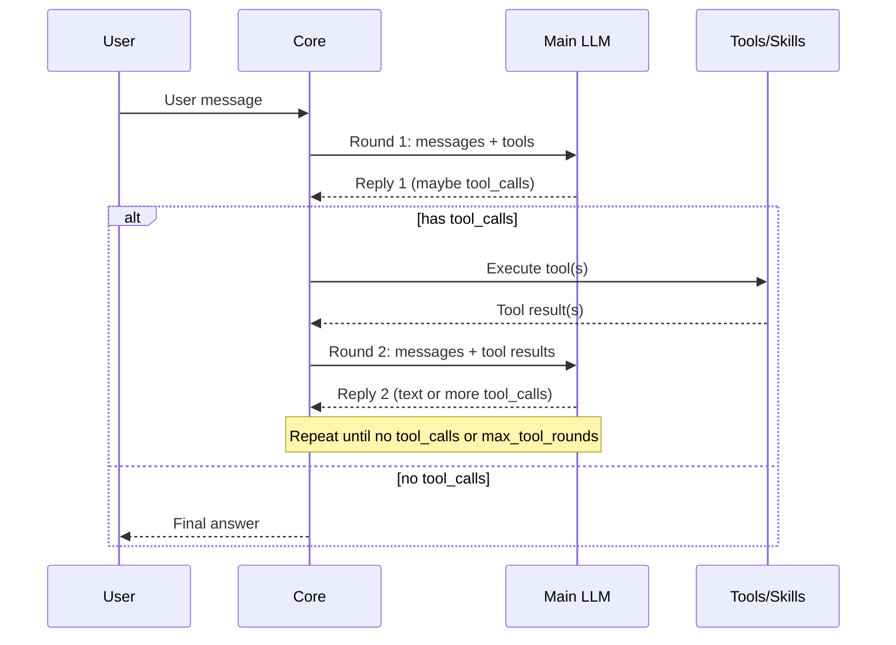
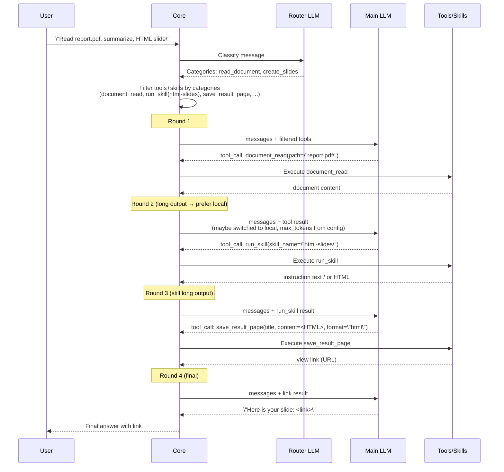

## Tool & Skill Workflow — Full Pipeline

This document describes the **end‑to‑end workflow** for handling a user message in HomeClaw:

- How we **route intent → categories**.
- How we **filter tools & skills**.
- How the **multi‑round tool loop** works.
- How **mix mode** (local + cloud) and **long‑output routing** interact.
- How we **save long outputs** (HTML slides, reports) via `save_result_page`.

It complements `ToolUse_Workflow_OneChat.md` by showing the **full pipeline** with diagrams.

---

## 1. High‑level pipeline

**Goal:** Turn a single inbound user text message into either:

- a direct answer, or
- a sequence of tool uses (files, web, skills, plugins) followed by an answer or file link.

### 1.1 High‑level sequence

At a high level, one inbound request goes through:

1. **Inbound handling & context**
   - Decode request (user text, optional image, channel metadata).
   - Load user session, recent chat history, and memory/RAG (if enabled).
2. **Intent routing**
   - Call a **small router LLM** with the user message (and optionally short chat history) to get **category / categories**.
3. **Tools & skills selection**
   - From categories + config we derive:
     - **Tool set** for this message.
     - **Skill set** for this message.
4. **Main LLM loop (tool loop)**
   - Call the **main model** with user + context + tool definitions.
   - The model may:
     - Return **plain text** → we respond and stop.
     - Return **tool_calls** → we execute tools, append results, and call it again.
   - Repeat until done or `max_tool_rounds` reached.
5. **Long output handling**
   - For long documents/slides/reports:
     - Prefer **local model** for the long‑generation turn.
     - Use **`completion.max_tokens`** (e.g. 32768) for all turns; if unset, Core uses `llama_cpp.predict` or 8192.
     - Save content to file via `save_result_page` / `file_write` and return a **link**.

### 1.2 Top‑level diagram

```mermaid
flowchart TD
    U[User message] --> I[Inbound handler<br/>load chat + memory]
    I --> R[Intent router<br/>(small LLM)]
    R --> C[Categories]
    C --> F[Filter tools & skills<br/>by categories + config]
    F --> L[Main LLM tool loop]
    L -->|no tool_calls| A[Answer text<br/>return to user]
    L -->|tool_calls| T[Execute tools<br/>(files/web/skills/plugins)]
    T --> L
    L -->|long HTML/Markdown| S[Save to file<br/>save_result_page/file_write]
    S --> Link[Return file link<br/>to user]
```

---

## 2. Intent router and category → tool/skill set

### 2.1 Router call

When a user message comes in:

1. Core builds a **small prompt** for the router LLM:
   - System: “You are a classifier. Reply with one or two category names from this list…”
   - User: the **current user message** (optionally with short chat history if configured).
   - Category list: names and **descriptions** from `skills_and_plugins.yml`.
2. Router returns:
   - `"general_chat"` **or**
   - one category name **or**
   - two comma‑separated categories, e.g. `read_document, create_slides`.

### 2.2 Categories → tools

Given the router result:

- If one category: use `get_tools_filter_for_category(config, category)`.
- If two categories: use `get_tools_filter_for_categories(config, [cat1, cat2])`:
  - This **unions** tool profiles / allowlists across categories.
  - Result is a **merged tool set** that may include shared tools (e.g. `document_read`, `save_result_page`) only once.
- Apply `tools_always_included` (if configured) to guarantee a baseline (e.g. `file_read`, `markdown_to_pdf`, `save_result_page`) is **always** present.

The result is a **filtered list of tool definitions** that we will expose to the main LLM as OpenAI tools.

### 2.3 Categories → skills

Similarly for skills:

- Single category: `get_skills_filter_for_category(config, cat)`.
- Two categories: `get_skills_filter_for_categories(config, [cat1, cat2])`:
  - Returns a **union** of allowed skills; `None` means “no filter” (all configured skills visible).
- We then:
  - Apply `skills_filter` (OpenClaw‑style explicit allowlist).
  - Apply `skills_use_vector_search` only if enabled (off by default).

The final skills set is used to:

- Build an **“Available skills”** section in the system prompt.
- Patch the **`run_skill`** tool schema with an `enum` of valid `skill_name` values.

---

## 3. Main LLM tool loop (multi‑round)

Once we have:

- `current_messages` (system + chat + memory + last user),
- `openai_tools` (filtered tool definitions),
- `skills` (filtered),

we enter a **tool loop**.

### 3.1 Loop structure



### 3.2 What each round sees

Each **round** the main LLM sees:

- System prompt (identity, tool instructions, “Handling tool results” block when applicable).
- Recent **chat** messages (user + assistant).
- Recent **tool results** (`role: "tool"`).
- **Tool definitions** (names, descriptions, JSON schemas).
- **Available skills** section in text.

The LLM chooses:

- Either: **no tool_calls** (just content) → we treat as **final answer** for this request.
- Or: one or more **tool_calls**:
  - Each has `function.name` (e.g. `document_read`, `run_skill`, `save_result_page`) and JSON `arguments`.

Core then:

- Executes each tool.
- Appends each result as a new `role: "tool"` message.
- Loops.

We **do not** remove tools after they’re used; tools are **reusable**:

- Retry `document_read` with different path.
- Call `web_search` again with a refined query.
- Call `save_result_page` more than once for multiple files.

---

## 4. Mix mode, local vs cloud, and long outputs

### 4.1 Picking local vs cloud per request

Depending on config (`main_llm`, `main_llm_local`, mix strategy), we decide:

- For this **request**, should we:
  - Use **local** only,
  - Use **cloud** only, or
  - Use **mix mode** (try local first, fallback to cloud or vice versa)?

This decision is made **once per request**, but some adjustments are per‑turn.

### 4.2 Prefer local for long‑output turns

Cloud providers (e.g. DeepSeek via LiteLLM) often cap `max_tokens` at **8192**.

To avoid truncating long slides/reports:

- When the **last message** is a **tool result** and:
  - `last_tool_name in ("document_read", "run_skill")`, and
  - `mix_route_this_request == "cloud"`,
- We **switch** this turn to the **local model** (if configured):
  - `llm_name_this_turn = main_llm_local`.
  - The same **`completion.max_tokens`** is used for every turn (no override); set it high (e.g. 32768) in config to avoid truncation.

Result:

- The heavy “generate HTML slides/report” turn runs on **local**, using **`completion.max_tokens`** from config (not capped by Core for local).

### 4.3 max_tokens and truncation

For **every** turn:

- Core uses **`completion.max_tokens`** from `llm.yml`. If not set, it falls back to **`llama_cpp.predict`** (server default); if neither is set, it uses **8192**. So **if you don't set `max_tokens`**, the effective limit is `predict` or 8192—set `completion.max_tokens` (e.g. 32768) to avoid truncation of slides/reports.
- For **cloud** models, the provider may enforce its own cap (e.g. 8192).
- For **local**, we send whatever you set in config; the local server must support it.

We also propagate the LLM `finish_reason` (e.g. `"length"`) into an internal `_finish_reason`, and:

- Log warnings when truncation occurs.
- Guard `save_result_page` against truncated HTML in tool args.

---

## 5. Long outputs: documents, HTML slides, and save_result_page

### 5.1 Intended pattern for “document → slides/report”

User asks e.g.:

> “Summarize norm-v4.pdf and generate an HTML slide deck.”

Ideal tool sequence:

1. **Round 1**
   - LLM calls: `document_read(path="norm-v4.pdf")`.
2. **Round 2**
   - After seeing document content, LLM calls:
     - Either `run_skill(skill_name="html-slides")`, or
     - Directly constructs HTML and calls `save_result_page(title=..., content=<full HTML>, format="html")`.
3. **Round 3 (if needed)**
   - After `run_skill`, LLM calls `save_result_page` with the HTML, or
   - After `save_result_page`, LLM returns a short answer with the **link**.

### 5.2 Where we guide the next tool choice

Because the loop is **stepwise**, we sometimes guide the **next** round explicitly:

- System “Handling tool results” block explains:
  - If the user asked for slides and you have document content, you **must** call `run_skill(html-slides)` or `save_result_page` this turn—not just narrate.
- run_skill (instruction‑only skills like `html-slides-1.0.0`) returns:
  - “Instruction-only skill confirmed… You MUST in this turn: (1) document_read (2) generate (3) save_result_page(…).”

For long‑output turns where we route to **local**, we can further add **short, direct instructions** (design under discussion) so the model is very likely to emit `save_result_page` instead of plain text.

### 5.3 Fallbacks: saving from message content

Sometimes models put the long HTML/Markdown in **message content** instead of tool args. We have fallbacks:

- If the final reply contains a long ` ```html ``` ` block and the user asked for slides:
  - Extract HTML and call `save_result_page` on behalf of the model.
- If the reply contains a long ` ```markdown ``` ` or document‑like text:
  - Extract it and call `save_result_page(format="markdown")`.

We **reject** clearly truncated HTML in `save_result_page` (no closing `</html>`), and try to recover from the message content when possible.

---

## 6. Putting it all together – end‑to‑end example

Example: **“Read report.pdf, summarize it, and generate one HTML slide for me.”**



Key points:

- **Router** decides which tools/skills exist in the sandbox.
- **Main LLM** decides, **round by round**, which tool(s) to call next.
- **Core**:
  - Executes tools and feeds results back to the model.
  - Routes long‑generation turns to **local** so **`completion.max_tokens`** (e.g. 32768) is honored.
  - Saves long outputs to files and returns **links**, not walls of text.

---

## 7. Summary

- **Router & config**: decide **which tools/skills are available** for this message (categories → tool/skill sets, plus `tools_always_included`).
- **Main LLM loop**: decides **which tool(s) to call in each round**, based on user text + tool results.
- **Tools & skills**: are **reusable**; we don’t remove them after one use.
- **Mix mode & long outputs**: prefer **local** for the “generate big content” turns and use **`completion.max_tokens`** (e.g. 32768) in config to avoid truncation. If you don't set `max_tokens`, Core uses `llama_cpp.predict` or 8192.
- **save_result_page** and fallbacks: ensure long HTML/Markdown is stored as a file and the user gets a **link**, even if the model puts the content in message text instead of tool args.

This is the full tool & skill workflow from user intent to multi‑step tool usage, long‑output handling, and final answer or file link.

